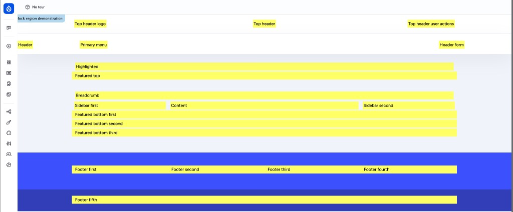

Almost every visible piece of an Open Intranet page outside the main content area — the header bar, the sidebar widgets, the footer columns, the search box, the "My last bookmarks" widget — is a **block** placed in a **region**. This page explains the moving parts and shows the most common admin tasks. For deep mechanics, follow the links to drupal.org.

## Mental model

- **Region** — a slot defined by the active theme (sidebar, header, footer, primary menu, content, …). Each theme defines its own.
- **Block** — a piece of UI placed in a region. A block can be a Drupal-provided thing ("Site branding"), a Views display, or a custom Block-Content entity authored in the admin UI.
- **Block layout** — the page at `/admin/structure/block` where you see every region of the active theme and the blocks placed in each.
- **Visibility** — every block has rules deciding *on which pages* it should appear (URL path, content type, role, language, custom block visibility group). Two blocks with different visibility can share a region without colliding.

Open Intranet runs **two themes** that are configured separately:

- **`openintranet_theme`** — the front-end theme end users see.
- **`gin`** — the admin theme (what authors and admins see while editing content).

When you open Block layout you are always editing one theme at a time — switch via the theme tabs at the top. Most front-end work happens in `openintranet_theme`; `gin` is rarely customised.

## Regions in the Open Intranet front-end theme

The front-end theme `openintranet_theme` defines 24 regions. Roughly grouped:

| Group | Regions |
| --- | --- |
| **Top header** | `top_header_logo`, `top_header_user_actions`, `top_header`, `top_header_form` |
| **Header** | `header`, `header_form` |
| **Navigation** | `primary_menu`, `secondary_menu` |
| **Above content** | `page_top`, `highlighted`, `featured_top`, `breadcrumb` |
| **Main** | `content`, `sidebar_first`, `sidebar_second` |
| **Below content** | `featured_bottom_first`, `featured_bottom_second`, `featured_bottom_third` |
| **Footer** | `footer_first`, `footer_second`, `footer_third`, `footer_fourth`, `footer_fifth` |
| **Page bottom** | `page_bottom` |

You can see them visually by visiting `/admin/structure/block/demo/openintranet_theme` — Drupal renders each region with its name overlaid, so you know exactly where a block will appear before placing it.

## What is already placed by default

Open Intranet ships with a sensible default block layout. A few highlights from `openintranet_theme`:

| Block | Region | What it does |
| --- | --- | --- |
| Site branding | `top_header_logo` | Logo + site name in the top bar |
| Search form (wide) | `top_header_form` | Global search input |
| Help Desk | `header_form` | Help / contact link |
| Main navigation | `primary_menu` | Top-level menu |
| Dropdown Language | `top_header_user_actions` | Language switcher |
| User Notifications | `top_header_user_actions` | Bell icon with mention / kudos / must-read counts |
| User account menu | `top_header_user_actions` | Profile / sign-out dropdown |
| New office banner | `featured_top` | Site-wide announcement banner |
| Knowledge Base book | `sidebar_first` | KB navigation when on a KB page |
| My Last Bookmarks | `sidebar_first` | User-specific bookmarks widget |
| Your last pages | `sidebar_first` | Recently-read content widget |
| Highlighted links | `sidebar_first` | Quick links curated by admins |
| Events Main Block | `sidebar_second` | Upcoming events |
| Example Block | `sidebar_first`, `sidebar_second` | Placeholder for editors to replace |
| Latest user comments | `content` | Activity stream entry |
| Information | `footer_first` | Company info column |
| Quick Links | `footer_fourth` | Footer navigation column |
| Legal & Compliance | `footer_third` | Privacy / terms / cookie links |
| Footer Info | `footer_fifth` | Address / branding |

You can rename, move, hide or remove any of these from `/admin/structure/block`. The defaults are a starting point — most production sites end up swapping at least the "Example Block" placeholders, the Highlighted links and the footer columns.

## Common tasks

### Place an existing block in a region

1. Go to **Structure → Block layout** (`/admin/structure/block`).
2. Pick the region you want, click **Place block** at the right.
3. Search by block name (e.g. *"Recently read content"* or *"Powered by Drupal"*).
4. Click **Place block**.
5. Configure visibility: which pages, content types, roles, languages should see it. Leave empty to show on every page.
6. Save.

### Create a custom block (reusable content snippet)

Use a custom block when you want to author HTML once and reuse it across multiple regions or pages — banner with announcements, contact info, image + paragraph teaser.

1. **Structure → Block layout → Custom block library** (`/admin/structure/block-content`).
2. **Add custom block**, pick the type (Basic block by default), enter title and body, save.

   This creates a reusable **Block-Content entity** — it does *not* place it on the page yet.
3. Go to **Block layout**, find your block under "Place block" → **Custom blocks**, place it in the region you want.
4. Editing the block content later updates it everywhere it is placed.

### Place a Views block (data-driven)

Most "what's new" / "popular" / "my X" widgets in Open Intranet are **Views blocks** — generated from a View configured in the admin UI. Examples already on the site include `views_block:bookmarks-block_1` ("My Last Bookmarks") and `views_block:events_blocks-block_1` ("Events Main Block").

To add your own:

1. **Structure → Views** (`/admin/structure/views`), open or create a View.
2. Add a **Block** display under *Displays*.
3. Configure the query (filters, sort, fields, format), save.
4. Now go to **Block layout** and place it like any other block. It appears under the View's name with the display ID as suffix.

Views blocks are the right tool whenever the content of the widget should be **dynamic** (the latest 5 events filtered by department, the top 10 most-read KB pages this week, all open Ideas tagged "innovation"…). For static HTML, prefer custom blocks.

### Group blocks by visibility (Block Visibility Groups)

Open Intranet ships [`block_visibility_groups`](https://www.drupal.org/project/block_visibility_groups). It lets you define a **group** with shared visibility rules (e.g. "show only on KB pages, only for the *Editor* role") and assign multiple blocks to that group at once. Useful when you have 5–10 blocks that should appear together on a context.

1. **Structure → Block visibility groups**, create a group with the rules you want.
2. When placing a block, pick the group from the *"Block Visibility Group"* setting in addition to (or instead of) per-block visibility rules.

### Move or remove a block

Drag-and-drop in `/admin/structure/block` to reorder within a region or move between regions. Set region to **None** (or click *Disable*) to hide the block without deleting its configuration — useful for blocks you may want back later.

## Visibility — what to use when

| You want the block to appear… | Use this rule |
| --- | --- |
| On specific URL paths | **Pages** condition (e.g. `/news/*`, `<front>` for the homepage) |
| Only on certain content types | **Content type** condition |
| Only for certain roles | **Role** condition |
| Only in a specific language | **Language** condition |
| On a recurring set of pages used by many blocks | A **Block Visibility Group** |
| On dynamic / complex conditions | A custom condition plugin in your own module |

## Layout Builder vs. Block layout

Drupal core also ships **Layout Builder**, a separate page-building tool. The two coexist in Open Intranet:

- **Block layout** (the topic of this page) controls **site-wide chrome** — header, footer, sidebars and any cross-page widget.
- **Layout Builder** is opt-in *per content type* and lets you compose **the body of a single piece of content** out of Drupal blocks, custom layouts and inline content.

For the global page frame, stick with Block layout. For richly-laid-out landing pages or content-type-specific layouts, enable Layout Builder on that bundle.

## Where to learn more

- [Drupal Block module documentation](https://www.drupal.org/docs/8/core/modules/block) — full reference for the Block system
- [Working with blocks in the Drupal admin UI](https://www.drupal.org/docs/user_guide/en/block-concept.html) — beginner-friendly walkthrough in the official user guide
- [Block visibility](https://www.drupal.org/docs/8/core/modules/block/working-with-blocks-content-blocks-and-custom-blocks#s-block-visibility) — every visibility condition Drupal core supports
- [Block Visibility Groups](https://www.drupal.org/project/block_visibility_groups) — module page with full configuration docs
- [Views module documentation](https://www.drupal.org/docs/8/core/modules/views) — for Views blocks
- [Layout Builder documentation](https://www.drupal.org/docs/8/core/modules/layout-builder) — when Block layout is not enough
