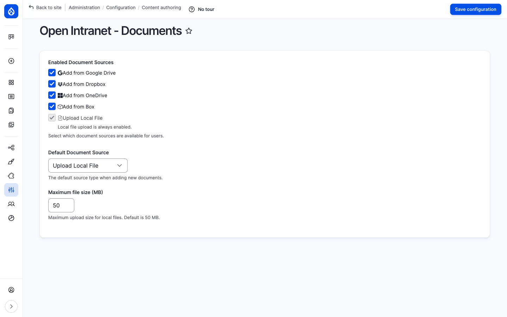
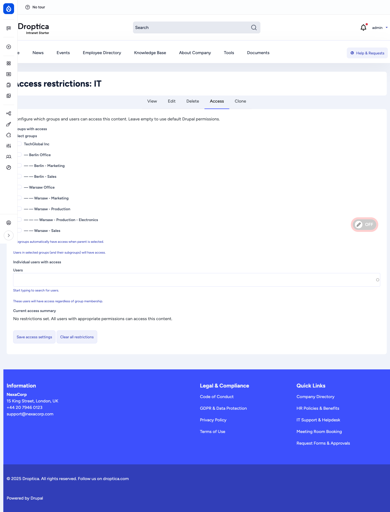
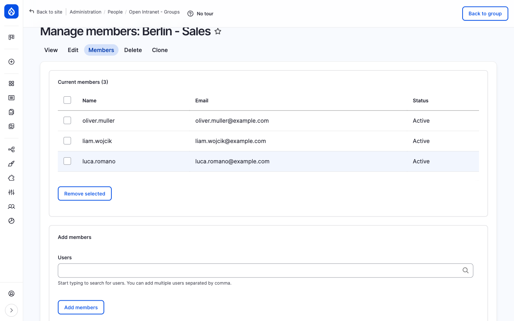

This page covers the administration side of the document library: enabling cloud sources, configuring per-folder and per-document access restrictions, managing the **groups** that drive those restrictions, and the full permissions reference. The end-user side (browsing, uploading, searching, sharing) is covered in [User guide → Document Management](/docs/user-guide/documents/).

The document library is provided by two cooperating modules:

- **`openintranet_documents`** — the folder/document entities, the `/documents` browser, the source plugins (local file + Google Drive / OneDrive / Dropbox / Box.com), the upload form, the revision UI and the **Settings** page.
- **`openintranet_access`** — the **OI Group** entity (with hierarchy and memberships), the per-entity **Access** tab on documents, folders and selected node types, the access checker, and its **Settings** page. This module is optional but ships enabled in the default install.

Both have their own permissions, their own settings page and their own admin URLs. They are documented together here because in practice you configure them as a single feature.

## Mental model

Think of the system in three layers:

1. **What can be uploaded** — controlled by the **Documents settings** page. Which sources (local file, Google Drive, etc.) are available, what the default is, what the maximum local file size is.
2. **What can be restricted** — controlled by the **Access settings** page. Which entity types are eligible for per-item access control (documents, folders, plus selected node bundles like *News article*, *Knowledge Base Page*, *Event*…) and the global behaviour rules (does the owner always have access? do documents inherit folder restrictions?).
3. **The actual restrictions** — set per item via the **Access** tab on each document, folder or node. This is where you say *"this folder is for the Berlin Office only"* or *"this document is also visible to sophie.dupont"*.

You can also manage the **groups** that the per-item restrictions reference: add/edit/delete groups, organise them in a hierarchy, add and remove members. That's done at **People → Open Intranet — Groups**.

## Enabling document sources

**Settings page:** **Configuration → Content authoring → Open Intranet — Documents** (`/admin/config/content/documents`).

The form has three controls:

| Setting | What it does |
| --- | --- |
| **Enabled Document Sources** | Checkbox per source plugin. **Upload Local File** is always enabled and cannot be disabled — it is the fallback. Tick **Add from Google Drive / Dropbox / OneDrive / Box** to expose those options in the **+ Add** menu of the document browser. |
| **Default Document Source** | Which source is pre-selected when a user opens the upload form via a non-source-specific link. |
| **Maximum file size (MB)** | Upload limit for **Upload Local File** (1 to 500 MB, default 50). Cloud sources are not affected — they only store URLs. |

When a user adds a document via a cloud source, Open Intranet does **not** copy the file content; it stores the sharing URL and renders the provider's own embed iframe. This means:

- The file must remain shared on the cloud provider — if the link breaks, the preview breaks.
- The intranet stores only the sharing URL plus the document's title, description and metadata; search indexes those fields. To also index the file *contents* of locally-uploaded files, install a content-extraction module like [Search API Attachments](https://www.drupal.org/project/search_api_attachments).
- Per-file access on the cloud provider is independent of intranet access. A document linked from Google Drive but shared as "Anyone with the link" is, in practice, accessible to anyone who can guess the URL.

If you want to disable a cloud source globally (no users should be able to add files from it), uncheck it here. Existing documents that already use that source remain accessible — only new uploads are blocked.

## Access control on folders and documents

The **Access** tab is the heart of per-item permissions. It lives on every folder, every document and every node whose content type is enabled in **Access settings** (next section).

URLs:
- Folder: `/documents/folder/{id}/access`
- Document: `/documents/document/{id}/access`
- Node: `/node/{nid}/openintranet-access`

You also reach it from the **Access** tab when viewing the folder/document, or via the **Manage access** quick action on the document detail page.

The form has two input sections plus a summary:

### Groups with access

A nested checkbox list of every **OI Group** defined on the site. Hierarchy is shown by indentation (`— Berlin Office`, `— — Berlin - Sales`). Tick a group to grant its members access; subgroups automatically inherit.

The inheritance rule is:

> If you tick *Warsaw Office*, every user who is a member of *Warsaw Office* **or** of any of its descendants — *Warsaw - Marketing*, *Warsaw - Sales*, *Warsaw - Production*, *Warsaw - Production - Electronics* — gets access.

This means you usually pick the **highest** group that should have access and let the hierarchy do the rest. There is no need to tick every leaf group separately.

### Individual users with access

A free-form autocomplete picker for users who should have access **regardless of their group memberships**. Useful for one-off exceptions — a contractor who needs to see a single document, or the project manager who isn't formally in the team but should still be in the loop.

Listed users are added to the access list **on top of** the group rules, not in place of them. Removing a user from the list does not remove them from any group they belong to.

### Current access summary

A short readout of how many groups and how many individual users currently grant access to this item, plus an approximate total of unique users (groups deduplicated against the individual list). Use this as a sanity check before saving.

### The two action buttons

- **Save access settings** — applies your changes. The item now has restrictions; everyone outside the listed groups and users (except the owner, if "Owner always has access" is on, and admins with bypass) will no longer see it.
- **Clear all restrictions** — removes all access records for this item in one click. The item falls back to standard intranet permissions and becomes visible to everyone with the *View* permission.

### What happens with no restrictions

A folder or document with **no groups and no users selected** is *unrestricted*. Standard Drupal/Open Intranet permissions apply — anyone with *View document* (granted to **Authenticated user** by default) can see it.

This is the default state for every new folder and every new document — restrictions are opt-in.

## Folder-to-document inheritance

If a folder has access restrictions and the **Documents inherit folder access** behaviour is on (it is by default — see [Access settings](#access-settings)), then every document inside that folder inherits the folder's restrictions automatically. You do not need to set the same groups on the folder *and* on each document inside.

A document can also have its **own** restrictions on top. The two combine as a **union** — a user gets access if they pass either set of rules. So:

- A folder restricted to *Finance*, with a document inside that has no restrictions of its own → the document is accessible to *Finance*.
- A folder restricted to *Finance*, with a document inside that adds *sophie.dupont* as an individual user → the document is accessible to *Finance* **and** to sophie.dupont.

This makes it easy to set policy at the folder level and add per-document exceptions when needed.

## Access settings

**Settings page:** **Configuration → People → Open Intranet Access settings** (`/admin/config/people/openintranet-access`).

The form has four fieldsets.

### Content types

Per-bundle checkboxes that control which **node types** get the **Access** tab. Out of the box, the recommended set (News article, Event, Knowledge Base Page, Basic page, Webform) is enabled. Leaving every box unchecked enables access control for *all* content types — which is rarely what you want; a deliberate selection is safer.

### Other entity types

Two toggles, one for **Documents** (`oi_document`), one for **Folders** (`oi_folder`). Both are on by default. Turning one off removes the **Access** tab from items of that type and disables enforcement for them — existing access records are kept in the database but ignored until you re-enable.

### Behavior

| Toggle | What it controls |
| --- | --- |
| **Owner always has access** | If on, the user who created the item (the *owner*) can always see it, even if they're not in any of the allowed groups and not in the individual users list. Recommended — prevents people from accidentally locking themselves out of their own files. |
| **Documents inherit folder access** | If on, documents inherit access restrictions from their parent folder (combined with the document's own restrictions as described above). This is the most common policy and is on by default. |

### User interface

| Toggle | What it controls |
| --- | --- |
| **Show access summary** | Show the **Current access summary** block on the Access form. |
| **Show inherited access** | Show inherited rules from parent folders on a document's Access form (so the editor sees *what they're inheriting* before adding their own rules). |

After changing **Content types**, Drupal asks you to rebuild node access permissions at `/admin/reports/status/rebuild`. Run that once after changing which bundles are covered, otherwise the new rules won't take effect on existing nodes.

## Managing groups

Groups (`oi_group` entities) are the unit of access control. They are not Drupal roles — they exist purely to model your organisation: companies, offices, departments, teams, project crews, distribution lists. Hierarchy is supported, so you can mirror your real org chart.

**Admin URL:** **People → Open Intranet — Groups** (`/admin/people/oi-groups`).

The list shows every group with its **Parent**, **Members** count, **Status** (Active / Inactive) and an **Edit** operation. Click **+ Add group** in the top right to create a new one. A group has just three real fields:

- **Name** (required)
- **Description** (optional)
- **Parent** (optional — pick another group to nest this one beneath it)

Plus an **Active** toggle (deactivate a group to remove it from the access pickers without losing memberships).

### Managing members

Click a group name, then the **Members** tab.

The page is in two parts:

- **Current members** — a checkboxed list with the user's name, email and account status. Tick one or more and click **Remove selected** to remove them from the group.
- **Add members** — an autocomplete that accepts a comma-separated list of usernames. Click **Add members** to add them all at once.

A user can belong to **any number of groups** — there is no limit. Membership in a group automatically grants access to anything restricted to that group **or** to any of its ancestors. So a user in *Warsaw - Sales* automatically passes access checks for *Warsaw Office* and *TechGlobal Inc* without being a member of those upper groups.

### Tab structure on a single group

Opening any group gives you five tabs:

| Tab | Purpose |
| --- | --- |
| **View** | Read-only summary — name, description, parent, status, member count. |
| **Edit** | Edit the name, description, parent and status. |
| **Members** | Add/remove members (the page above). |
| **Delete** | Remove the group. Confirms first. Deleting a group does not delete the users in it; it only removes the group definition. Items that were restricted to the deleted group fall back to the standard permissions for that orphaned access record (effectively become unrestricted unless other groups/users are also listed). |
| **Clone** | Duplicate the group definition (members are not copied). |

## How access is enforced (the rules engine)

When a user tries to view a folder, document or node, the access checker runs through this sequence:

1. **No restrictions on the item?** → Falls back to standard Drupal/Open Intranet permissions. End.
2. **User has the *Bypass access restrictions* permission?** → Allow. End.
3. **"Owner always has access" enabled and user is the owner?** → Allow. End.
4. **User is in the *Individual users with access* list for this item?** → Allow. End.
5. **User belongs to one of the *Groups with access* (or any of their descendants)?** → Allow. End.
6. **For documents, "Documents inherit folder access" is on, and the parent folder grants access?** → Allow. End.
7. Otherwise → **Deny**.

Notes on the consequences:

- A user who passes none of the rules sees a *Page not found* (404), not an *Access denied* (403). This is intentional — it doesn't reveal the existence of a restricted item.
- The check is per-item. A folder being unrestricted does not make its documents unrestricted: each document is checked separately (with the folder-inheritance step thrown in if enabled).
- Listings (the document browser, search results) are filtered automatically — restricted items disappear from the listing rather than appearing as "denied".

## Permissions reference

### `openintranet_documents`

| Permission | Default role(s) | Description |
| --- | --- | --- |
| **Administer documents** | Administrator | Full admin on documents (CRUD plus settings). Restricted access. |
| **Administer folders** | Administrator | Full admin on folders. Restricted access. |
| **View document** | Authenticated user | See documents in listings and on the detail page. |
| **View folder** | Authenticated user | Browse folders. |
| **Create document** | Content editor | Upload new documents (any source). |
| **Create folder** | Content editor | Create new folders. |
| **Edit document** | Content editor | Edit existing documents. |
| **Edit folder** | Content editor | Edit existing folders. |
| **Delete document** | Content editor | Remove documents. |
| **Delete folder** | Content editor | Remove folders (and their contents). |
| **Download document** | Authenticated user | Use the **Download** button — separate from view so you can let someone *see* a document but not get the file. |
| **View document revision** | Editorial roles | See the **Revisions** tab and old revisions. |
| **Revert document revision** | Editorial roles | Roll back to an older revision. |
| **Delete document revision** | Administrator | Permanently remove an old revision. |

### `openintranet_access`

| Permission | Default role(s) | Description |
| --- | --- | --- |
| **Administer Open Intranet Access** | Administrator | Open the Settings page, configure module behaviour. Restricted access. |
| **Administer groups** | Administrator | Full admin on groups (CRUD plus members). Restricted access. |
| **Manage groups** | Administrator | Create, edit and delete groups. Restricted access. |
| **Manage group members** | Administrator | Add/remove users from groups. Does not grant edit on the group itself. |
| **View groups** | (none by default) | See the groups list and group details — useful for read-only auditors. |
| **Bypass access restrictions** | Administrator | View every item regardless of restrictions. Restricted access — give this only to people who are allowed to see *everything*. |
| **Set entity access restrictions** | Administrator | Open the **Access** tab and modify groups/users on a folder, document or node. |

In a typical install, the **Administrator** role gets everything; **Content editor** gets the create/edit/delete on documents and folders but no group management and no access-restriction permission; **Authenticated user** can only browse, view, download and search.

## Operational tips

- **Plan groups before you restrict anything.** Build out the org-chart hierarchy first and add real members. Trying to set per-document restrictions on top of an empty groups table is painful.
- **Restrict at the folder level when you can.** With *Documents inherit folder access* on, you only have to set the rules once and they apply to every file added later. Per-document restrictions are best kept for exceptions.
- **Use the access summary as a sanity check.** *"Approximately 14 unique users have access"* is a quick way to spot a too-narrow or too-wide rule before you save.
- **Audit deletions.** Removing a group does not delete files — it just orphans the access records. Items restricted only to the deleted group can become unintentionally restricted (no rules pass) or unintentionally open, depending on your policy. Run an audit before deleting any group with more than a handful of items pointing at it.
- **Owner-always-has-access is your safety net.** If you're going to leave it on (recommended), make sure your editorial workflow doesn't rely on transferring ownership; reassigning a document to a different user reassigns the safety net too.
