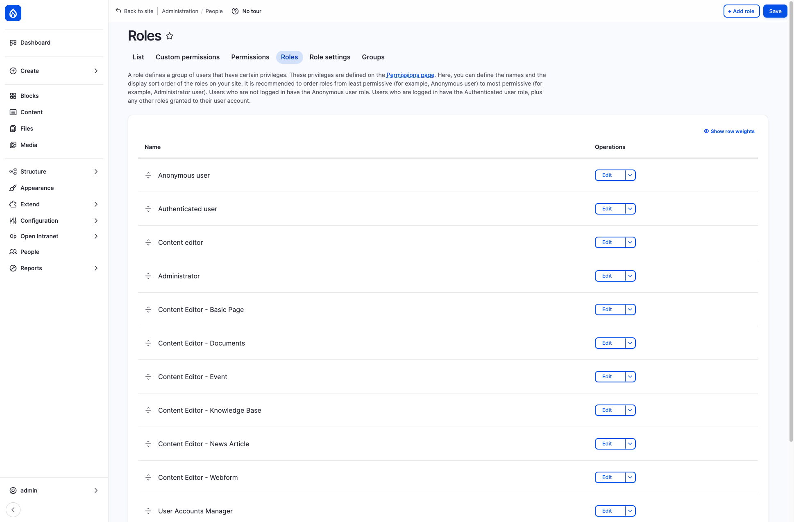
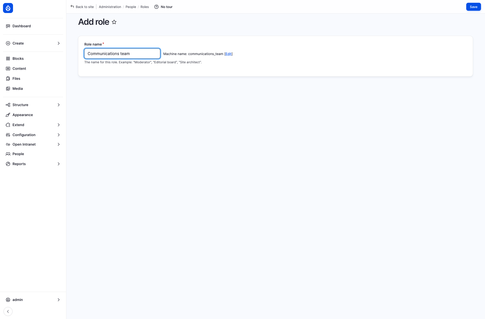
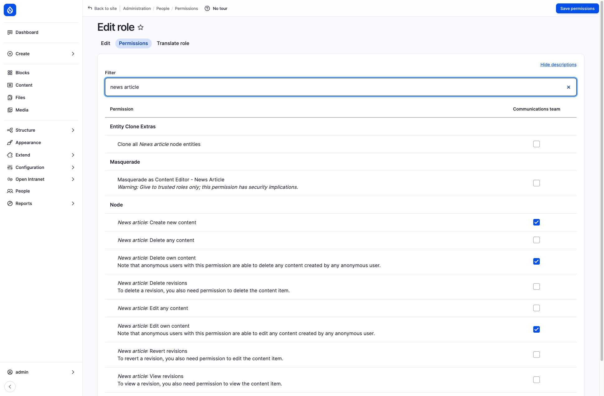
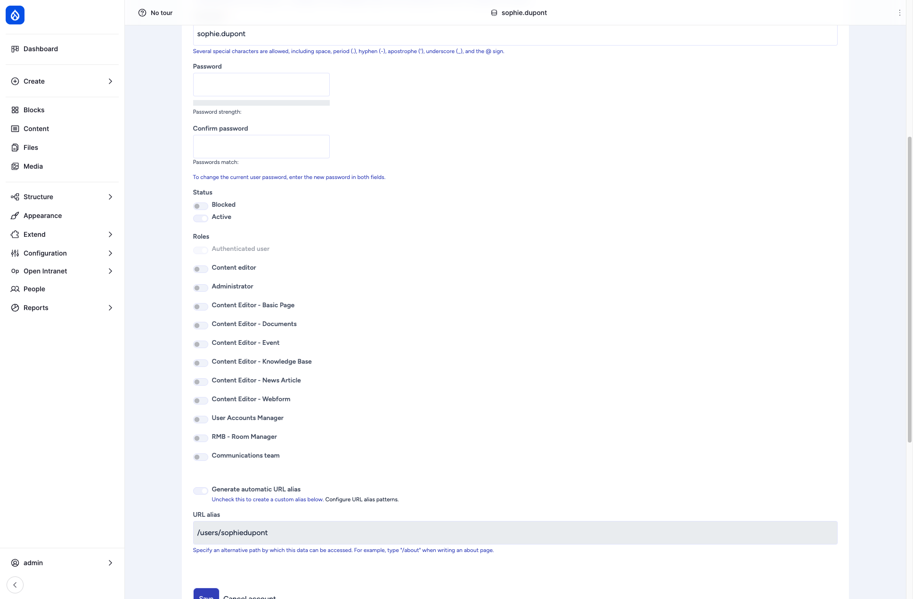
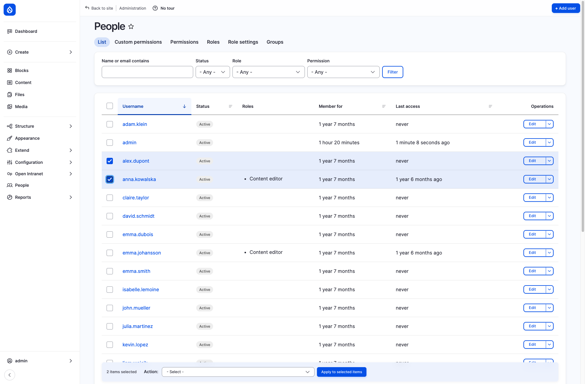

import { Steps } from '@astrojs/starlight/components';
import Audience from '../../../components/Audience.astro';

<Audience level="administrators" />

A **permission** is a single thing a user may do, such as *News article: Create new content*. A **role** is a named set of permissions. You never give permissions to a person directly: you give the person a role. This page shows how to add a role, change what it allows and hand it out. For what the roles in a stock install can do, see [Roles: what you can do](/docs/user-guide/roles/) and the [list of default roles](/docs/administration/users/#default-roles).

Roles answer *what people can do*. *Which restricted content they can see* is a separate question, answered by department groups. See [Access Control](/docs/features/access/).

## Where to find it

Open **People** in the administration sidebar (`/admin/people`). Besides the user **List**, it has these tabs:

| Tab | Address | What it is |
|---|---|---|
| **Roles** | `/admin/people/roles` | All roles. Add, rename, delete a role or open its permissions |
| **Permissions** | `/admin/people/permissions` | One big table with every permission and every role side by side |
| **Role settings** | `/admin/people/role-settings` | Choose the **Administrator role**: the role that is automatically granted all permissions |
| **Custom permissions** | `/admin/people/custom-permissions/list` | Extra permissions that control who can open certain administration pages |
| **Groups** | `/admin/openintranet/oi-groups` | Department groups, see [Access Control](/docs/features/access/) |

Each role has an **Edit** button and a menu next to it with **Edit permissions**, **Translate** and **Delete**.

## Add a role

<Steps>

1. Open **People → Roles** and click **Add role**.
2. Type a **Role name**, for example *Communications team*. The **Machine-readable name** (`communications_team`) is filled in for you.
3. Click **Save**. The new role appears in the list.
4. Give the role its permissions, as described next. Until you do, it adds nothing to what a logged-in user can already do.

</Steps>

## Set a role's permissions

<Steps>

1. On the **Roles** page open the menu next to the role's **Edit** button and choose **Edit permissions**. You land on `/admin/people/permissions/<machine name>`.
2. Type part of a permission name into **Filter**, for example *news article*, to show only matching permissions.
3. Tick the permissions the role should have. **Hide descriptions** makes the list shorter, but read the descriptions first: some permissions carry a warning such as *Give to trusted roles only*.
4. Click **Save permissions**.

</Steps>

### Example: let a team publish news and events

For a *Communications team* role that may create news articles and events, and edit and delete only its own, tick:

| Area | Permissions |
|---|---|
| News article | Create new content, Edit own content, Delete own content |
| Event | Create new content, Edit own content, Delete own content |
| Reaching the editing screens | Use the toolbar, Access navigation bar, Use the administration pages, View the administration theme, Access the Content overview page |
| Writing and media | Use the Full HTML text format, Create media, Image: Create new media |

We tested this set: a user with only this role saw **News article** and **Event** in the **Create** menu (plus **Booking**, which every logged-in user can create when Room Booking is enabled) and could open both forms, while **Basic page** and **Knowledge Base Page** answered *Access denied*.

*Edit own* lets people change only what they created. Add *Edit any content* and *Delete any content* to let them change everything of that type.

:::tip
The quickest way to build a role is to copy an existing one. Open the permissions of the closest default role, for example *Content Editor - News Article*, next to your new role and tick the same boxes.
:::

## Give a role to users

**One user:** open **People**, click **Edit** next to the user, open the **Account** tab and switch on the role under **Roles**. Save.

**Many users at once:** on the **People** list tick the users. A bar appears at the bottom. Choose an **Action** such as *Add the Communications team role to the selected user(s)* (there is a matching *Remove the ... role from the selected user(s)*) and click **Apply to selected items**.

The **People** list can also be filtered by **Role** and by **Permission**. The permission filter answers *who can do this?* in one click.

## Rename or delete a role

On the **Roles** page, **Edit** changes the role name and the **Delete** item in the menu next to it removes the role after a confirmation. People keep their accounts but lose what the role gave them.

## Who can manage roles

Managing roles takes two kinds of permission:

- **Administer roles and permissions**, which allows changing roles and their permissions.
- Three custom permissions that open the administration pages: **Access admin people roles**, **Access admin people permissions** and **Access admin people role-settings**. You see them on the **Custom permissions** tab.

In a stock install only the **Administrator** role has the custom permissions. The **User Accounts Manager** role has *Administer roles and permissions*, because without it nobody can give roles to users. When we tested a user with only that role:

- The **Account** tab of any user showed the **Roles** toggles, including **Administrator**, and the **People** list offered the bulk action *Add the Administrator role to the selected user(s)*. So this user can make anyone, including themselves, an administrator.
- The **Roles** and **Permissions** tabs were hidden, but the permissions page of any role, including Administrator, and the **Add role** form opened when typed into the address bar.

:::caution
Treat **User Accounts Manager** as an administrator-level role and give it only to people you would trust as administrators. To let account managers hand out only chosen roles, install the Role Delegation module (not included by default, see [User management](/docs/administration/users/#useful-contributed-modules-for-power-users)). It adds one permission per role (*Assign ... role*), after which you can remove *Administer roles and permissions* from the User Accounts Manager role.
:::

## Test a role

Changing permissions is easier to get right when you look at the result. Create a test user, give it the role and log in as that user. On sites with the Masquerade module (shipped with Open Intranet) an administrator can do the same without a password, see [Masquerade as another user](/docs/administration/users/#masquerade-as-another-user-debugging-permissions). Note that Masquerade adds a permission per role (`Masquerade as <role name>`) with a security warning: grant it only to trusted roles.

## Good practice

- Prefer several small roles to one big one. The default *Content Editor - ...* roles are examples of this.
- Keep the **Administrator** role for a few people and do everyday editing with an editor role.
- After a change, check the result with a test user, then use the **Permission** filter on the **People** list to see who is affected.
