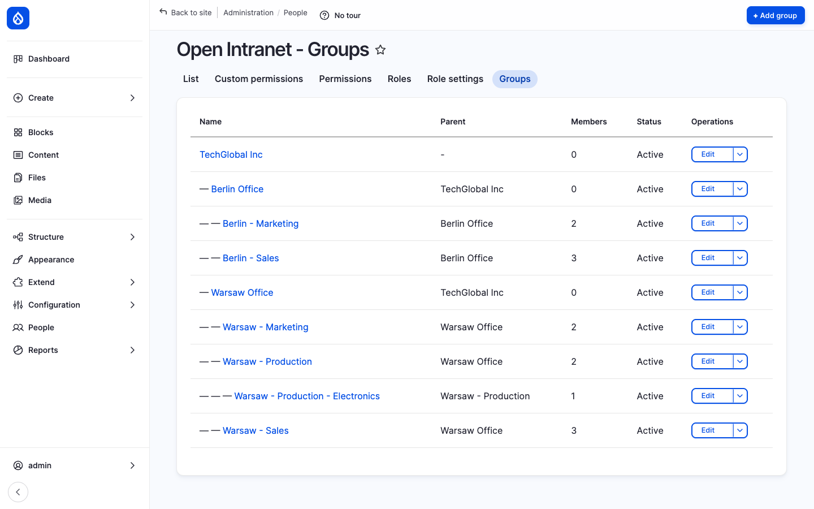
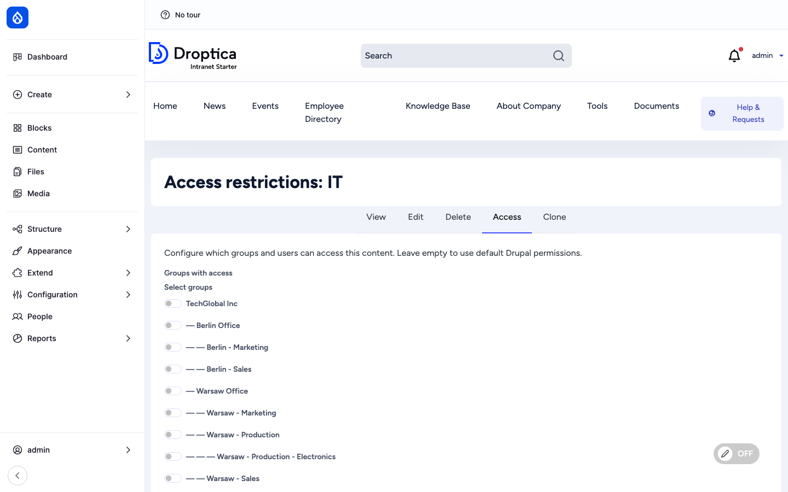
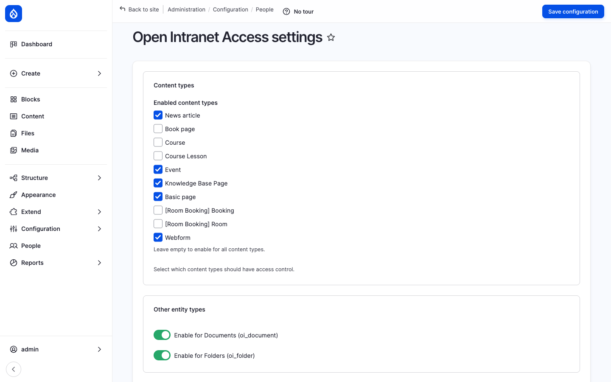

The **Access Control & Groups** layer (provided by `openintranet_access`) is what lets Open Intranet model a real organisation. Administrators define a tree of **OI Groups** — the company, its offices, the departments inside each office, the teams inside each department — and then any folder, document or selected node type can be restricted to one or more of those groups (or to specific users on top). Group hierarchy is enforced: granting access to *Berlin Office* automatically grants every team underneath without having to tick them one by one.



## What it is

`openintranet_access` adds three things to the platform:

1. **The `oi_group` content entity** — a hierarchical group with a name, description, parent group and status. Groups are full Drupal entities, with their own URL, permissions and Field UI.
2. **The Access form** — a single reusable form that adds an **Access** tab to every folder, document and any node type enabled in **Access settings**. Pick *which groups* and / or *which individual users* should see the item.
3. **An access checker service** — a runtime hook that filters listings (search results, folder browsers, related-content blocks) so restricted items disappear for users who do not pass the check.

The result is a flexible, plain-language permissions story: *"the Annual Report 2025 is restricted to Finance, with Sophie Dupont added as an exception"* — and that single sentence is enforceable everywhere on the site.

## Components

### The OI Group entity

Each group has:

| Field | Purpose |
| --- | --- |
| **Name** | Display name (e.g. *Berlin - Sales*). |
| **Description** | Optional free-form description. |
| **Parent** | Reference to another group. Empty for root groups. |
| **Status** | Active / inactive. Inactive groups stop granting access. |

The standard Drupal entity capabilities are all there — fields can be added through Field UI, view modes are configurable, revisions are supported.

### The group hierarchy

Groups form a tree. There is no limit on depth. The example below uses two levels of organisation under a single root:

```
TechGlobal Inc                      ← root
├── Berlin Office
│   ├── Berlin - Marketing
│   └── Berlin - Sales
└── Warsaw Office
    ├── Warsaw - Marketing
    ├── Warsaw - Production
    │   └── Warsaw - Production - Electronics
    └── Warsaw - Sales
```

Hierarchy is rendered in the admin list with indentation, and on the Access form as a nested checkbox tree.

The **inheritance rule** is:

> If you tick *Warsaw Office*, every user who is a member of *Warsaw Office* **or** of any of its descendants — *Warsaw - Marketing*, *Warsaw - Sales*, *Warsaw - Production*, *Warsaw - Production - Electronics* — gets access.

This means administrators usually pick the **highest** group that should have access and let the hierarchy do the rest. There is no need to tick every leaf group separately.

### The Access form

Every folder, document and Access-enabled node type has an **Access** tab:

- Folder: `/documents/folder/{id}/access`
- Document: `/documents/document/{id}/access`
- Node: `/node/{nid}/openintranet-access`

The form has two input sections plus a live summary:



- **Groups with access** — Nested checkbox list of every OI Group on the site. Hierarchy shown by indentation. Tick a group to grant its members access; subgroups automatically inherit through the rule above.
- **Individual users with access** — Free-form autocomplete picker for users who should have access *regardless of their group memberships*. Useful for one-off exceptions — a contractor who needs to see a single document, or the project manager who is not formally in the team but should still be in the loop.

Listed users are added **on top of** the group rules, not in place of them.

### Folder-to-document inheritance

Restrictions on a folder cascade to the documents inside it unless the document explicitly overrides them. So restricting the *Finance* folder is enough to restrict every document inside *Finance* — no need to set the Access tab on each file.

A document's effective access is therefore: **(group rules on the document)** ∪ **(group rules on the parent folder)** — read as a union. To loosen access for a specific document inside a restricted folder, just tick a wider group on that document's Access tab.

### Access settings

`/admin/config/people/openintranet-access` is where the administrator chooses **which entity bundles** get the Access tab.



Folders and documents are always Access-aware (they are the most common case). Node types (article, page, knowledge_base_page, event, etc.) are opt-in: tick a checkbox to add the **Access** tab to that type. Only ticked types have per-item restrictions.

This page also exposes the **bypass** options — which roles can see every item regardless of restrictions (typically only the *Administrator* role).

### Group membership management

Group membership is managed at `/admin/people/oi-groups/{id}/members`. The page has two halves: **Current members** (checkboxed list with Remove selected) and **Add members** (autocomplete that accepts a comma-separated list of usernames). A user can belong to **any number of groups** — there is no limit.

### Listing-level enforcement

Access is enforced **at the listing level**, not just on the entity page. That means restricted folders, documents and KB pages **disappear** from:

- The folder browser at `/documents`
- Search results
- Related-content blocks
- Recently-read lists
- Bookmark lists
- The KB sidebar tree

A user who lacks access never sees a "denied" message — for them the item simply does not exist. This is the right default for an intranet where leakage of *the existence* of a confidential file (e.g. a redundancy plan) can itself be sensitive.

The full administration walkthrough — bypass roles, audit logs, access-by-group reports — is on the [Documents administration](../../administration/documents) page.

### Access checker service

For programmatic use:

```php
$checker = \Drupal::service('openintranet_access.access_checker');

// Yes/no question:
$checker->canAccess($entity, $account); // bool

// Who has access to an entity?
$users = $checker->getAccessibleUsers($entity); // User[]

// Which entities can a user access?
$entities = $checker->getAccessibleEntities('oi_document', $account); // EntityInterface[]
```

This is the same service the runtime hook calls before rendering each listing.

## Integration with other features

- **Documents** — Folders and documents always have the Access tab. The full permissions story for the file library is on [Documents administration](../../administration/documents).
- **Knowledge Base** — KB pages have an opt-in Access tab; admin enables it from Access settings.
- **News, Events, Pages** — Any node type can be enabled for Access; once enabled it gets the per-item Access tab.
- **Search** — Restricted entities are filtered out of search results before they are rendered.
- **Recently Read & Bookmarks** — Both filter their lists through the access checker, so a user never sees a recent item or bookmark they no longer have access to.
- **Engagement scoring** — Engagement only counts events on entities the user actually accessed.
- **Messenger** — A future channel plugin can resolve recipients via OI Group membership (e.g. "all active users in *Berlin Office* and its descendants").

## Permissions

| Permission | Default role(s) |
| --- | --- |
| Administer OpenIntranet Access (settings page) | Administrator |
| View any group | Authenticated user |
| Manage group members | Administrator (and a dedicated *Group manager* role you can create) |
| Set entity access (use the Access tab on a folder / document / node) | Content editor + the entity's owner |
| Bypass OI Access checks (see everything) | Administrator |
| View user access info page | Administrator |

## Modules behind it

- `openintranet_access` — entity, services, Access form, checker
- Drupal core: `entity`, `field`, `views`, `user`
- [`flexible_permissions`](https://www.drupal.org/project/flexible_permissions) — granular permission scopes used by the bypass / set-access permissions

## Learn more

- [Documents administration](../../administration/documents) — the full permissions story applied to folders and documents
- [Documents](./documents) — the file library that uses this layer most heavily
- [Knowledge Base](./knowledge-base) — KB pages with opt-in per-page restrictions
- [Employee Directory](./employee-directory) — user profiles and the user model that backs group membership
