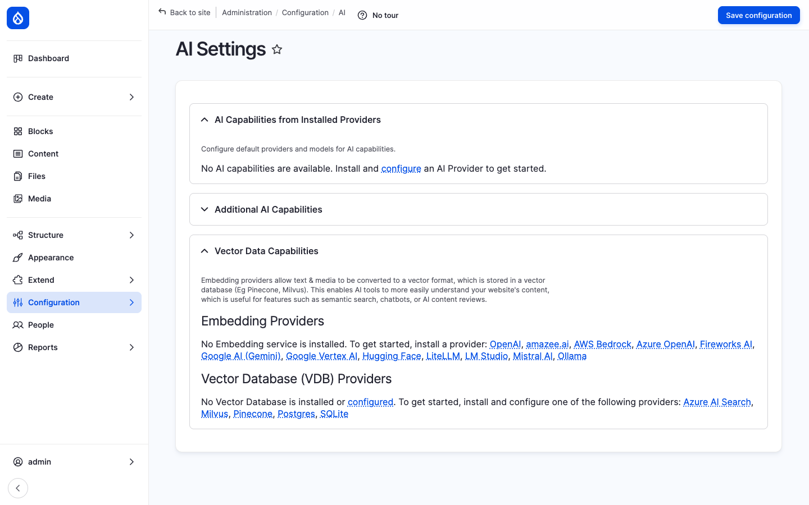
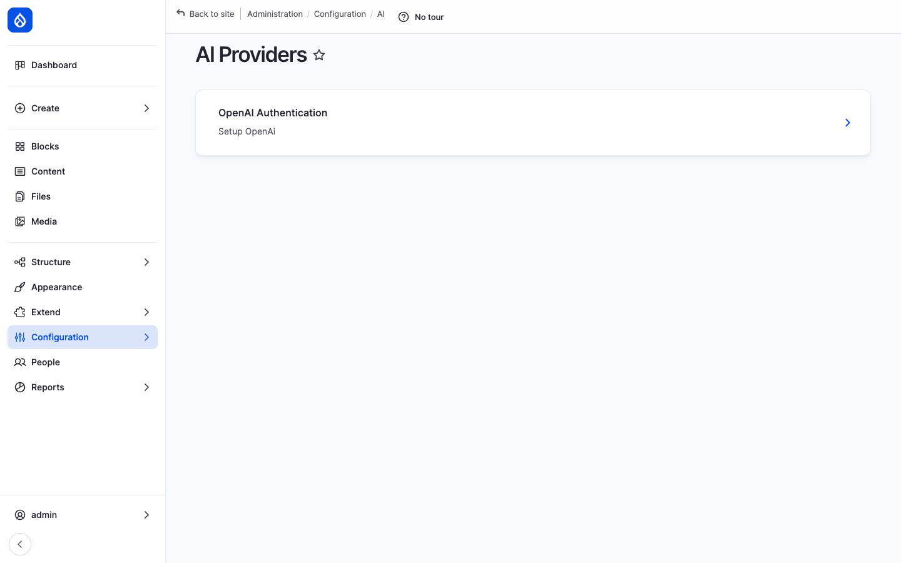

Open Intranet bundles the **Drupal AI** module suite (`drupal/ai`, `ai_ckeditor`, `ai_agents`, `ai_provider_openai`) which puts a small **AI** button on the CKEditor toolbar of every content form on the site — News, Pages, KB pages, Events, comments, even the Webform editor. Click it, pick what you want the model to do (*Improve writing*, *Translate*, *Summarise*, *Make shorter*, *Make longer*, *Generate image*, *Free-form prompt*) and the model rewrites or extends the current selection in place.

The provider is **pluggable** — out of the box the OpenAI provider ships, but the AI ecosystem includes 14+ provider modules covering OpenAI, Anthropic, Google Gemini, AWS Bedrock, Azure OpenAI, Mistral, Hugging Face, Ollama (self-hosted), LM Studio, LiteLLM, and others. The same toolbar button works regardless of which model is doing the actual work.



## What it is

The bundle has four layers:

1. **`drupal/ai` (core)** — The framework. Defines provider interfaces, a normalised request / response shape, a settings page, and a *capabilities* concept (chat, embeddings, image generation, speech-to-text, translate, classify).
2. **`drupal/ai_provider_openai`** — One concrete provider plugin (OpenAI). Other providers ship as their own modules (`ai_provider_anthropic`, `ai_provider_gemini`, `ai_provider_aws_bedrock`, …) and can be installed alongside.
3. **`drupal/ai_ckeditor`** — Adds the **AI** toolbar button to CKEditor 5 with a built-in palette of tasks (write, rewrite, translate, summarise, brainstorm, generate alt text).
4. **`drupal/ai_agents`** — A higher-level agent framework: declarative workflows that combine tool calls, multiple model invocations and Drupal entity operations (e.g. *summarise this article and post the summary as a comment*).

## Components

### Provider configuration

Providers live at `/admin/config/ai/providers`. Each installed provider plugin shows up as a row with its own settings form — typically an API key, an organisation ID, an optional base URL (for Azure / self-hosted endpoints), and the list of models the provider exposes.



A site can have **multiple providers** enabled at the same time — e.g. OpenAI for writing tasks, Hugging Face for embeddings, Ollama for an internal "private GPT" fallback. The mapping of *which provider serves which capability* is done on the **AI Settings** page.

### AI Settings: capability mapping

`/admin/config/ai/settings` is the central dispatcher. The page is split into three accordion sections:

- **AI Capabilities from Installed Providers** — for each capability (chat, embeddings, image, translate, …) the admin picks a default provider + model. Modules call `\Drupal::service('ai.provider')->createInstance($capability)` and get the configured one.
- **Additional AI Capabilities** — toggles for advanced features (function calling, streaming, structured output) that some providers support.
- **Vector Data Capabilities** — embedding-provider + vector-database pairing for semantic search and RAG. Supported embedding providers include OpenAI, amazee.ai, AWS Bedrock, Azure OpenAI, Fireworks AI, Google AI (Gemini), Google Vertex AI, Hugging Face, LiteLLM, LM Studio, Mistral AI and Ollama. Supported vector databases include Azure AI Search, Milvus, Pinecone, Postgres (pgvector) and SQLite.

The decoupling means a content editor never has to know which model is running — they always click the same AI button.

### CKEditor AI button

The `ai_ckeditor` module registers a CKEditor 5 plugin that adds a small **AI** button to the toolbar:

```
B  I  U  •  H1 H2 H3  •  Link  Image  Table  •  AI ✦  •  Source
```

Clicking it opens a dialog with **preset tasks**:

| Task | What it does |
| --- | --- |
| **Improve writing** | Polishes grammar / style of the selected text. |
| **Make shorter** | Condenses the selection. |
| **Make longer** | Expands / elaborates the selection. |
| **Translate** | Translates to a chosen language. |
| **Summarise** | Replaces the selection with a 1–3 sentence summary. |
| **Brainstorm** | Lists ideas / bullet points. |
| **Generate image** | Inserts an AI-generated image (uses the configured image-generation capability). |
| **Generate alt text** | Reads an embedded image and writes its `alt` attribute. |
| **Free-form prompt** | Custom prompt with the selection as context. |

Output appears in a side panel for **Accept / Discard** review — it never overwrites the text without the editor confirming.

The button respects the editor's CSS / theme — the dialog inherits the site's design tokens, so it looks native rather than pasted-in.

### Per-text-format configuration

The AI button is enabled / disabled per **text format** at `/admin/config/content/formats`. Editors only see it on formats where the admin has added the plugin to the toolbar. For example: enabled on *Full HTML* (used by News / Pages / KB), but disabled on *Plain text* (used by some webform fields).

The list of preset tasks is also configurable per text format — site builders can hide tasks that do not fit a particular use-case, or add custom prompt presets ("*write a corporate-tone replacement for this paragraph*", "*translate to Polish formal*").

### AI Agents

`drupal/ai_agents` adds an *agent* concept on top: a YAML-defined workflow that orchestrates multiple model calls and Drupal API calls. Examples that ship with the module include:

- **Article summariser** — Takes a long News article, asks the model for a 3-sentence summary, writes the result into the article's `field_intro` and saves a new revision.
- **Comment moderator** — When a comment is posted, asks the model whether it is spam / toxic, and unpublishes it if the score is high.
- **Translation agent** — Translates a content item end-to-end (calls the translate capability, copies fields, generates per-language URL aliases).

Agents are plain YAML configuration; they can be created from the UI, exported to a module and version-controlled.

### Function calling and tool use

For providers that support function calling (OpenAI, Anthropic, Mistral), the AI module exposes Drupal functions as **tools**. An agent can ask the model "*find me 5 News articles about onboarding*" and the model will invoke the registered `search_content` tool with its own arguments, get the result back, and continue the conversation.

This is the foundation for in-app **chatbots** that can answer questions about *the actual data on this intranet* rather than generic web knowledge.

### Vector search (RAG)

When the *Vector Data Capabilities* are configured, every save of a configured content type also writes embeddings to the vector database. Searches can then be **semantic** — *"performance review process"* matches an article titled *"Annual review cycle"* even though no keyword overlaps.

Combined with **AI Agents** this enables a private chatbot ("*ask the intranet anything*") that retrieves the most-relevant company documents, feeds them as context, and answers with citations.

## Integration with other features

- **News, Pages, KB, Events, Comments, Webforms** — Every CKEditor instance can have the AI button. Same plugin, same configuration, no per-bundle setup.
- **Multilingual** — The translate task feeds the multilingual workflow. An agent can pre-translate an article into every enabled language.
- **Search** — Vector embeddings can re-rank standard Search API results, or replace them with a semantic search view.
- **Messenger** — A future agent can draft a Messenger broadcast from a brief admin prompt ("*tell the Berlin office about the new IT policy*"), pre-fill the recipient list and the message body.
- **Engagement scoring** — An agent can summarise *what's been engaging this week* into the homepage block.

## Permissions

| Permission | Default role(s) |
| --- | --- |
| Use AI features in CKEditor | Authenticated user (configurable per format) |
| Administer AI providers | Administrator |
| Administer AI settings | Administrator |
| Use AI Agents | Administrator |
| Configure AI Agents | Administrator |

## Modules behind it

- [AI](https://www.drupal.org/project/ai) — core framework, provider interface, settings dispatcher
- [AI CKEditor](https://www.drupal.org/project/ai_ckeditor) — the toolbar button + preset tasks
- [AI Agents](https://www.drupal.org/project/ai_agents) — declarative agent workflows
- [AI Provider OpenAI](https://www.drupal.org/project/ai_provider_openai) — bundled provider
- Other provider plugins (install on demand): `ai_provider_anthropic`, `ai_provider_gemini`, `ai_provider_aws_bedrock`, `ai_provider_mistral`, `ai_provider_huggingface`, `ai_provider_ollama`, `ai_provider_litellm`, …

## Learn more

- [Drupal AI ecosystem on drupal.org](https://www.drupal.org/project/ai)
- [News and Articles](./news), [Knowledge Base](./knowledge-base), [Pages](./pages) — heaviest users of the CKEditor AI button
- [Multilingual](./multilingual) — pairs naturally with the translate task
- [Search](./search) — what RAG / vector search re-ranks
