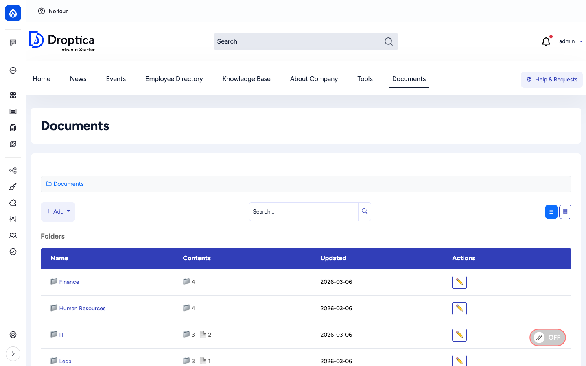
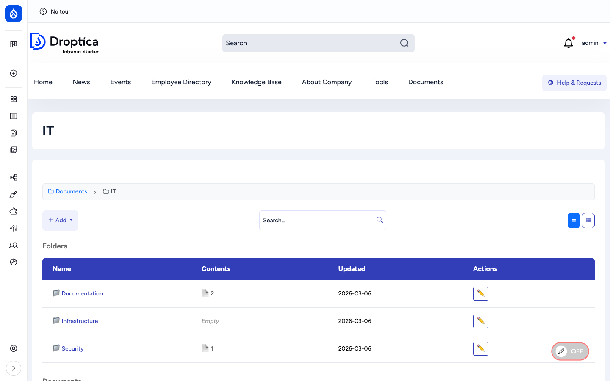
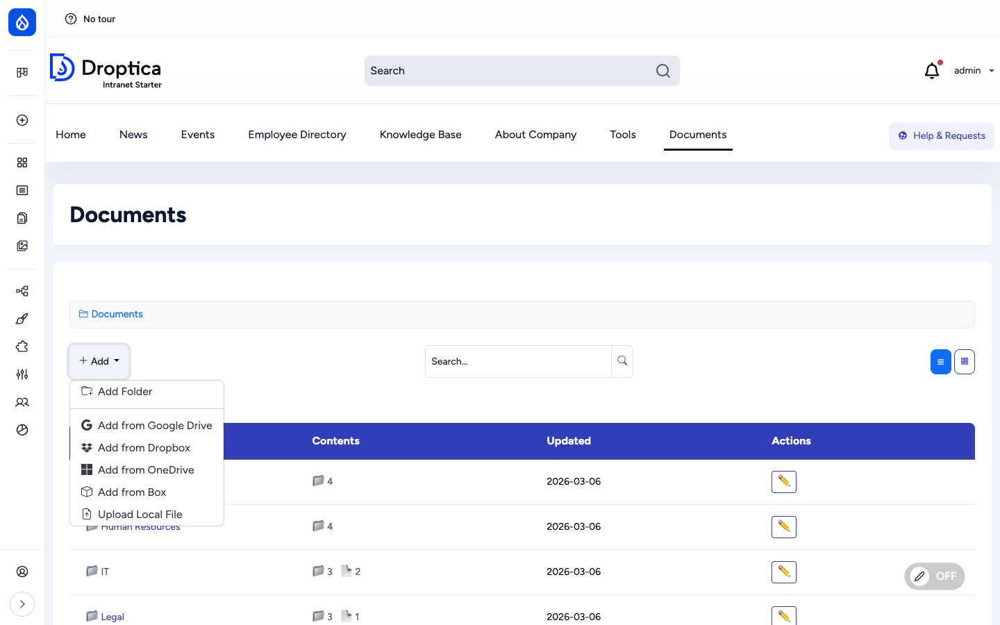
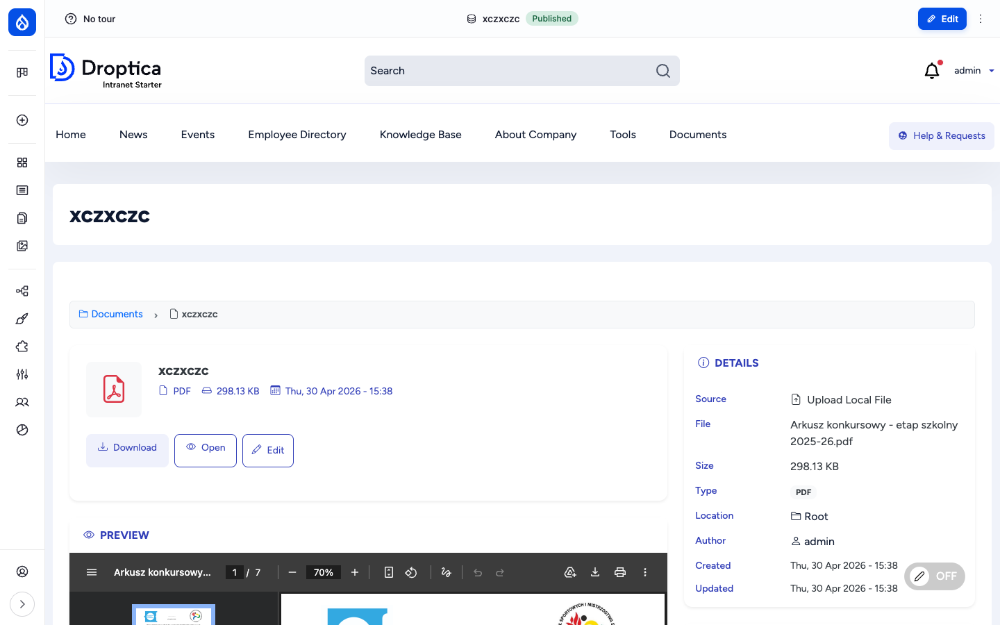

The **Documents** section is the company-wide file library. Editors organise files in a tree of folders and either upload them locally or link them from the four supported cloud sources (Google Drive, OneDrive, Dropbox, Box). Every file gets its own detail page with metadata, download, open and edit actions and an in-browser preview for the formats that support it (images, PDFs, every cloud-provider preview iframe). Per-folder and per-document access control is built in.

## What it is

Documents is built on two custom content entities provided by the `openintranet_documents` module:

- `oi_folder` — a hierarchical container with a name, optional description and a parent folder. Folders can nest indefinitely.
- `oi_document` — a file (local or remote) attached to a folder, with a title, description, source plugin and source-specific data (a file reference for local uploads, a URL for cloud sources).

Together they form a virtual file system at `/documents`, with each folder and each file having a stable URL and a stable ID. Both entities are full Drupal entities, so they support fields, view modes, revisions, search indexing, access control and theming.

## Components

### The folder browser

`/documents` is the entry point. It shows the current folder's contents in two sections — a **Folders** table on top and a **Documents** table below — plus the breadcrumb at the top, a folder-aware search box, and toggle buttons for grid vs. list view.

The browser supports two display modes:

- **List view** — table with Name, Contents (subfolder count + document count), Updated date and Actions.
- **Grid view** — card layout with thumbnails / icons.

Subfolders nest visually through the breadcrumb, which is always rooted at **Documents**.

### Adding folders and documents

The blue **+ Add** button opens a dropdown with all six options. Six because **Upload Local File** is always available and the four cloud sources can each be enabled independently in **Documents settings**:

- **Add Folder** — opens a modal to create a subfolder of the currently-viewed folder (or a top-level folder if you are at `/documents`).
- **Upload Local File** — file uploaded into Drupal's private file system.
- **Add from Google Drive** — picker that lets you pick any file you can access in Google Drive; the intranet stores the sharing URL and renders the Google preview.
- **Add from OneDrive** — same model, against Microsoft 365 / OneDrive.
- **Add from Dropbox** — same model, against Dropbox.
- **Add from Box** — same model, against Box.com.

For cloud sources Open Intranet does **not** copy the file content — it stores the sharing URL and lets the cloud provider serve and preview the file. This keeps the source of truth in the cloud and the intranet's database small.

### The document detail page

Opening a document takes you to `/documents/document/{id}`. The page is built around four blocks:

- **Header card** — file icon, title, file format, size and updated date, with three primary actions: **Download**, **Open** (cloud sources) and **Edit**.
- **Details panel** (right side) — Source plugin, original filename, size, type, parent folder location, author, created and updated timestamps.
- **Preview** — an embedded viewer that adapts to the file type:
  - **Images** (`.jpg`, `.png`, `.gif`, `.webp`) — rendered inline.
  - **PDFs** — embedded PDF viewer with zoom, page navigation, fit-to-width and download from inside the viewer.
  - **Google Drive / OneDrive / Dropbox / Box** files — provider's own preview iframe.
  - **Other types** (Word, Excel, ZIP, etc.) — only the download / open buttons are shown.
- **Actions** — Download, Open (in source), Edit (open the file metadata edit form).

### Folders and documents are full entities

Both `oi_folder` and `oi_document` have the standard Drupal entity capabilities:

- **Fields** — additional fields can be added through Field UI (`/admin/structure/oi-folder` and `/admin/structure/oi-document`).
- **View modes** — default, full, compact, search result.
- **Revisions** — every save creates a new revision; older revisions can be restored.
- **Tags / categories** — through additional taxonomy reference fields.
- **Translations** — when additional languages are enabled, the metadata can be translated.

### Search

The folder browser has its own search box at the top, scoped to documents and folders. There is also a global search at `/documents/search` and the site-wide search at `/search` (which includes documents in the cross-content index).

Search covers the title, description and original filename of every document. Folders that match by name are also returned and listed at the top of the results. To also index the *content* of files (the words inside a PDF, Word document, etc.), install the [Search API Attachments](https://www.drupal.org/project/search_api_attachments) module.

### Sharing and access control

Every folder and every document has an **Access** tab (`/documents/folder/{id}/access`, `/documents/document/{id}/access`). On that tab a content owner or admin can grant access to:

- **OI Groups** — picked from a hierarchical checkbox list. Hierarchy is enforced: ticking *Berlin Office* automatically grants every descendant group (*Berlin Sales*, *Berlin Marketing*, etc.).
- **Individual users** — added on top of the group rules.

Folder restrictions are inherited by documents inside the folder unless the document overrides them.

The full administration story for groups, group hierarchy and access enforcement lives on the [Documents administration](../../administration/documents) page.

## Integration with other features

- **Access Control & Groups** — `openintranet_access` provides the per-item access form, the group hierarchy and the inheritance rules used by Documents. See [Access Control & Groups](./access).
- **News articles** — Articles can attach Document references via the `field_oi_document_ref` field, so the same file appears on the article and in the library without being uploaded twice.
- **Engagement scoring** — Document views and downloads feed the user's [Engagement](./engagement) RFV score.
- **Search** — Documents are indexed by the `default_index` Search API index alongside articles, pages, KB pages and users.
- **Must Read** — When [Must Read tracking](./must-read) is enabled on a content type that references documents, the reminder includes the attached files.

## Permissions

| Capability | Default role(s) |
| --- | --- |
| View `oi_folder` / `oi_document` | Authenticated user |
| Download `oi_document` | Authenticated user |
| Create folder / document | Content editor |
| Edit / delete own folder or document | Content editor |
| Edit / delete any folder or document | Administrator (or "bypass" permission) |
| Manage access on a folder / document | Administrator + the document owner |
| Configure document sources (`/admin/config/content/documents`) | Administrator |

## Modules behind it

- `openintranet_documents` — folders, documents, source plugins, the browser
- `openintranet_access` — group hierarchy, per-item access tab
- Drupal core: `file`, `image`, `media`, `views`, `path`
- [`pfdp`](https://www.drupal.org/project/private_files_download_permission) — permission-aware private-file downloads
- [`search_api`](https://www.drupal.org/project/search_api) — search indexing
- Source-plugin requirements (only for the sources you enable):
  - Google Drive — Google API credentials
  - OneDrive — Microsoft Graph credentials
  - Dropbox — Dropbox API credentials
  - Box — Box API credentials

## Learn more

- [How to use it](../../user-guide/documents) — step-by-step procedures for browsing, adding, editing, previewing and bookmarking documents
- [How to configure it](../../administration/documents) — admin configuration: enabling document sources, setting up groups, per-item access, the access settings page, full permissions reference
- [Access Control & Groups](./access) — the group hierarchy that powers Documents permissions
- [Must Read tracking](./must-read) — flag a document as required reading and report on who has read it
