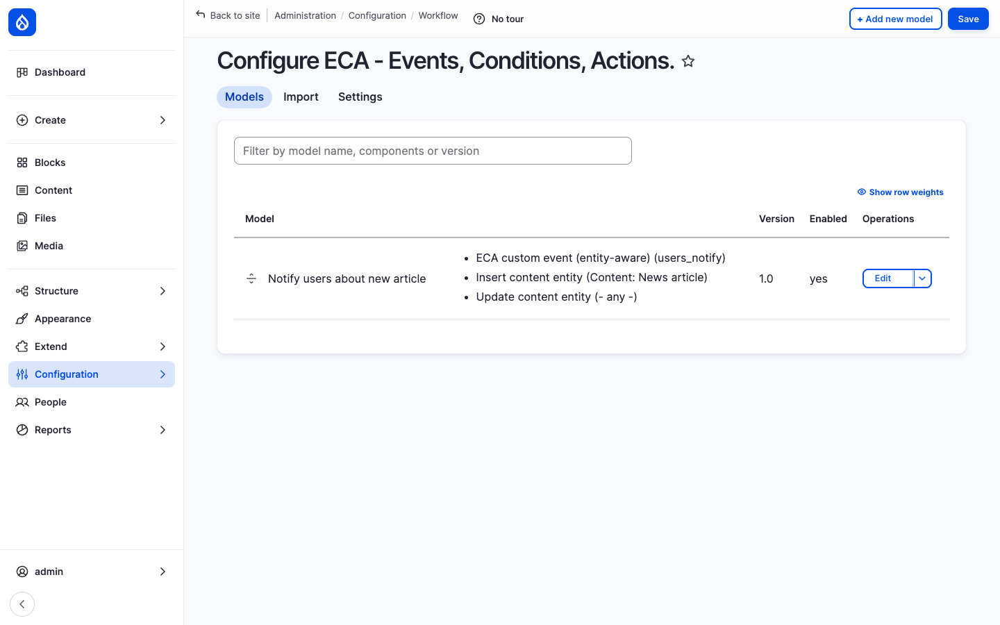

The [Events, Conditions, Actions (ECA)](https://www.drupal.org/project/eca) module is Open Intranet's **no-code workflow engine**. It lets administrators define automated behaviour for almost anything that happens on the site — *when a News article is published, send an email; when a comment is posted, check toxicity; when a webform is submitted, create a task and notify the manager* — using a graphical [BPMN.io](https://bpmn.io/) modeller. There is no PHP to write, no module to scaffold, no `.module` file to deploy.

ECA is what fills the gap between *out-of-the-box* and *custom development*. Anything a non-developer admin would have asked a Drupal developer to "*just add a quick hook*" for is now a 5-minute job in the modeller.

## What it is

ECA reverses the usual *write-code-to-extend-Drupal* contract: you draw a diagram on a canvas, the diagram becomes a serialised BPMN model, and the engine reads it at runtime to decide what to do. Every Drupal event (entity insert / update / delete, user login, cron, comment post, webform submission, route access, …) is exposed as a *start event*; every Drupal action (entity update, send email, set token, trigger another event, …) is exposed as a *task*; conditional gateways branch the flow.

The bundled [openintranet recipes](https://www.drupal.org/project/openintranet) ship a small set of ECA models that demonstrate the engine — for example, the **Notify users about new article** model below sends an email to all users when a News article is inserted or updated.

## Components

### The Models list

`/admin/config/workflow/eca` is the management page. Each model has:

- A **machine name** (`process_xxxxxxx` is the auto-generated default; admins can rename to something readable like `notify_new_article`).
- A **label** — the human-readable name that appears in the UI.
- A list of **components** — the events, conditions and actions the model uses (this gives a quick at-a-glance summary of what the model does).
- A **version** number — bumped manually each time the admin saves a meaningful change.
- An **Enabled** flag — disable a model without deleting it (useful for temporary turn-offs and A/B testing).

A search input at the top lets you filter models by name, component or version.

### The BPMN modeller

Clicking *Edit* on a model opens the **graphical canvas** powered by the BPMN.io library:

The toolbar on the left provides:

| Tool | Purpose |
| --- | --- |
| **Hand** | Pan the canvas. |
| **Lasso** | Multi-select. |
| **Connection** | Draw a sequence flow between two elements. |
| **Activity** (rounded rectangle) | A task — *do something*. |
| **Event** (circle) | An event — *something happens*. |
| **Gateway** (diamond) | A condition / branch. |
| **Annotation** | Free-form note attached to an element. |

The footer toolbar covers zoom, fit-to-screen, search, undo / redo, and import / export of the underlying BPMN XML — useful for sharing models between sites or version-controlling them in code.

### Events — *what triggers the flow*

ECA exposes **200+ events** out of the box, grouped into:

- **Entity** events — `Insert content entity`, `Update content entity`, `Delete content entity`, `Entity presave`, `Entity translation insert`, …
- **User** events — `User login`, `User logout`, `User register`, `User update`, `User cancel`, …
- **System** events — `Cron`, `Form alter`, `Route access`, `Theme negotiate`, `Mail send`, …
- **Custom** events — admins can declare their own *named* events (e.g. `users_notify`), then `Trigger a custom event` from elsewhere — the canonical pub-sub pattern, in BPMN.
- **Module-specific** events — Webform (`Webform submit`), Comment (`Comment insert`), Group (`Group membership change`), Path (`Alias create`), …

Each event carries the related entities into the flow so subsequent tasks / conditions can read its title, body, author, and so on.

### Conditions — *should the flow continue?*

ECA exposes **200+ conditions** that gate sequence flows:

- **Entity** — `Entity has bundle`, `Entity is published`, `Entity has field value`, `Entity is new`, …
- **User** — `User has role`, `User is owner`, `User has permission`, `User is active`, …
- **Field comparison** — `Entity: compare field value` (used in the screenshot above), `Token: compare values`, `Token: matches regex`, …
- **Time** — `Time is between`, `Day of week is`, `Cron has not run for N hours`, …
- **System** — `Module is enabled`, `Path is`, `Language is`, `Page is admin`, …

Conditions plug into BPMN **gateways** — diamonds — which then branch the sequence flow into *yes / no* paths.

### Actions — *what to do*

ECA exposes **400+ actions** — every Drupal action plus dozens of ECA-only ones:

- **Entity** — Create entity, Update entity, Delete entity, Publish / unpublish, Set field value, Add to taxonomy, Save entity, Clone entity, …
- **Notifications** — Send email, Send Drupal message, Send chat message (Slack / Teams / Mattermost), Trigger another ECA event, …
- **HTTP** — POST / GET to remote URL, Read JSON response, Parse XML, …
- **Tokens** — Set token, Concatenate tokens, Read token from entity, …
- **Views** — Execute view, Read view results into a token (used in the screenshot above), …
- **Files** — Read file, Write file, Move file, …
- **Workflow** — Set moderation state, Apply workflow transition, …
- **Maths** — Increment counter, Compare numbers, …
- **Custom** — A site builder can register their own action with a `#[Action]` attribute and it appears in the ECA palette automatically.

### Sequence flows

Tasks, events and gateways are connected by **arrows** (sequence flows). Each arrow can have a label (shown in the screenshot — *Entity: compare field value*) which is the *condition* that must be true for the flow to follow that path.

Multiple arrows can leave the same gateway — the labels distinguish which path runs in which case (e.g. `Entity: is published` → branch A, `else` → branch B).

### Save, version, archive, recipe

The toolbar at the top right of the editor provides:

- **+ Translate** — Translate the model's labels into other languages (so the same model serves a multilingual site).
- **Save** — Persist the BPMN diagram to config storage.
- **Archive** — Snapshot the current model into a versioned archive.
- **Recipe** — Export the model as a Drupal recipe (so it can be redeployed on another site, version-controlled, or shared with the community).
- **Tokens** — Show the available token tree (entity fields, system tokens, user tokens, etc.) for use in action settings.

### Sub-processes

Complex flows can be split into **sub-processes** — a single rounded rectangle that opens its own sub-canvas when double-clicked. A sub-process can be **called** from any other model, so common patterns (e.g. *send the standard "your request is being reviewed" email*) become reusable.

### Tokens everywhere

Every action's settings form (subject of an email, body of a chat message, value to write to a field, URL to call) accepts Drupal **tokens** — `[node:title]`, `[user:mail]`, `[site:name]`, `[current-date:long]`, plus ECA-specific tokens (`[event:entity]`, `[event:trigger]`, `[arg:0]`). The token browser is available everywhere a setting accepts text input.

## Real-world examples

| Model | What it does |
| --- | --- |
| **Notify users about new article** (bundled) | When a News article is inserted or its `notify_all_users_about_new` flag is set, query all active users via a view, set the recipient token, and send an email to each one. |
| **Auto-archive stale events** | Every night, find events older than 90 days and unpublish them. |
| **Comment moderation** | When a comment is posted, send it to a moderation queue if the author has fewer than 5 approved comments. |
| **Onboarding workflow** | When a user is created, set their default groups, send a welcome email, schedule a 7-day-follow-up email. |
| **Approval workflow** | When a Page is saved, route to the manager for approval based on the editor's department. |
| **External integration** | When a webform is submitted, POST the data to Slack / Salesforce / ServiceNow / Jira. |
| **Engagement nudge** | When a Must Read item is unread for >7 days, send a reminder. |

These are all *YAML-only* — no module, no `.php` file, no deploy.

## Integration with other features

- **News, Pages, KB, Events, Documents, Comments** — every entity event hooks into ECA. Common patterns: notify on publish, auto-tag, route to approval.
- **Webforms** — `Webform submit` is an ECA event; submissions can fire any flow.
- **Messenger** — ECA actions can call the Messenger broadcast service, so a workflow like *"new HR policy → notify all of office X"* is a 3-node BPMN diagram.
- **AI assistant** — ECA can call the AI module's *generate* action — useful for *summarise on save*, *translate on save*, *generate alt text on image upload*.
- **Multilingual** — Models can be translated; tokens resolve in the active language.
- **Access Control & Groups** — Conditions can read group membership; actions can change it. Workflows like *"add the user to the Berlin group when their office is set to Berlin"* are trivial.
- **Recipes** — Any model can be exported as a recipe and shipped with a custom module / site.
- **Backup & Migrate** — The whole ECA configuration is part of the standard config export, so it backs up with the rest of the site.

## Permissions

| Permission | Default role(s) |
| --- | --- |
| Administer ECA models (create / edit / delete / save) | Administrator |
| View ECA models (read-only) | Administrator |
| Use the BPMN.io editor | Administrator |
| Trigger custom ECA events from a controller | Configurable (depends on the event's exposed permission) |

ECA models themselves run with the **same permissions as the user that triggered the start event** (or as the cron user when the event is a cron event), so an action will not bypass Drupal's normal access checks unless the admin explicitly sets the model to *run as administrator*.

## Modules behind it

- [ECA — Events, Conditions, Actions](https://www.drupal.org/project/eca) — the engine, the action catalogue, the conditions catalogue
- [BPMN.io](https://www.drupal.org/project/bpmn_io) — the JavaScript modeller wrapped in a Drupal module
- ECA sub-modules: `eca_base`, `eca_content`, `eca_user`, `eca_form`, `eca_views`, `eca_workflow`, `eca_misc`, `eca_log` — each adds events / actions / conditions for one Drupal subsystem (install only those you need)

## Learn more

- [News and Articles](./news) — heaviest user of ECA in the bundle (notify-on-publish)
- [Messenger](./messenger) — the natural action target for cross-channel notifications
- [Webforms](./webforms) — submissions are first-class ECA events
- [AI Assistant in CKEditor](./ai-assistant) — combine with ECA for *summarise / translate on save* automation
- [ECA module on drupal.org](https://www.drupal.org/project/eca) — the full event / condition / action catalogue
- [BPMN.io](https://bpmn.io/) — the underlying open-source BPMN modeller
