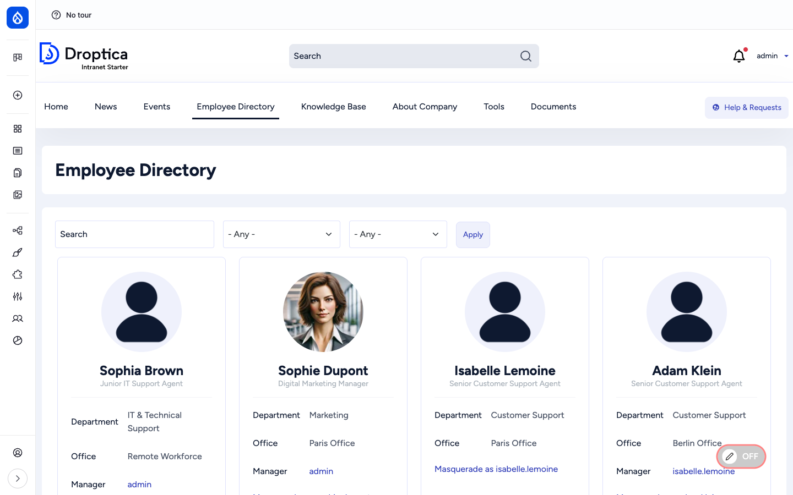
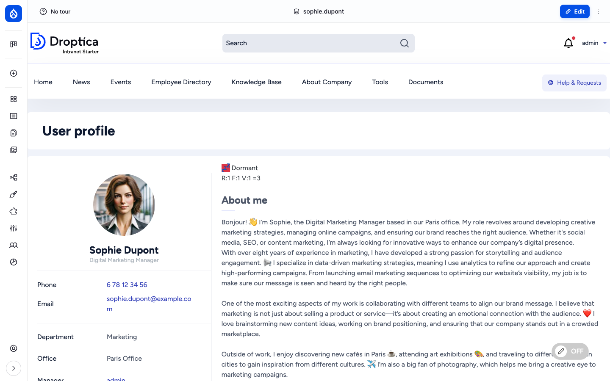
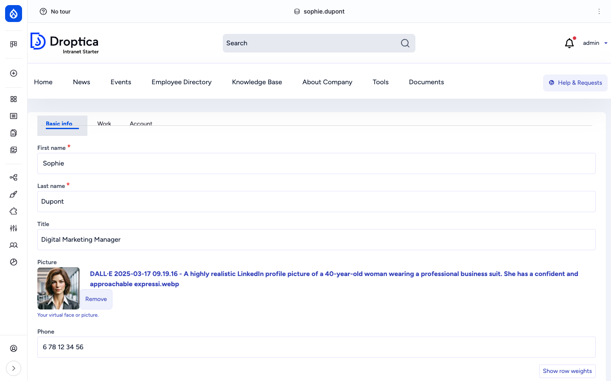

The **Employee Directory** is the human side of the intranet. Every employee has a rich user profile with a photo, job title, department, office, manager, contact information, social links and a free-form **About me** section. The directory at `/employee-directory` lists everyone as searchable cards that can be filtered by department, office and free-text query.

## What it is

User profiles are built directly on Drupal's core `user` entity. Open Intranet adds ten custom fields on top of the core user (name, email, password) so that every authenticated user becomes a fully-fledged employee record. The directory itself is a Drupal view (`employee_directory`) rendered as a card grid with three filter facets — search, department, office.

The same set of profile fields is exposed through several **view modes** so that the user can be rendered differently in different contexts: a compact teaser in the directory, a small avatar+name combo in comment threads, a search-result card in search results, a full profile on `/user/{id}`, an embedded card on author bylines, and a full edit form at `/user/{id}/edit`.

## Components

### The user fields

Open Intranet ships the following custom user fields on top of the core user entity:

| Field | Type | Purpose |
| --- | --- | --- |
| **First name** (`field_first_name`, required) | Plain text | Given name. |
| **Last name** (`field_last_name`, required) | Plain text | Family name. |
| **Display name** (`field_name`) | Plain text | Display variant, used when the formatted "First Last" is not what you want. |
| **About me** (`field_about`) | Long string | Free-form bio shown on the profile page. |
| **Department** (`field_department`) | Taxonomy reference | Department membership (Marketing, Engineering, IT & Technical Support, etc.). Used as a directory filter. |
| **Office** (`field_office`) | Taxonomy reference | Physical office (Paris, Berlin, London, Remote Workforce, etc.). Used as a directory filter. |
| **Manager** (`field_manager`) | User reference | Direct manager — clickable, links to the manager's profile. |
| **Phone** (`field_phone`) | Telephone | Phone number with `tel:` link. |
| **Social links** (`field_social_links`) | Link (multi-value) | LinkedIn, GitHub, Twitter, etc. — one row per platform. |
| **Profile picture** (`user_picture`) | Image | Avatar shown in the directory, profile, comments, author bylines, the toolbar. |

These fields are configurable through Field UI at `/admin/config/people/accounts/fields`. View modes are at `/admin/config/people/accounts/display`.

### The Employee Directory view

`/employee-directory` is a Drupal view in card grid mode. The exposed filters at the top are:

- **Search** — free-text against name, email and the About-me field.
- **Department** — dropdown of all values in the *Department* taxonomy.
- **Office** — dropdown of all values in the *Office* taxonomy.

The grid uses the `compact` user view mode and shows the photo, name, job title, Department, Office and Manager. Cards are clickable; clicking the name opens the full profile.

For users with the *Masquerade* permission, a **Masquerade as {username}** link is rendered on each card, so support / admins can quickly impersonate an employee for troubleshooting.

### The single profile page

`/user/{id}` (or `/user` for "my profile") renders the full user profile:

Key elements:

- **Left column** — large circular avatar, name, job title, then a contact card with Phone, Email, Department, Office and Manager (each clickable where applicable).
- **Main column** — the engagement segment label (e.g. *Dormant*, *At Risk*, *Champion*) and R / F / V scores, then the About me free-form bio with rich content.
- **Sidebar (right)** — the user's social links, recently-read items and bookmarks (subject to view permissions).

The profile page uses Layout Builder, so site builders can drag in additional blocks (recent activity, content authored by this user, contributions to specific groups, etc.) without code.

### View modes

The user entity has six view modes shipped with Open Intranet:

| View mode | Used in |
| --- | --- |
| `default` | Main profile page. |
| `compact` | Employee Directory card grid, mention picker. |
| `full_embedded` | Author byline on articles / pages. |
| `search_result` | Search results page when a user matches the query. |
| `user_profile` | Full standalone profile (the one most people see). |
| `user_profile_teaser` | Small-card variant for "people you might know" / mention search. |

Site builders can add or override view modes through Display modes UI.

### The user edit form

`/user/{id}/edit` is the standard Drupal user edit form, with the additional Open Intranet fields grouped together. The user themselves can edit their own profile; managers / admins can edit any profile.

Authentication-related fields (username, current password, email, password, language preference) are at the top; the Open Intranet fields (First name, Last name, Department, Office, Manager, Phone, About me, Social links, Profile picture) follow.

### Search

Users are indexed by the `default_index` Search API index. A search for a person's name, email or About-me content surfaces them as a search result with the `search_result` view mode (small avatar + name + role + Department + Office).

### URL pattern

Users keep the standard Drupal `/user/{id}` URL. The directory itself is at `/employee-directory`.

## Integration with other features

- **Engagement scoring** — The user profile shows the user's [Engagement](./engagement) segment and R/F/V scores. The reports at `/admin/reports/engagement` group users by department and office for cohort analysis.
- **Access Control & Groups** — Group membership is managed separately at `/admin/oi-group/{id}/members`, but the user's groups can be displayed on their profile through additional blocks.
- **Messenger** — The [Messenger](./messenger) module sends notifications to users by department, office, role, or individual selection — directly from the user fields documented here.
- **Comments** — The author of a comment is rendered with the `compact` user view mode (avatar + username).
- **Articles & Authors** — News articles, KB pages and other content show authors through the `full_embedded` view mode in the byline.
- **Search** — Users appear alongside articles, pages, KB and documents in the cross-content search.
- **Translations** — The interface (labels, field names) is translated, but profile data itself is per-user.
- **Frontend editing** — When enabled, users can edit their own profile fields in place from the profile page.

## Permissions

| Capability | Default role(s) |
| --- | --- |
| View user profiles (`access user profiles`) | Authenticated user |
| Edit own profile | Authenticated user |
| Edit any profile / change roles | Administrator |
| Masquerade as another user | Administrator (or a dedicated "Masquerade" role) |
| Configure user fields / display | Administrator |
| Register new accounts | Administrator only (default) — registration is admin-only out of the box |

## Modules behind it

- Drupal core: `user`, `views`, `image`, `taxonomy`, `path`, `layout_builder`
- [`address`](https://www.drupal.org/project/address) — postal address fields where used
- [`telephone`](https://www.drupal.org/project/telephone) — phone field with `tel:` link
- [`masquerade`](https://www.drupal.org/project/masquerade) — impersonation for support / admins
- [`views_organization_chart`](https://www.drupal.org/project/views_organization_chart) — org chart view (optional, configurable per site)
- `openintranet_engagement` — engagement segment + RFV score badge on the profile
- `openintranet_messenger` — sending notifications to selected users
- [`recently_read`](https://www.drupal.org/project/recently_read) — "recently read" block on the profile
- [`flag`](https://www.drupal.org/project/flag) — bookmarks block on the profile

## Learn more

- [How to use it](../../user-guide/employee-directory) — finding colleagues, viewing a profile, editing your own profile
- [User profile](../../user-guide/user-profile) — what your colleagues see when they look at your profile, and how to update it
- [How to administer users](../../administration/users) — admin tasks (creating users, role assignments, password policies, masquerade)
- [Engagement analytics](./engagement) — the segments and RFV scores shown on profiles
- [Messenger](./messenger) — broadcasting notifications based on department / office / role
