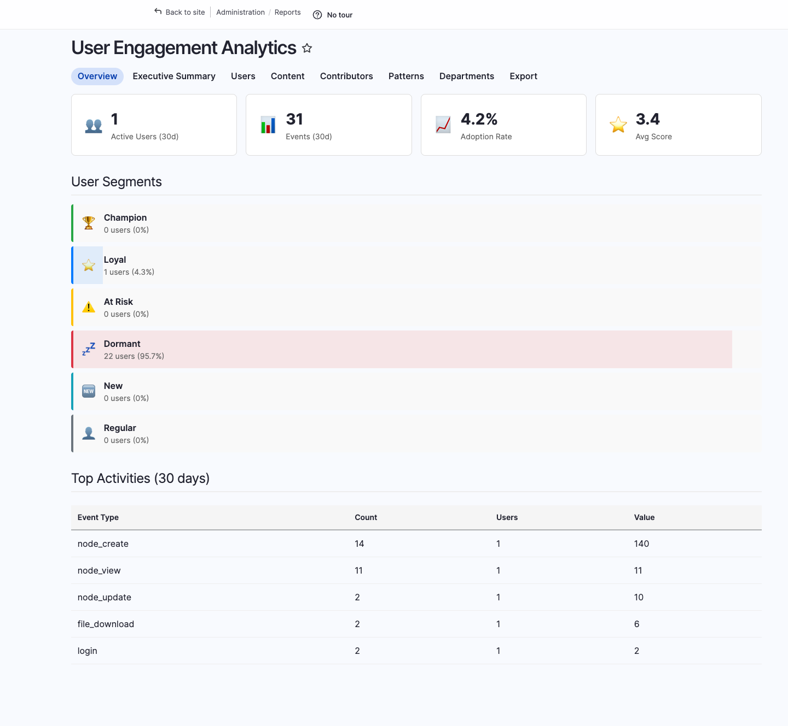
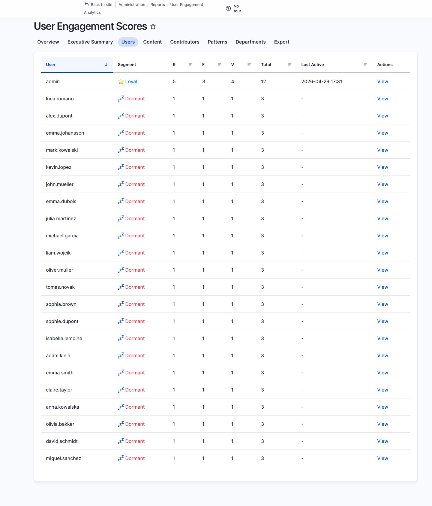
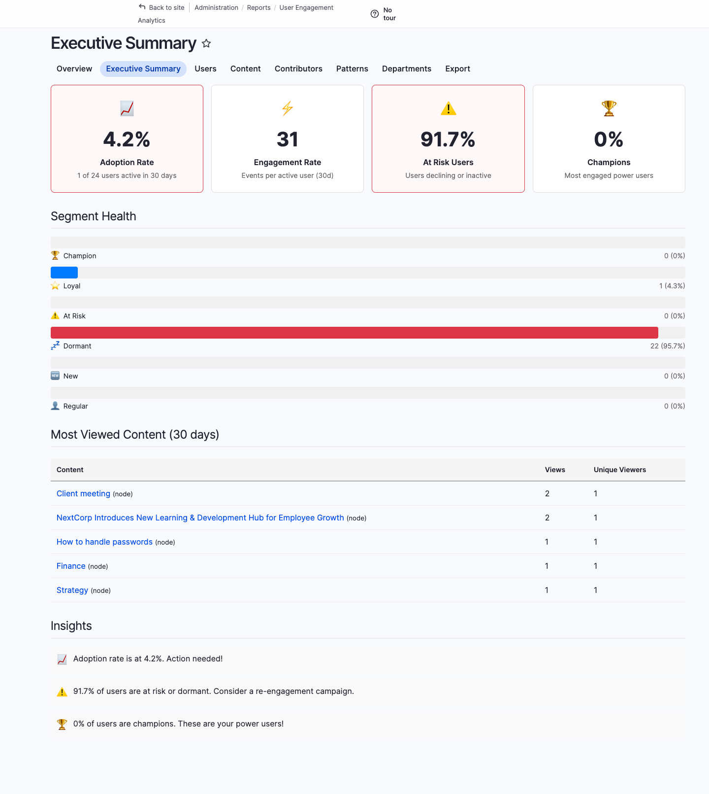
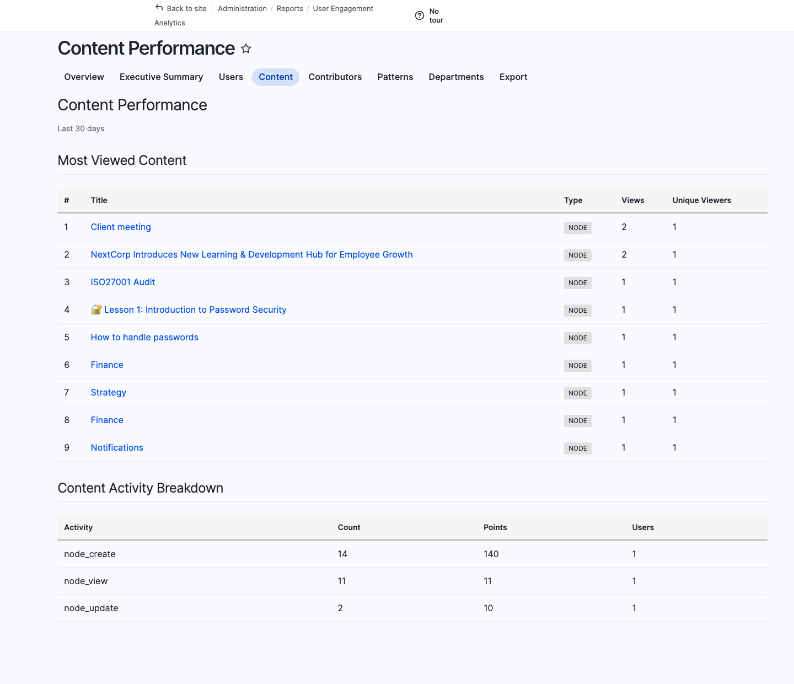
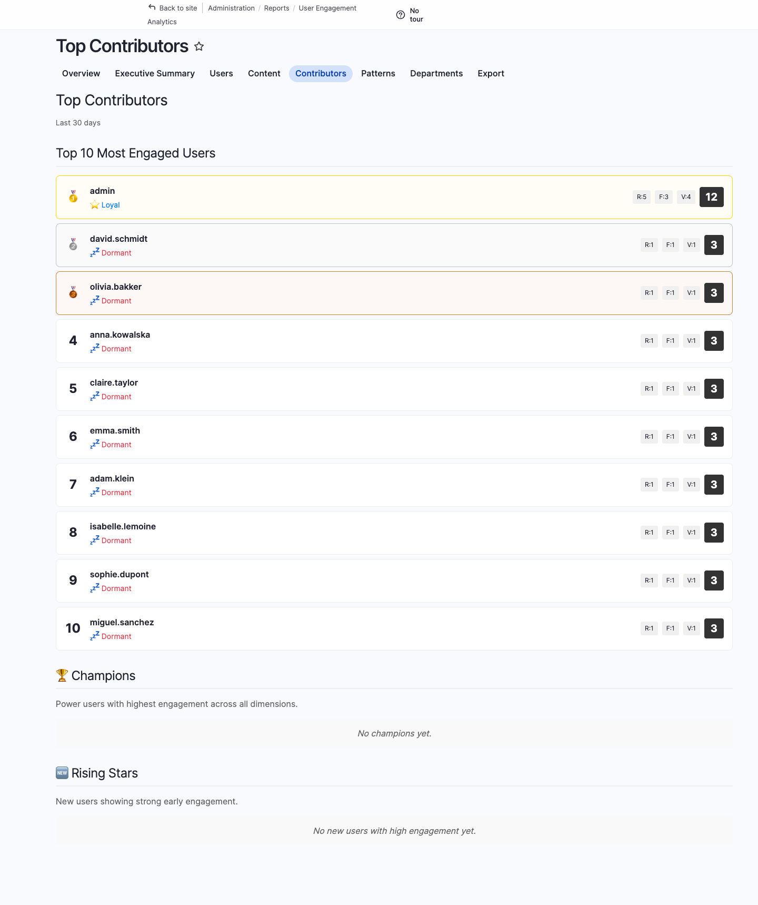
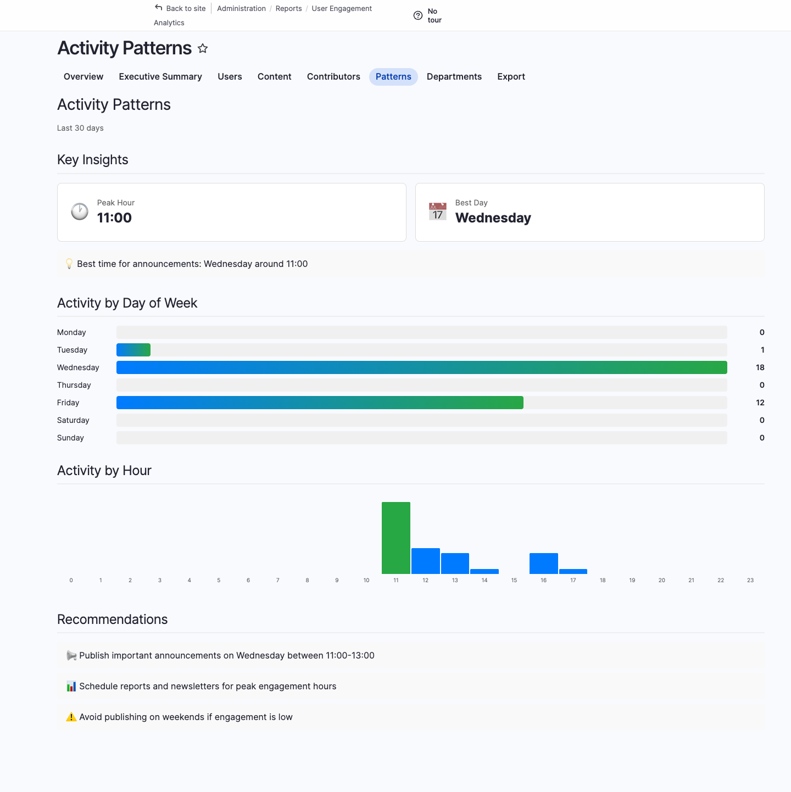
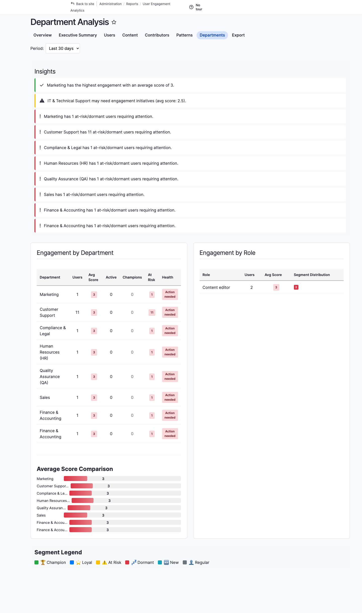
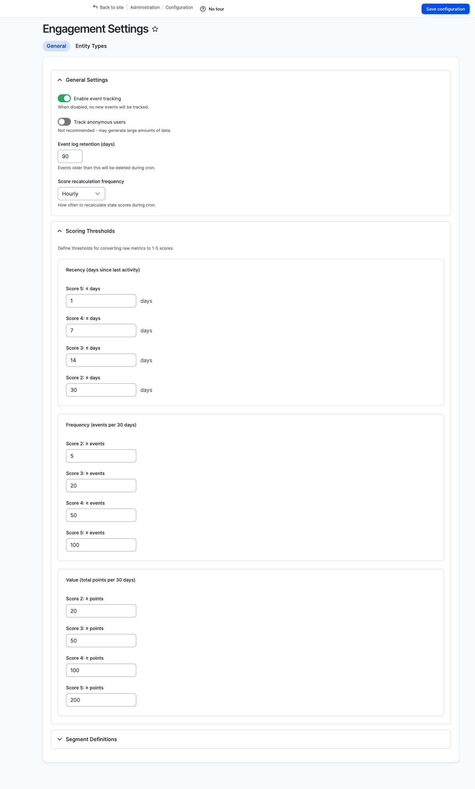

Measure who actually uses your intranet, who is at risk of disengaging, and which content drives behaviour — out of the box, no external analytics required.

## Overview

The **Engagement Analytics** module ships with Open Intranet and tracks every user action against a configurable point system. Users are scored using the **RFV model** (Recency · Frequency · Value) and automatically classified into engagement segments. Eight ready-made admin reports turn that raw data into actionable insights for managers, content editors, and HR.

## Key capabilities

- **RFV scoring** — Combine *Recency*, *Frequency* and *Value* of activity into a single score per user
- **Automatic user segmentation** — Champion · Loyal · At Risk · Dormant · New · Regular
- **Generic entity tracking** — Track any content entity type (nodes, comments, media, custom entities) with configurable points per operation
- **Executive dashboards** — KPIs, segment distribution, top contributors, content performance, activity patterns and department analysis
- **CSV / Excel export** — Filter by segment or date range; pipe straight into your BI tool
- **Drush automation** — Recalculate scores, generate summaries and export from the CLI or cron
- **Privacy-friendly** — All data stays inside your Drupal database, no third-party trackers

## Where to find it

After installation the reports live under **Administration → Reports → User Engagement**, or directly at `/admin/reports/engagement`. Configuration is at `/admin/config/openintranet/engagement`.

## Dashboard

The main dashboard at `/admin/reports/engagement` gives you the at-a-glance view: active users, total events, adoption rate, average engagement score, segment distribution, and the top activities for the last 30 days.



## User scores

`/admin/reports/engagement/users` lists every user with their current RFV breakdown, segment and total score. Click a row to drill into a single user's activity timeline.



## Executive summary

`/admin/reports/engagement/executive` is the C-level view: adoption rate, engagement rate, at-risk users, champions, segment health, most-viewed content and a plain-English **Insights** block ("Adoption rate is at 4.2%. Action needed!") — designed to be screenshot-pasted straight into a board deck.



## Content performance

`/admin/reports/engagement/content` shows which articles, knowledge base pages and other entities drive the most engagement — views, time on page, comments, reactions.



## Top contributors

`/admin/reports/engagement/contributors` ranks the people who publish, comment and react the most. Useful for kudos campaigns and identifying internal subject-matter experts.



## Activity patterns

`/admin/reports/engagement/patterns` shows when your organisation actually uses the intranet — by hour of day and day of week. Plan publishing schedules and notifications accordingly.



## Department analysis

`/admin/reports/engagement/departments` breaks scores down by team or group, so you can compare adoption between departments and identify ones that need a nudge.



## Configuration

Open `/admin/config/openintranet/engagement` to enable tracking, tune RFV thresholds and choose which entity types to track and how many points each operation is worth.



## Drush commands

For automation and cron jobs:

```bash
drush engagement:recalculate     # Recalculate all user scores
drush engagement:segments        # Show segment distribution
drush engagement:summary         # Print executive summary
drush engagement:top 20          # Show top 20 engaged users
drush engagement:cleanup         # Purge old event data past retention
drush engagement:export /tmp/users.csv --segment=at_risk
```

## Permissions

| Permission | Typical role |
| --- | --- |
| `administer openintranet engagement` | Administrator |
| `view engagement dashboard` | Manager, HR |
| `view engagement scores` | Manager, HR |
| `view own engagement score` | Authenticated user |
| `export engagement data` | Manager, HR |

## Tracking custom events

You can track any custom action from PHP:

```php
$tracker = \Drupal::service('openintranet_engagement.tracker');
$tracker->trackEvent($user_id, 'custom_action', $entity_type, $entity_id, $points);
```

The score is recalculated incrementally — no expensive recompute is required for individual events.
