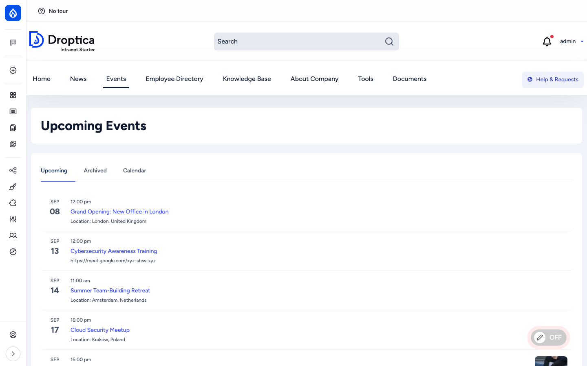
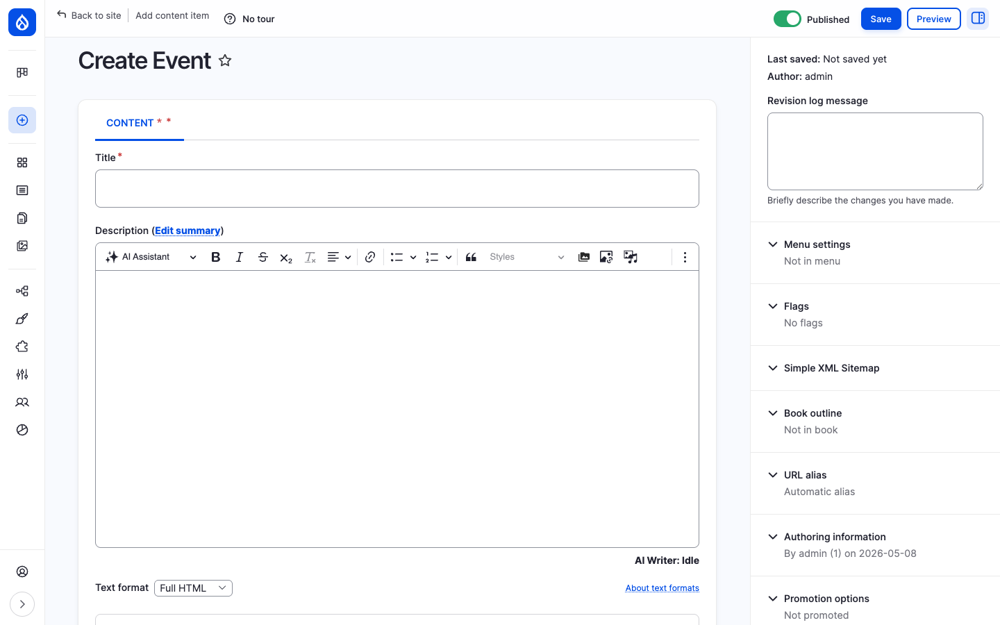
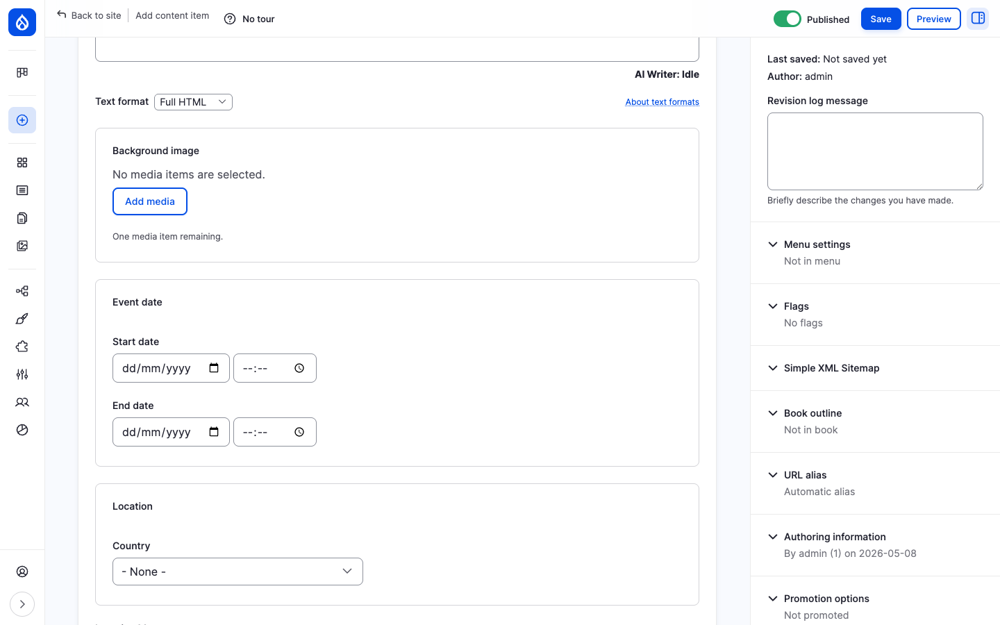
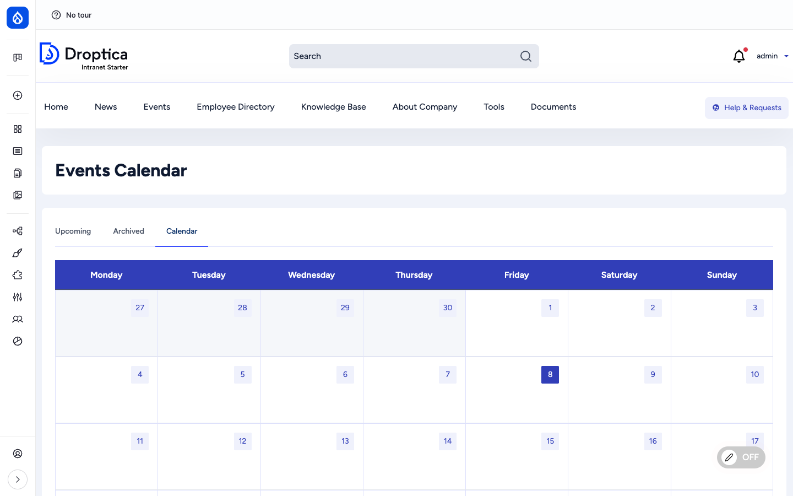
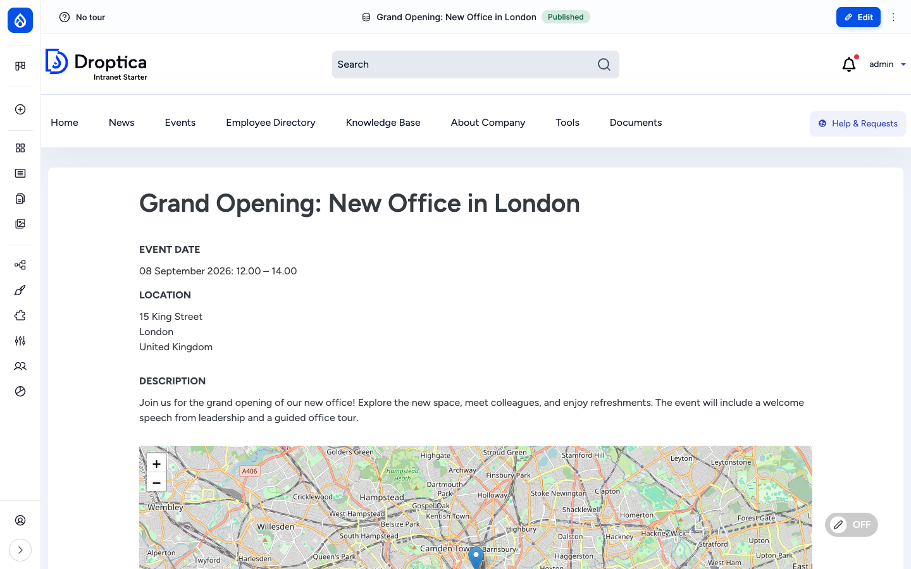

The **Events** section is where the company publishes everything that happens at a specific time and place: training sessions, office openings, meetups, audits, all-hands, parties. Events are first-class content with a dedicated landing page (`/events`), a month-grid calendar at `/events/calendar`, an upcoming-events block on the homepage and a single-event page at `/event/{slug}` that includes a Leaflet map for physical locations.

## What it is

An event is a Drupal node of bundle `event`. It captures **when** something happens (a date range), **where** it happens (a physical address with a geocoded map point, or an online URL) and **what** it is about (rich-text description with cover image). Events are surfaced through three views (upcoming list, archived list, month calendar) and a homepage block.

The calendar layer is provided by the [Calendar View](https://www.drupal.org/project/calendar_view) module with the optional [FullCalendar View](https://www.drupal.org/project/fullcalendar_view) integration; locations are rendered with [Leaflet](https://www.drupal.org/project/leaflet) on top of OpenStreetMap tiles.

## Components

### The event content type

Each event carries the following editorial fields:

| Field | Type | Purpose |
| --- | --- | --- |
| **Title** | Plain text | Headline shown on listings, calendar cells and the event page. |
| **Description** (`body`) | Rich text (CKEditor 5) | The main event copy: agenda, speakers, dress code, parking notes, etc. |
| **Background image** (`field_background_image`) | Media reference | Cover image used as the listing thumbnail and behind the event title. |
| **Event date** (`field_event_date`) | Date range | Start date and time, end date and time. Drives every listing, sort order and the calendar position. |
| **Location** (`field_event_location`) | Address | Country, address lines, city, postal code. |
| **Map location** (`field_map_location`) | Geofield | Geocoded latitude / longitude rendered as a Leaflet marker on the event page. |
| **Hide location** (`field_hide_location`) | Boolean | If checked, the address block and map are not rendered on the public page. Useful for confidential events. |
| **Event online** (`field_event_online`) | Boolean | Marks an event as online; the location section is replaced by the online URL. |
| **Event online text** (`field_event_online_text`) | String | The URL or call-in details for online events (Google Meet, Zoom, Teams, etc.). |

### Three tabs: Upcoming, Archived, Calendar

`/events` is split into three tabs:

- **Upcoming** — `/events`. Date-grouped list of events whose start date is in the future. Each row shows a date column on the left (large day number, abbreviated month) and a content column on the right with the time, title, and location (or online URL).
- **Archived** — `/events/archived`. Same layout, but events whose end date is in the past.
- **Calendar** — `/events/calendar`. A month grid (Mon → Sun) with one cell per day. Events appear as coloured pills in the relevant cell; a click opens the full event page. Use the navigation controls to move between months.

### The event detail page

A single event is rendered with the title, key metadata block (date, location, description) and — for physical events — a Leaflet map below the description. The map zoom and centre are derived from the geocoded coordinates stored in `field_map_location`.

For online events the address block is replaced by the **Event online text** value (the meeting URL or dial-in details). For events with **Hide location** ticked, both the address and the map are hidden.

### Events on the homepage

The default front page (`/news-homepage`) reserves a slot in the right column for an **Events** block. It lists the next few upcoming events as compact rows: date pill on the left (day number + month abbreviation), then the start time, title and location. A click jumps to the full event page.

This block is provided by the `events_blocks` view, which can also be placed on any other Drupal page from `/admin/structure/block`.

### URL pattern

Event URLs are aliased automatically by Pathauto using the pattern `/event/[node:title-slug]`. The listings live at `/events`, `/events/archived` and `/events/calendar`.

### Views that power the section

| View | Role | URL / display |
| --- | --- | --- |
| `events_listing` | Upcoming + Archived tabs | `/events`, `/events/archived` |
| `events_calendar` | Month grid | `/events/calendar` |
| `events_blocks` | Homepage and any other "upcoming events" block | placeable via Block layout |
| `content_calendar` | Editorial calendar in the admin | `/admin/dashboard/content-calendar` |

## Integration with other features

- **Engagement scoring** — Viewing an event detail page and interacting with it (where reactions / comments are enabled) feeds the user's [Engagement](./engagement) RFV score.
- **Search** — Events are indexed by the `default_index` Search API index. Title, body and location are full-text searchable; users can filter results to events only.
- **Layout Builder** — The single-event display is rendered with Layout Builder, so a site builder can rearrange the date / location / map / body blocks per content type without touching code.
- **Notifications** — When the [Messenger](./messenger) module is enabled and configured, an admin can broadcast an event invitation by email or SMS to selected groups.
- **Translations** — When additional languages are enabled, events can be translated; each translation has its own date and location.
- **Room Booking** — The [Room Booking](./room-booking) recipe ships its own calendar (`room_booking_calendar`) for booking conference rooms; the two calendars sit next to each other on the same site.

## Permissions

| Capability | Default role(s) |
| --- | --- |
| View published events | Anonymous + authenticated user |
| Create / edit / delete own events | Content editor |
| Edit / delete any event | Content editor, Administrator |
| Set "Hide location" / "Event online" | Content editor (via standard edit permission) |
| View revisions / revert | Content editor, Administrator |

## Modules behind it

- Drupal core: `node`, `views`, `path`, `datetime`, `datetime_range`, `editor`, `image`, `layout_builder`
- [`address`](https://www.drupal.org/project/address) — postal address field for the location
- [`geofield`](https://www.drupal.org/project/geofield) — geocoded point storage for the map
- [`leaflet`](https://www.drupal.org/project/leaflet), [`leaflet_views`](https://www.drupal.org/project/leaflet) — Leaflet map rendering
- [`calendar_view`](https://www.drupal.org/project/calendar_view), `calendar_view_multiday` — month grid display
- [`fullcalendar_view`](https://www.drupal.org/project/fullcalendar_view) — alternative FullCalendar.io display
- [`pathauto`](https://www.drupal.org/project/pathauto) — `/event/{slug}` URL alias
- [`datetimehideseconds`](https://www.drupal.org/project/datetimehideseconds) — keeps the date inputs short

## Learn more

- [How to use it](../../user-guide/events) — step-by-step procedures for browsing, adding and editing events
- [Creating content](../../user-guide/creating-content) — common authoring patterns shared by all content types
- [Room Booking](./room-booking) — the related, opt-in recipe for booking specific rooms / facilities
