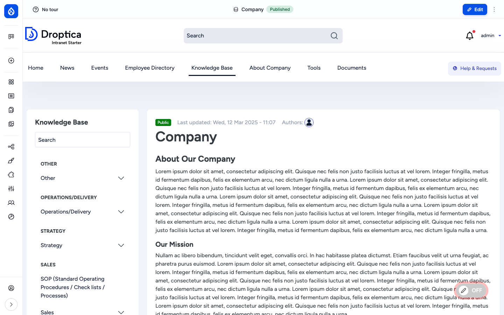
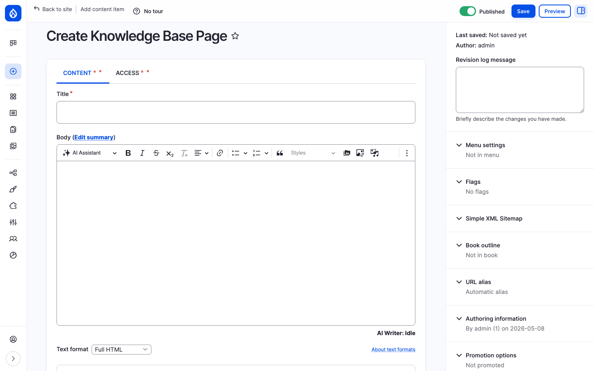
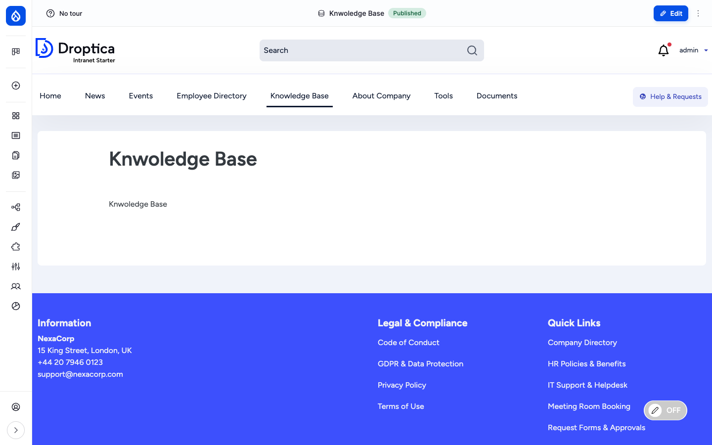
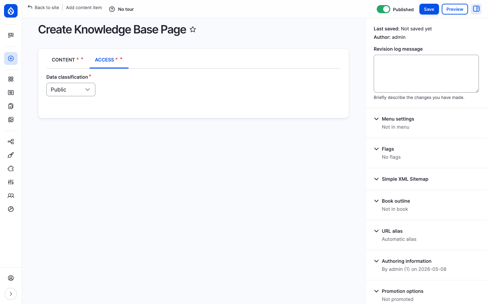

The **Knowledge Base** (KB) is the place for long-form, slowly-changing company knowledge: HR policies, the employee handbook, technical runbooks, security procedures, "how we work" documents and Standard Operating Procedures. Where News is *what just happened*, the KB is *what is true now*. Pages are organised in a hierarchy so they read like a digital handbook, with a permanent sidebar showing the user where they are in the tree and what comes next.

## What it is

A KB page is a Drupal node of bundle `knowledge_base_page`. Pages are connected through Drupal's core **Book** module, which gives every page a parent / siblings / children relationship. The Book hierarchy is the navigation backbone: opening any KB page renders a sidebar block showing the section it belongs to, the siblings around it and the children below.

Beyond the body and hierarchy, every KB page carries a **Data classification** label (Public, Internal, Confidential, etc.), an optional list of **Related content** to cross-link, **Tags** for taxonomy filtering and **Document references** so the page can pin specific files from the [Documents library](./documents).

## Components

### The knowledge_base_page content type

Each KB page carries the following editorial fields:

| Field | Type | Purpose |
| --- | --- | --- |
| **Title** | Plain text | Headline shown in the sidebar tree, breadcrumbs and as `<h1>`. |
| **Body** | Rich text (CKEditor 5) | The long-form content of the page, with images, embedded media, links and the AI Assistant button. |
| **Data classification** (`field_data_classification`, required) | List | Information sensitivity label — *Public*, *Internal*, *Confidential*, etc. Rendered as a coloured badge next to the page title. |
| **Document references** (`field_oi_document_ref`) | OI Document reference (multi-value) | Pin specific files from the [Documents](./documents) library to the page (the file lives in one place but appears here too). |
| **Related content** (`field_related_content`) | Entity reference (multi-value) | Curated list of other pages, articles or events that the reader should consider next. |
| **Tags** (`field_tags`) | Taxonomy reference (multi-value) | Topic tags used in faceted search and listings. |
| **Book outline** (core) | Book | The page's position in the Book hierarchy: parent page and weight. |

### The Book hierarchy

Every KB page belongs to a Book. The Book outline panel on the edit form lets the editor pick the parent page (or "Top-level page of book") and the weight (sort order among siblings).

The Book hierarchy is what gives the KB its *handbook* feel. Each book can be many levels deep, and the rendered KB page automatically shows:

- A **sidebar table of contents** for the current section.
- **Breadcrumbs** from the root to the current page.
- **Previous / next** navigation between siblings.
- A **child pages list** at the bottom, automatically maintained as new children are added.

### The Knowledge Base landing page

The main navigation menu has a **Knowledge Base** entry that points at the KB landing page (e.g. `/pages/knwoledge-base`). The landing page is a Basic page laid out with paragraphs and Layout Builder, so each site can shape it differently — typically a hero, a list of top-level Books, and "popular pages" or "recently updated" blocks.

### The page detail view

Opening a KB page renders three columns:

1. **Sidebar (left)** — the Book navigation block. Top of the block is a KB-scoped search box. Below it the topic tree (e.g. *Other*, *Operations/Delivery*, *Strategy*, *Sales*) with the current branch expanded. Click any item to jump.
2. **Main column (centre)** — the page header (data-classification badge, last-updated timestamp, authors), then the body content rendered with the configured paragraphs.
3. **Right gutter / actions (top)** — the standard **Edit** button for users who can modify the page; the **Bookmark** action; and on hover, the in-place **Frontend editing** pencil.

The data-classification badge (e.g. *Public*, *Internal*, *Confidential*) is shown prominently next to the title so a reader always knows the sensitivity of what they are reading.

### Per-page access control

KB pages have an extra **ACCESS** tab in the edit form (and a corresponding `/node/{nid}/openintranet-access` route). The tab provides the same per-item access form as folders and documents: pick **OI Groups** that should see the page (with hierarchy inheritance) and / or pick **individual users**.

This makes the KB usable for sensitive material: a *Confidential* HR runbook can be restricted to *HR* and selected leadership; everyone else sees neither the page nor a "denied" message — it disappears from the sidebar tree, search results and related-content lists.

The full access control story (groups, hierarchy, inheritance, individual users, "bypass" permissions) is on the [Documents administration](../../administration/documents) page.

### Custom Book block

The [`custom_book_block`](https://www.drupal.org/project/custom_book_block) module ships with Open Intranet to give site builders a more flexible Book navigation block than core's. The block can be placed anywhere via Block Layout, restricted to a specific book, and styled per region. The default KB sidebar uses it.

### Search and discovery

KB pages are part of two search experiences:

- **The KB-scoped search box** in the sidebar — searches inside the current Book only.
- **The site-wide search** at `/search` — covers KB pages, articles, pages, documents and users together.

Search covers the title and body of every KB page. Tags and the data classification are exposed as filter facets through Better Exposed Filters.

### URL pattern

KB pages are aliased automatically by Pathauto using the pattern `/knowledge/[node:title-slug]`. Sub-pages also live at `/knowledge/...`, so the URL hierarchy mirrors the Book hierarchy.

## Integration with other features

- **Documents** — Pin files from the [Documents library](./documents) on a KB page through the Document references field; the file lives once in the library and is referenced from the KB page.
- **Access Control & Groups** — The KB Access tab uses the same `openintranet_access` form, group hierarchy and inheritance rules as Documents. See [Access Control & Groups](./access).
- **Engagement scoring** — Page views and time-on-page feed the [Engagement](./engagement) RFV score.
- **Search** — Indexed by the `default_index` Search API index alongside articles, events, pages and documents.
- **Must Read tracking** — A KB page can also be flagged as Must Read to require every employee to read it. See [Must Read tracking](./must-read).
- **Social interactions** — Bookmarks and recently-read apply to KB pages automatically. See [Social interactions](./social).
- **Translations** — When additional languages are enabled, KB pages can be translated; each translation has its own revisions.

## Permissions

| Capability | Default role(s) |
| --- | --- |
| View published KB pages | Authenticated user (subject to per-page access) |
| Create / edit / delete own KB page | Content editor |
| Edit / delete any KB page | Content editor, Administrator |
| Add / move / remove pages in a book outline | Content editor |
| Manage access on a KB page | Content editor + page owner |
| View revisions / revert | Content editor, Administrator |

## Modules behind it

- Drupal core: `node`, `book`, `views`, `path`, `editor`, `image`
- [`custom_book_block`](https://www.drupal.org/project/custom_book_block) — flexible Book navigation block
- `openintranet_access` — per-page access tab and group-based restrictions
- [`pathauto`](https://www.drupal.org/project/pathauto) — `/knowledge/{slug}` URL alias
- [`search_api`](https://www.drupal.org/project/search_api) — search indexing
- [`flag`](https://www.drupal.org/project/flag) — bookmarks and Must Read flag

## Learn more

- [How to use it](../../user-guide/knowledge-base) — step-by-step procedures for browsing, adding, editing, linking and reorganising KB pages
- [Documents](./documents) — the file library that KB pages can pin from
- [Access Control & Groups](./access) — the group hierarchy that powers per-page restrictions
- [Must Read tracking](./must-read) — flag a KB page as required reading
