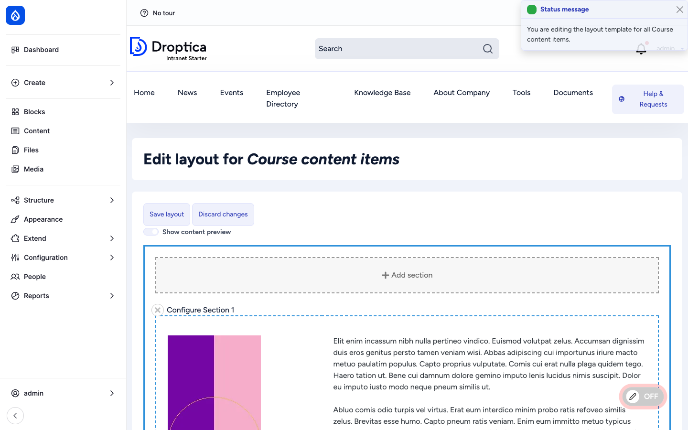
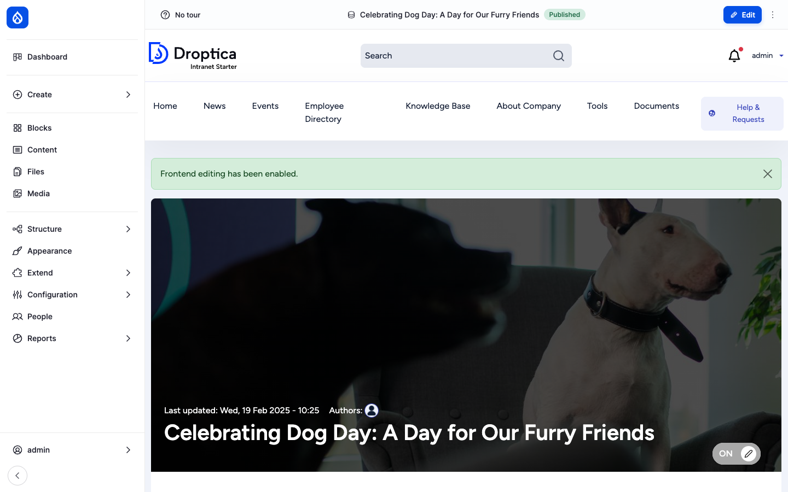
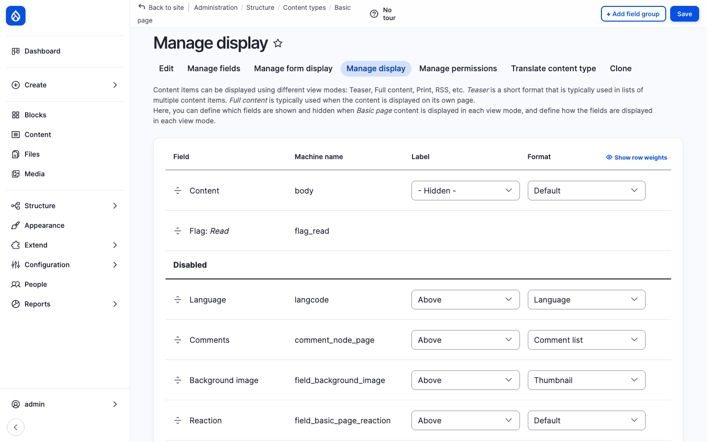

Open Intranet bundles **two complementary editing experiences** that together cover the spectrum from "rearrange the whole page" to "fix this typo right now". They are deliberately kept separate so each one can be enabled per content type, per role, or both:

- **Layout Builder** — The visual *what goes where* tool. Drag-and-drop sections and blocks onto a page; pick from one-, two-, three-column layouts, custom CSS classes and per-section styles. Used by site builders to create rich landing-style pages without writing a template.
- **Frontend Editing** — The inline *fix it on the live page* tool. Click an edit icon on any field of a published page (without leaving the page) to open a small modal that saves the change and refreshes just that field — no full edit form, no context-switch.

The two tools are completely independent — a content type can use either, both, or neither.

## Layout Builder

### What it is

Layout Builder is a Drupal core module that lets a site builder define *the layout of an entity's display* visually: which sections, which columns, which fields go where, what blocks (custom or system) appear alongside, and what styles each section uses.

In Open Intranet it is enabled out of the box on the **Course** content type (one of the heaviest layout users in the bundle) and is available to be enabled on any other bundle from the *Manage display* admin page.

### Two modes

Layout Builder has two distinct *modes*:

| Mode | Where it lives | Purpose |
| --- | --- | --- |
| **Default layout** | `/admin/structure/types/manage/{bundle}/display/default/layout` | The template layout for **all** items of this type. Editing it changes every existing item that has not been customised. |
| **Per-item layout** | The **Layout** tab on each individual item | Override the default layout for **this one item** only. Used for landing pages and one-of-a-kind content items. |

Per-item layouts can be enabled per bundle (`Allow each content item to have its layout customized`).

### Sections and blocks

A layout is composed of **sections** stacked vertically. Each section uses a **layout plugin** (one column, two columns, three columns, two-thirds + one-third, etc.) that determines its column structure. Inside each column the editor places **blocks** — which can be:

- **Field blocks** — one block per content field (Title, Body, Tags, Image, Reaction…) so fields can be ordered, hidden, or repositioned across columns.
- **Custom blocks** — reusable blocks managed under *Structure → Block layout*.
- **System blocks** — site-wide blocks (Search, Menu, Recent posts, Recently read, etc.).
- **Inline blocks** — one-off content blocks created right inside the Layout Builder dialog, scoped to this layout only.

Adding a section, dropping a block in, configuring the block, and saving — all happen on the same page via a sidebar dialog, with a live preview updating as you go.

### Layout Builder Styles

The **Layout Builder Styles** module adds a *style* picker to each section and each block. Site builders pre-define styles in YAML (e.g. *Hero with overlay*, *Tinted background*, *Card grid*, *Compact*, *Negative space large*) and editors pick from a dropdown — giving the layout a consistent design language without exposing raw CSS to editors.

### Layout Custom Section Classes

The **Layout Custom Section Classes** module adds a free-form **Custom CSS class** field to each section, so site builders / admins can hook ad-hoc styles into any section without creating a full *style* preset.

## Frontend Editing

### What it is

Frontend Editing puts a small toggle in the bottom-right of every page (a pill button labelled **Off** / **On**). When the editor flips it to **On**, the page enters *edit overlay* mode:

- A green status banner confirms `Frontend editing has been enabled.`
- Every field on the page that the user can edit shows a hover icon.
- Clicking the icon opens a slim modal pre-populated with the field's current value.
- Saving updates the field in place — no full reload, no context switch, no autosave dialog interrupting the flow.

### Per-field, per-bundle opt-in

Frontend Editing is enabled per bundle in the **Manage display** screen — alongside the field's display settings, a small *Edit on the frontend* checkbox decides whether that field becomes click-to-edit on the live page.

The granularity matters — sensitive fields (e.g. *Author*, *Created date*, *Published status*) can stay un-edit-able from the front-end while the *Title* and *Body* are click-to-edit.

### What it edits

Out of the box Frontend Editing supports:

- **Plain-text fields** — title, name, simple text fields. Inline input.
- **Long-text fields** — body, descriptions. Opens a modal with the same CKEditor 5 instance as the full edit form (so the [AI assistant](./ai-assistant) is available too).
- **Image / file fields** — upload + alt text from the modal.
- **Entity reference fields** — autocomplete in the modal.
- **Layout Builder regions** — when both modules are enabled, FE icons cover Layout Builder blocks too.

### Permissions

Frontend Editing respects existing entity permissions: the user must have *edit* access to the entity for the icons to appear. Admins can additionally restrict the front-end editing UI itself with the *use frontend editing* permission — useful for "any content editor can use the full edit form, but only senior editors can do quick inline fixes from the live page".

## Comparison

| Need | Use |
| --- | --- |
| *Rearrange the whole page* — change which columns appear, move blocks around | **Layout Builder** (per-item layout) |
| *Style a landing page* — apply hero / tint / card-grid styles to sections | **Layout Builder** (with Layout Builder Styles) |
| *Fix a typo, swap an image, update a paragraph* — already on the live page | **Frontend Editing** |
| *Quick price / number change* on a published item — without opening the full form | **Frontend Editing** |
| *Build a custom layout for a one-off item* (campaign landing, anniversary post) | **Layout Builder** (per-item layout) |
| *Define the canonical layout* for every News article | **Layout Builder** (default layout) |

## Integration with other features

- **Pages** — The most natural Layout Builder candidate. Once enabled on the *Page* type, marketing / HR / IT can build per-page landing layouts.
- **Knowledge Base** — A landing-page approach with sections of *featured articles*, *recently updated*, and CTAs to specific KB books.
- **News, Events** — Frontend Editing is the recommended workflow for quick text fixes. Layout Builder is rarely needed but available.
- **Courses** (recipe) — Ships with Layout Builder enabled for the *Course* content type (the default layout shown above).
- **AI assistant** — When Frontend Editing opens a CKEditor field, the AI button is right there. Click *Improve writing* without ever opening the full edit form.
- **Multilingual** — Layout Builder layouts can be translated per language; Frontend Editing edits the field in the active language.

## Permissions

| Permission | Default role(s) |
| --- | --- |
| Configure any layout (edit default layouts) | Administrator |
| Customize layout (per-item layout overrides) | Content editor |
| Use frontend editing | Authenticated user (configurable) |
| Administer Layout Builder Styles / Custom Section Classes | Administrator |

## Modules behind it

- Drupal core: `layout_builder`, `layout_discovery`
- [Layout Builder Styles](https://www.drupal.org/project/layout_builder_styles)
- [Layout Custom Section Classes](https://www.drupal.org/project/layout_custom_section_classes)
- [Frontend Editing](https://www.drupal.org/project/frontend_editing)

## Learn more

- [Pages](./pages) — primary Layout Builder use-case
- [Knowledge Base](./knowledge-base) — also a strong fit for Layout Builder landing layouts
- [AI Assistant in CKEditor](./ai-assistant) — pairs perfectly with the Frontend Editing modal
- [Courses recipe](./courses) — ships with Layout Builder enabled by default
- [Drupal Layout Builder docs](https://www.drupal.org/docs/8/core/modules/layout-builder)
