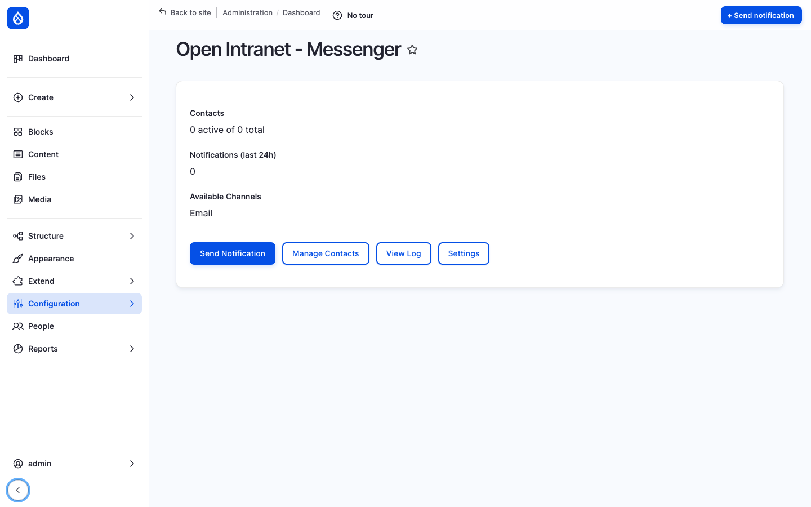
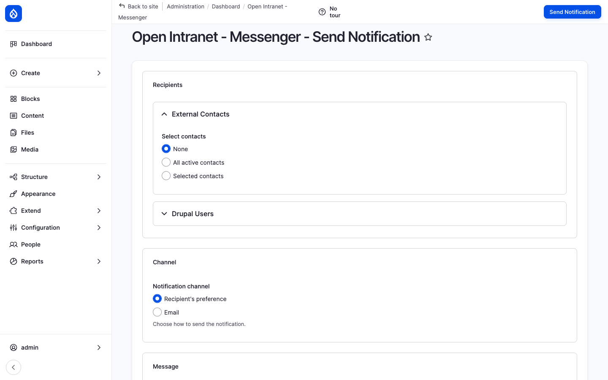
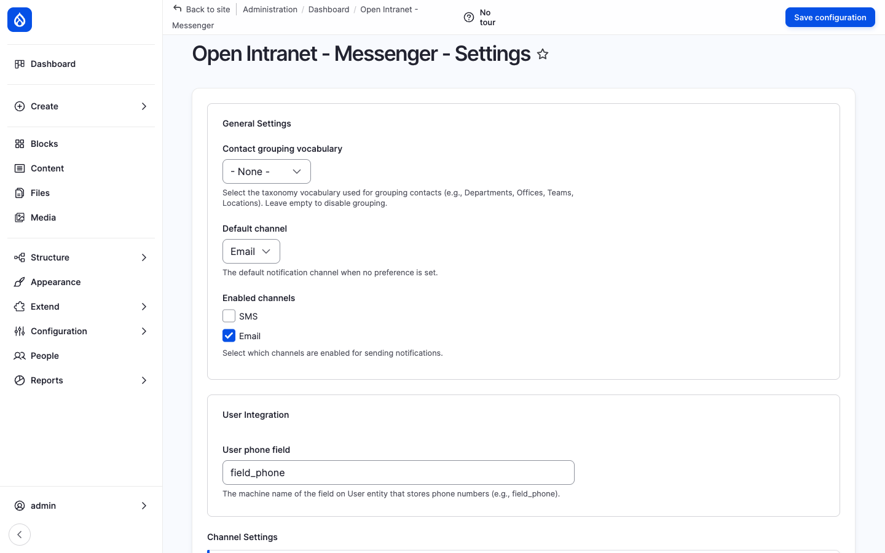

The **Messenger** module is Open Intranet's company-wide notification system. It lets administrators broadcast a message to *anyone the organisation needs to reach* — Drupal users, external contacts that have no Drupal account ("deskless workers" — frontline staff, contractors, customers, partners) — across one or more delivery channels (email by default, SMS via SMSAPI, custom plugins for any other transport).

Every send goes through a single recipient picker (all contacts, by department, by role, individual selection), a channel selector and a message editor. Every send is logged so admins can audit who got what, when, on which channel, and whether it succeeded.



## What it is

Messenger is a custom Open Intranet module (`openintranet_messenger`) that ships with the core recipe. It adds a custom **Messenger Contact** entity for non-Drupal recipients, a channel plugin system (`#[NotificationChannel]` attribute), a recipient resolver service, a notification log entity and a small admin UI under **Configuration → Messenger** (`/admin/openintranet/messenger`).

Messenger is the underlying broadcast mechanism behind the platform's **Send a reminder email** action on Must Read reports, the *notify all users about new* checkbox on News articles, and any custom workflow that needs to fan out a message to a defined audience.

## Components

### The dashboard

`/admin/openintranet/messenger` is the entry point. It shows three KPIs at the top — **Contacts** (active vs. total), **Notifications (last 24h)**, **Available Channels** — and four primary actions:

- **Send Notification** — open the broadcast form
- **Manage Contacts** — list, create, edit, delete external contacts
- **View Log** — full history of sends
- **Settings** — channel configuration, defaults

A sticky **Send notification** button is also pinned to the top-right of the page for one-click access.

### External contacts

The `messenger_contact` entity captures recipients who are *not* Drupal users:

| Field | Purpose |
| --- | --- |
| **Name** | Full name. |
| **Email** | Email address (used by the Email channel). |
| **Phone** | Phone number (used by the SMS channel). |
| **Department** | Taxonomy reference for grouping. |
| **Preferred channel** | The default channel for this contact (Email, SMS, etc.). |
| **Status** | Active / inactive. |

Contacts can be added one by one through the UI, imported in bulk from a CSV (`/admin/openintranet/messenger/contacts/import`), or created through the API. The contact list also supports per-field configuration through Field UI (`/admin/openintranet/messenger/contacts/settings`), so site builders can extend the schema (e.g. add a *language* field for localised messages).

### The Send Notification form

`/admin/openintranet/messenger/send` is a single page with three sections:

1. **Recipients** — split into *External Contacts* and *Drupal Users*. For each you choose **None / All active / Selected** and (when *Selected*) pick by department, role, or individual.
2. **Channel** — pick the delivery channel. Defaults to *Recipient's preference* (which honours each contact's `preferred_channel`); also exposes each enabled channel directly (Email, SMS, etc.).
3. **Message** — Subject + body. Drupal tokens are supported in both fields, so a single message can include `[user:display-name]`, the site name, the current date, etc., and be personalised per recipient.



Submitting the form runs the broadcast through Drupal's batch API (in chunks, recommended for large recipient lists) and returns a success summary plus a link to the relevant entry in the log.

### Channels

Channels are pluggable. The base Messenger module ships:

- **Email** — always available, uses Drupal's mail system.

The optional [SMSAPI](https://www.drupal.org/project/smsapi) module adds:

- **SMS** — sends through your configured SMSAPI account.

A site can add any number of additional channels by writing a plugin class with the `#[NotificationChannel]` attribute (Slack, Teams, push notification, internal HTTP webhook, …). The plugin only needs to implement `isAvailable()` and `send($recipient, $subject, $message)`.

```php
#[NotificationChannel(
  id: 'my_channel',
  label: new TranslatableMarkup('My Channel'),
)]
class MyChannel extends ChannelPluginBase {
  public function isAvailable(): bool { return TRUE; }
  public function send(RecipientInterface $r, string $s, string $m): bool { /* ... */ }
}
```

Channels enabled in **Settings** appear automatically in the dashboard's *Available Channels* list and in the Channel dropdown of the Send form.

### Settings

`/admin/openintranet/messenger/settings` lets the admin:

- Enable / disable each available channel.
- Set the default channel.
- Configure per-channel options (sender name, sender email, SMS sender ID, etc.).
- Configure SMSAPI integration (via the SMSAPI module's own config at `/admin/smsapi/configuration`).



### Notification log

`/admin/openintranet/messenger/log` is the audit trail. Every send writes a row with:

- Timestamp
- Recipient (name, channel address)
- Channel used
- Subject + message excerpt
- Status (sent / failed / skipped) + reason
- Triggering user

The log is searchable and filterable per channel, status and date range. It is the source of truth for "did the user actually receive the email?" troubleshooting.

### Recipient resolver service

For programmatic use (custom modules, ECA actions, drush scripts), Messenger exposes two services:

```php
$resolver = \Drupal::service('openintranet_messenger.recipient_resolver');
$service  = \Drupal::service('openintranet_messenger.notification_service');

$recipients = $resolver->resolveAllActiveContacts();
// Or: $resolver->resolveByDepartment('marketing');
// Or: $resolver->resolveByUserRole('content_editor');

$result = $service->sendBulk($recipients, 'Subject', 'Message body');
echo "Sent: " . $result->getSentCount();
```

This is how internal features like *notify all users about new* on News articles fire their broadcasts — through the same plumbing the admin form uses.

## Integration with other features

- **News articles** — The `field_notify_all_users_about_new` toggle on a News article triggers a Messenger broadcast at publish time (audience: all active users).
- **Must Read tracking** — The **Send a reminder email** action on a Must Read report posts to the [Views Send](https://www.drupal.org/project/views_send) form, which uses the same email infrastructure.
- **Employee Directory** — Recipient selection by department / office uses the same taxonomies as the [Employee Directory](./employee-directory).
- **Access Control & Groups** — A future channel plugin can resolve recipients via OI Group membership (e.g. "all active users in *Berlin Office* and its descendants"); the resolver service is plugin-aware.
- **ECA — no-code workflows** — A custom ECA action can fire a notification on any modelled event (entity insert / update / delete, cron, user login).

## Permissions

| Permission | Default role(s) |
| --- | --- |
| Administer Messenger (channels, defaults, contact schema) | Administrator |
| Manage Messenger contacts (create / edit / delete contacts, CSV import) | Administrator |
| View Messenger contacts | Administrator |
| Send notifications | Administrator |
| View notification log | Administrator |

Permissions are intentionally restrictive — broadcasting to the entire company is a high-impact action.

## Modules behind it

- `openintranet_messenger` — entities, services, channels, admin UI
- Drupal core: `taxonomy`, `field`, `entity`, `user`, `views`
- [SMSAPI](https://www.drupal.org/project/smsapi) — optional, for the SMS channel
- [Symfony Mailer](https://www.drupal.org/project/symfony_mailer) — optional, for advanced HTML email and per-tenant SMTP

## Learn more

- [How to administer it](../../administration/users) — admin tasks for users (Messenger administration sits in the same area)
- [Must Read tracking](./must-read) — the read-tracking feature whose reminder emails go through Messenger plumbing
- [News and Articles](./news) — the article-publish broadcast that uses Messenger
- [SMSAPI module on drupal.org](https://www.drupal.org/project/smsapi)
