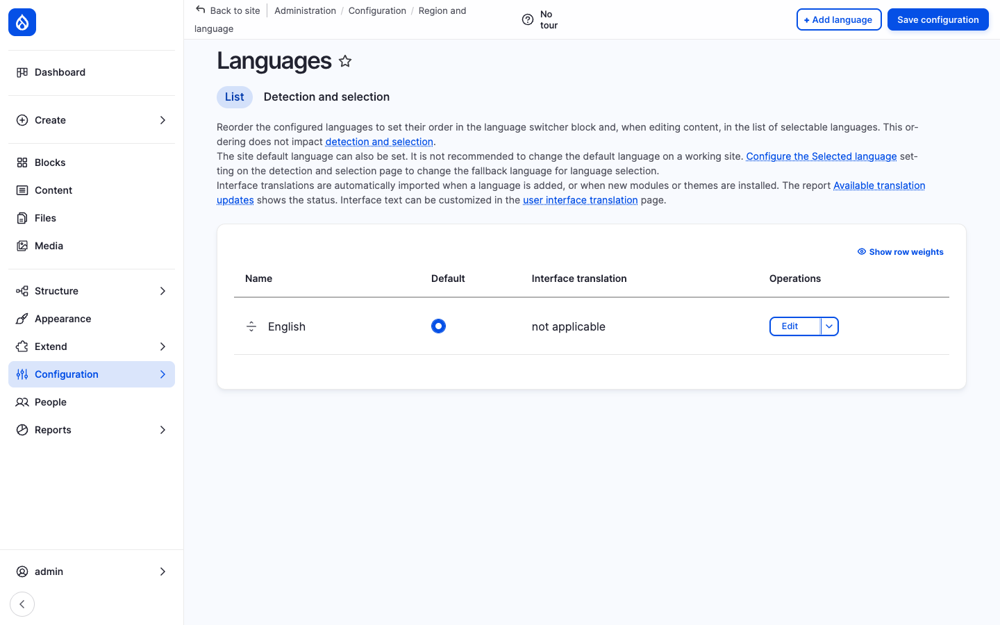
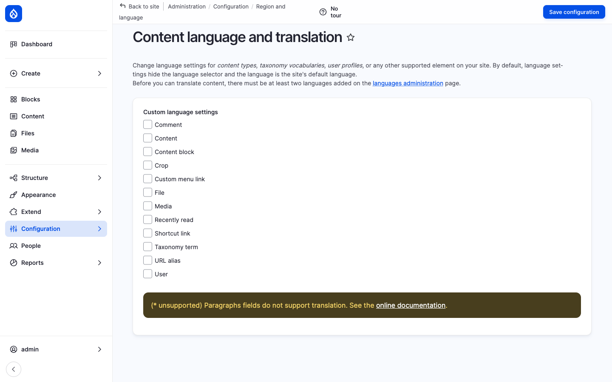

Open Intranet runs in **any number of languages** out of the box. The platform leans on Drupal core's four multilingual modules — **Language**, **Interface translation**, **Content translation** and **Configuration translation** — and adds a language switcher dropdown that ships with the default theme.

The result is a site where the *interface* (every label, button, error message, menu item), the *content* (each News article, KB page, page, event, document) and the *configuration* (block titles, view headers, field labels, system emails) can each be translated independently — and where every visitor lands on the page in the language they prefer.



## What it is

By default the platform installs **English only**. Adding a new language is a single admin click — it imports the language, downloads its interface translation pack from `localize.drupal.org` automatically, and wires it into every multilingual surface on the site.

Adding **Polish, German, French** or any of the other 100+ languages Drupal supports is a ~30-second operation. The day-to-day workflow afterwards is:

1. Pick the languages the company needs.
2. Decide which content types and fields should be translatable.
3. Translators fill in the per-language values from the **Translate** tab on each item.

## Components

### The Languages page

`/admin/config/regional/language` is where languages are added, ordered, and marked as default. Each row shows:

| Column | Purpose |
| --- | --- |
| **Name** | The language's display name. |
| **Default** | A radio that picks the site default. |
| **Interface translation** | Status of the imported `.po` file (or *not applicable* for English). |
| **Operations** | Edit, delete, reset the language. |

Drag-and-drop reordering changes the order in which the languages appear in the **switcher block** and in the **Translate** tab.

The **Detection and selection** sub-tab controls *how* a request gets a language — by URL prefix (the recommended default), by domain, by browser `Accept-Language`, by user preference, by session, by cookie. Multiple methods can run in priority order.

### Interface translation

Once a non-English language is added, Drupal automatically downloads the matching interface translation pack. *Interface* means everything written in code — button labels, form errors, watchdog messages, the standard menu items, the admin UI itself.

The `/admin/config/regional/translate` page lets administrators **override** any string for the site (e.g. translate "Bookmarks" as "*Mes favoris*" rather than "*Signets*"). Strings can also be edited inline directly on the page using the [Locale](https://www.drupal.org/docs/8/multilingual/locale-module) UI.

### Content translation

`/admin/config/regional/content-language` is the per-bundle, per-field opt-in for content translation:



For each entity bundle (News article, Page, Document, KB page, Event, …) the admin chooses:

- Whether the bundle is **translatable** at all.
- Which fields are **translated per language** (e.g. *Title*, *Body*, *Image alt text*).
- Which fields are **shared across languages** (e.g. *Author*, *Created date*, *URL alias*).
- The **default language** and whether to **publish translations independently**.

Once enabled, every item gets a **Translate** tab with one row per language. Click *Add* on a language row to open a copy of the edit form pre-populated with the source values — fill in the translated strings and save. Each translation is independently revisioned, can be in a different moderation state, and can have a different URL alias.

### Configuration translation

`/admin/config/regional/config-translation` lists every translatable configuration object — block titles, view headers, view exposed-form labels, field labels, system emails, contact-form messages — and lets administrators add per-language overrides. This is what makes the difference between a site that "looks translated" (interface only) and a site that genuinely *speaks the language* of its users.

### Language switcher

The default theme places a **language switcher dropdown** in the page header. It uses the [Dropdown Language](https://www.drupal.org/project/dropdown_language) module so that the current language is shown as a flag/code button and the other languages collapse into a dropdown — keeping the header tidy even with 6+ languages enabled.

Clicking a language reloads the current page on its translated URL (e.g. `/news/welcome` → `/de/news/welcome`).

### URL pattern

Multilingual URLs use the **path prefix** detection method:

```
/news/welcome           ← English (default)
/de/news/welcome        ← German translation
/fr/news/welcome        ← French translation
/pl/news/welcome        ← Polish translation
```

Pathauto generates the same alias on each language; an admin can override per language from the **URL alias** widget on the translation form. Switching language on a single item routes through the **Translation** tab so the user always lands on the correct localised URL.

## What's translatable

| Surface | Translation type |
| --- | --- |
| Admin UI (toolbar, forms, error messages) | Interface translation (`.po` import) |
| Menus & menu links | Configuration translation |
| Block titles & block content | Configuration / Content translation |
| Views: page title, header, footer, exposed labels | Configuration translation |
| Field labels & help text | Configuration translation |
| News articles, Pages, KB pages, Events | Content translation (per-field opt-in) |
| Documents (title, description, file alt) | Content translation |
| Taxonomy terms (categories, tags, departments) | Content translation |
| User profile fields (where appropriate) | Content translation |
| System emails, contact forms | Configuration translation |

## Integration with other features

- **News, Pages, KB, Events, Documents** — All Open Intranet content types can be turned multilingual through the Content language settings.
- **Search** — Each language has its own indexed content; the Search API view filters results by the current language.
- **Messenger** — A future channel plugin can pick the right per-recipient language by reading the recipient's `preferred_langcode`.
- **Pathauto + Redirect** — Per-language URL aliases for SEO-friendly translated routes.
- **AI assistant** — The CKEditor AI assistant can be prompted to translate the current selection or to draft the translated version of an article.

## Permissions

| Permission | Default role(s) |
| --- | --- |
| Translate any entity | Translator (custom role) + Administrator |
| Administer languages | Administrator |
| Administer content translation | Administrator |
| Administer configuration translation | Administrator |
| Translate user-edited configuration | Administrator |
| Translate interface text | Administrator |

## Modules behind it

Drupal core:

- `language` — language definitions, switcher block, detection
- `locale` — interface translation import / override
- `content_translation` — per-field, per-bundle content translation
- `config_translation` — translatable config objects (blocks, views, etc.)

Contrib:

- [Dropdown Language](https://www.drupal.org/project/dropdown_language) — clean dropdown switcher
- [Pathauto](https://www.drupal.org/project/pathauto) — per-language URL aliases
- [Redirect](https://www.drupal.org/project/redirect) — clean redirects when an alias changes

## Learn more

- [News and Articles](./news), [Knowledge Base](./knowledge-base), [Pages](./pages), [Events](./events), [Documents](./documents) — every content type can opt into translation
- [Search](./search) — per-language search results
- Drupal's [multilingual handbook](https://www.drupal.org/docs/multilingual-guide)
