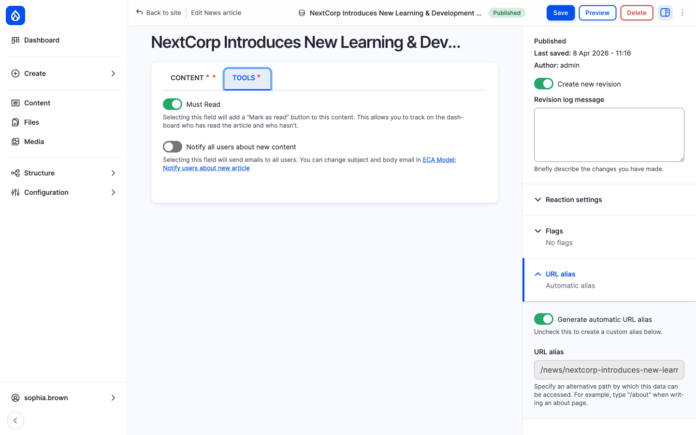
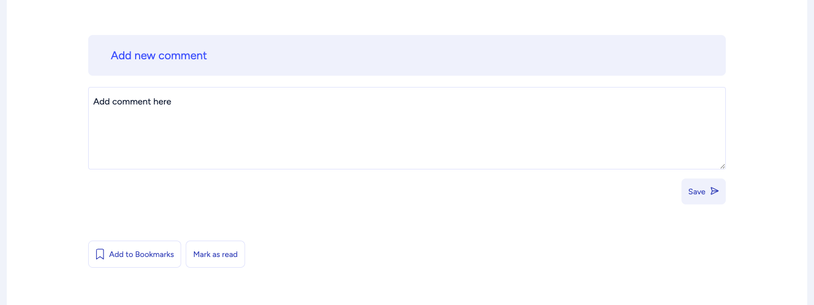
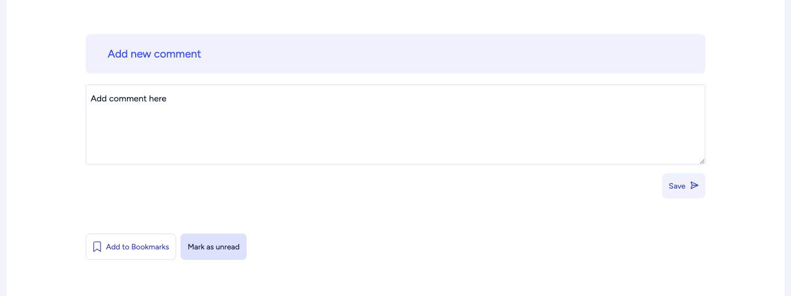
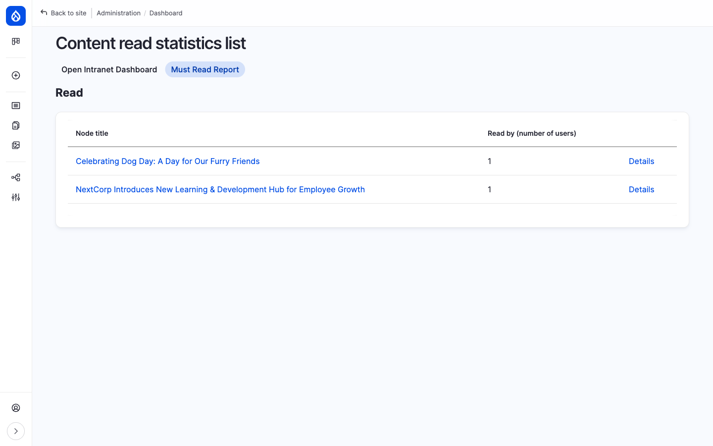
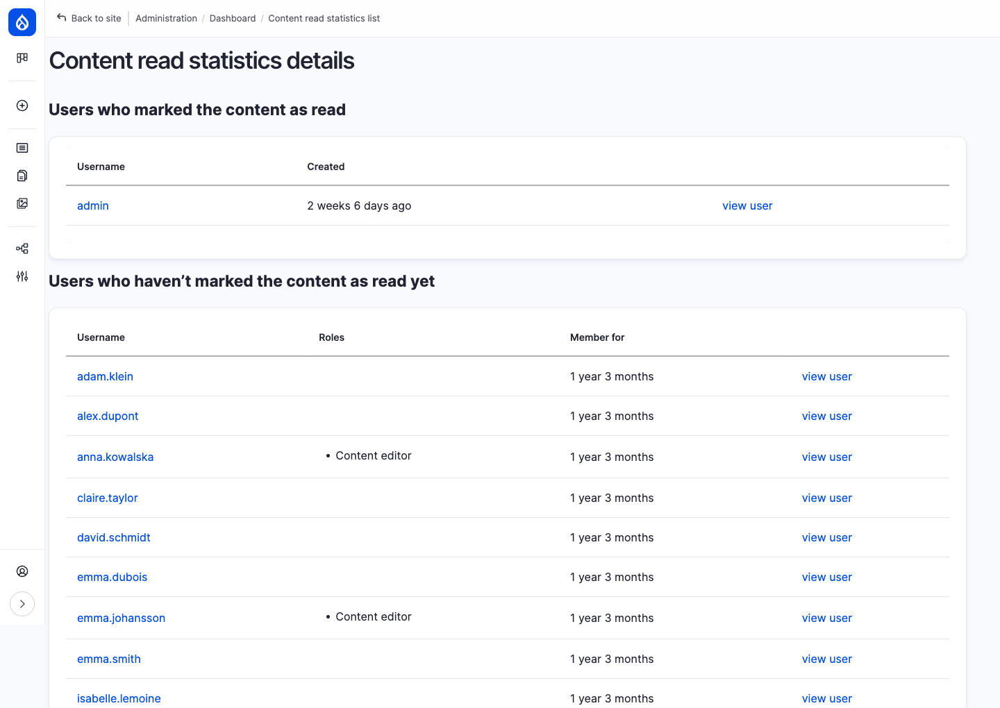
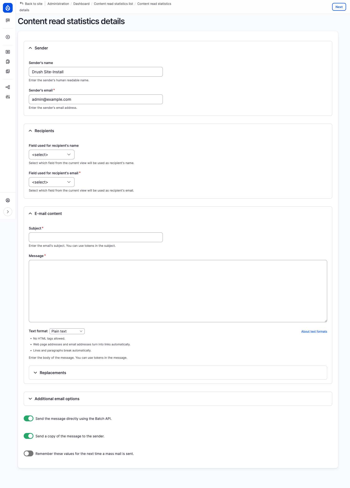

Open Intranet ships a **Must Read** workflow that lets editors flag a content item as required reading, lets readers acknowledge it with a single click, and lets administrators see exactly who has and who hasn't read each item — and email a reminder to the laggards.

## How it works

There are three roles in the workflow.

**The editor** publishes a piece of content and decides it is required reading. On the edit form, the **TOOLS** tab has a single toggle — **Must Read** — that turns the feature on for that content item.

**The reader** opens the content like any other article. Because Must Read is on, an extra **Mark as read** button appears in the article footer, next to **Add to Bookmarks**. Clicking it stores an acknowledgement against that user and that content item, and the button immediately flips to **Mark as unread** so the reader can change their mind.

**The administrator** sees a **Must Read Report** tab on the dashboard at `/admin/dashboard/must-read-report`. It lists every content item with Must Read enabled and how many users have clicked the button. Drilling into any row opens a per-item page with two side-by-side lists: users who *have* acknowledged the content, and users who *haven't* yet. From the bottom of the per-item page, a **Send a reminder email** button opens a bulk-email form pre-scoped to the not-yet-read audience — the administrator picks recipients, writes a subject and body, and sends. Reminders are a manual, on-demand action.

Under the hood, three pieces of Drupal configuration make this work: a boolean field (`field_mark_as_must_read`) on the **News article** content type, a Drupal `read` flag that records each acknowledgement, and a pair of Views displays — the report and the bulk-email form (the latter powered by the [Views Send](https://www.drupal.org/project/views_send) module).

## Enabling Must Read on a content item

1. Edit a **News article** (`/node/{nid}/edit`).
2. Switch to the **TOOLS** tab.
3. Toggle **Must Read** on.
4. Click **Save**.

The toggle's description matches what is shipped in the recipe verbatim:

> Selecting this field will add a "Mark as read" button to this content. This allows you to track on the dashboard who has read the article and who hasn't.

The toggle currently lives on the **News article** form. The underlying `read` flag is also enabled on `book`, `document`, `event`, `knowledge_base_page`, `page` and `webform` content types, so the flag mechanism is available there too — adding a Must Read toggle to one of those content types is just a matter of placing the boolean field on the form.

## Marking content as read

When a Must Read article is opened by an authenticated user, a **Mark as read** button appears in the article footer next to **Add to Bookmarks**:

Clicking it sends an AJAX request and the button immediately flips to **Mark as unread**, indicating the read flag is now stored for that user:

A user can toggle their own state at any time. Each click writes (or removes) one row in the `flagging` table.

## The Must Read report

Administrators with the **View Must Read Report Details** permission see a **Must Read Report** tab on the dashboard at `/admin/dashboard/must-read-report`.

The list shows three columns:

| Column | Meaning |
| --- | --- |
| **Node title** | Linked title of the content item |
| **Read by (number of users)** | Count of users who have flagged the item as read |
| **Details** | Link to the per-item breakdown |

Only content where **Must Read** is on (`field_mark_as_must_read = 1`) is listed.

## Detailed read status for one item

Click **Details** (or visit `/admin/dashboard/must-read-report/details?entity_id={nid}`) to see a per-item breakdown:

The page has two sections:

- **Users who marked the content as read** — Username, *Created* (when the read flag was added) and a *view user* link.
- **Users who haven't marked the content as read yet** — Username, Roles, Member for and a *view user* link. This list automatically excludes everyone already in the "read" list.

A **Send a reminder email** button at the bottom takes you to the bulk-email form prefilled with the not-yet-read audience.

## Sending a reminder

Clicking **Send a reminder email** opens a two-step bulk email form at `/admin/dashboard/must-read-report/details/send-email?entity_id={nid}`:

1. **Pick recipients** — tick the users you want to email (use the header checkbox to select all), then click **Next**.
2. **Compose the message** — fill in *Sender's name*, *Sender's email*, the **Subject** and **Message**, and choose a text format. You can use Drupal tokens in both the subject and the body.

Other options on the form:

- **Send the message directly using the Batch API** — sends in chunks rather than one big request, recommended for large recipient lists.
- **Send a copy of the message to the sender** — sends an audit copy to the sender's address.
- **Remember these values for the next time a mass mail is sent** — pre-fills the form on the next reminder.
- **Additional email options** — set message priority (low, normal, high, etc.) and other headers.

A **Back to list** link returns you to the report list. The form is provided by the [Views Send](https://www.drupal.org/project/views_send) module and sends each reminder on demand the moment you submit it.

## Permissions

| Action | Permission |
| --- | --- |
| Toggle Must Read on a piece of content | Standard edit permission for that content type (e.g. *Content editor* role) |
| Click **Mark as read** / **Mark as unread** | Any authenticated user — provided by the `read` flag |
| See the **Must Read Report** and per-item details | **View Must Read Report Details** |
| Send a reminder email | **View Must Read Report Details** plus permission to use the **Views Send** bulk action on the underlying view |
