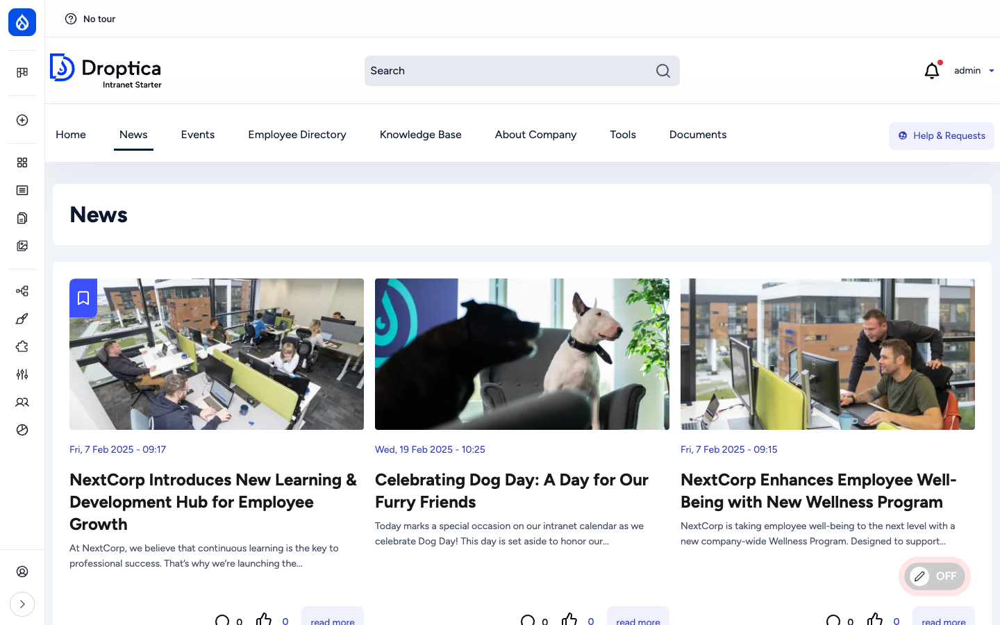
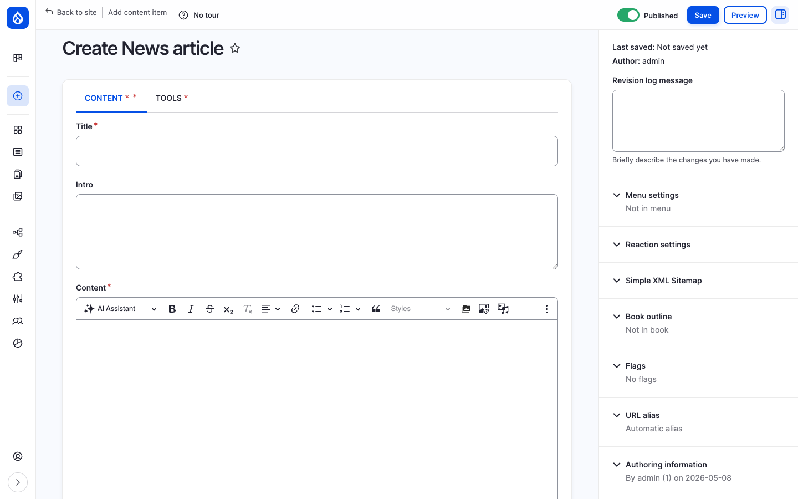
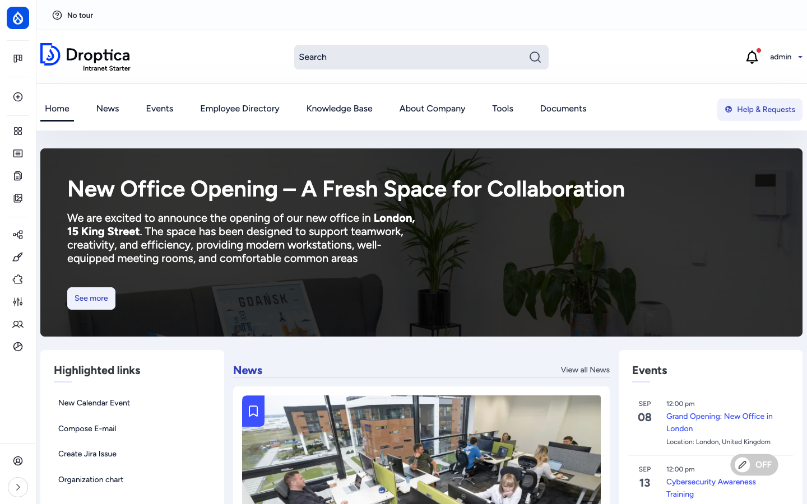
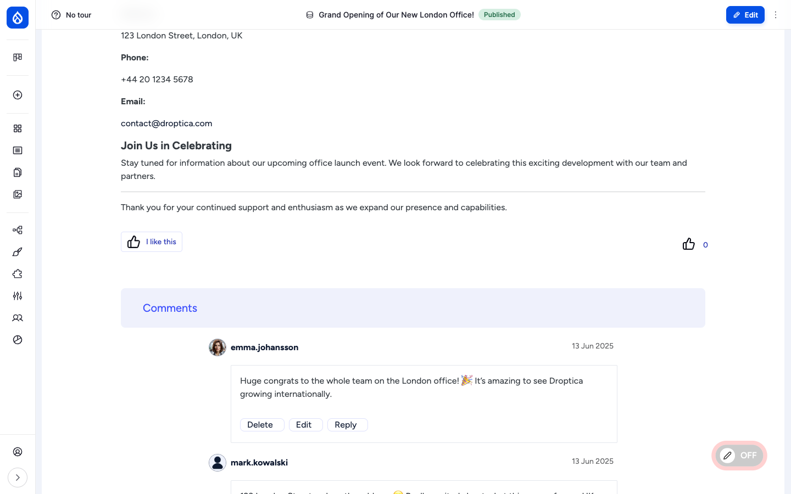
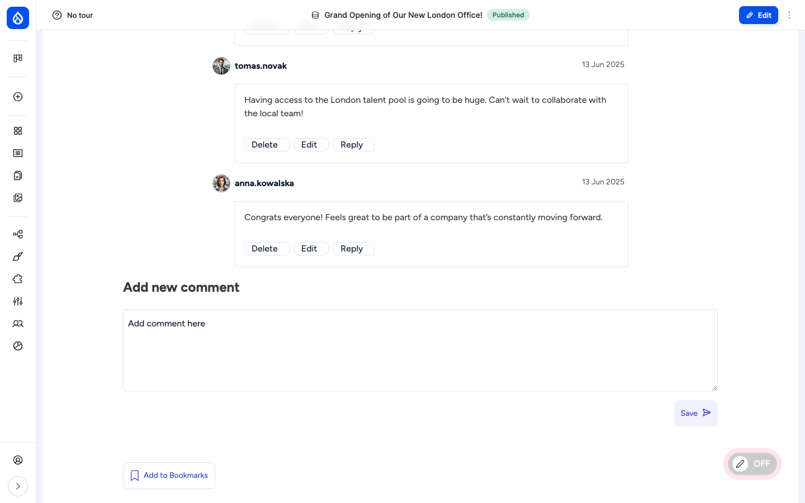
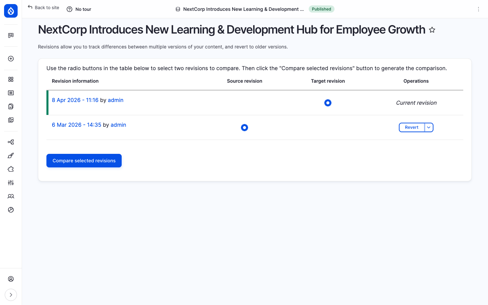

The **News** section is the central editorial channel of an Open Intranet site. It is where the company announces office news, milestones, new hires, events, policy changes and any other story worth broadcasting to all employees. News articles are first-class content: they have a dedicated landing page, a featured spot on the homepage, full social interactions, revision history and per-article reaction tracking.

## What it is

A News article is a Drupal node of bundle `article`. It is built around the idea of a **company announcement**: a headline, a short intro, a hero image and a rich body, surfaced in three places — the global navigation (`/news`), the front page (`/news-homepage`), and individually at `/news/{slug}`.

News articles are deeply integrated with the rest of the platform. They can be reacted to (thumbs-up), commented on, bookmarked, marked as Must Read, tracked by Engagement scoring, indexed by Search and tagged with taxonomy terms.

## Components

### The article content type

Each News article carries the following editorial fields:

| Field | Type | Purpose |
| --- | --- | --- |
| **Title** | Plain text | Headline shown on listings and as `<h1>` on the article page. |
| **Intro** | Long string | Short teaser / lead paragraph. Used in listings and the homepage feed. |
| **Content** (`body`) | Rich text (CKEditor 5) | The main article body, with image embeds, media, links and the AI Assistant button. |
| **Background image** (`field_background_image`) | Media reference | Cover image shown behind the title on the article page and as the listing thumbnail. |
| **Tags** (`field_tags`) | Taxonomy reference (multi-value) | Categorisation; used for filtering, related-content and faceted search. |
| **Document references** (`field_oi_document_ref`) | OI Document reference (multi-value) | Attach files from the **Documents** library to the article. |
| **Mark as Must Read** (`field_mark_as_must_read`) | Boolean | When checked, the article appears on every user's Must Read list until they mark it as read. See the [Must Read tracking](./must-read) feature page. |
| **Notify all users** (`field_notify_all_users_about_new`) | Boolean | When checked at publish time, an email is sent to all users about the new article. |
| **Reaction** (`field_news_article_reaction`) | Voting reaction | Lets readers click a single "I like this" thumbs-up. Counter is shown next to the button. |
| **Comments** (`comment_node_article`) | Comment | Threaded comments below the article body. |

The article content type ships with comments enabled by default and a full set of view modes (default, teaser, block teaser, grid layout, search result, RSS).

### The /news landing page

`/news` is the canonical News listing. It is rendered by the `news` Drupal view in a three-column grid. Each card shows:

- The cover image (from **Background image**)
- The publication date
- The title (linking to the article)
- A short teaser
- A bookmark icon in the top-left
- A row at the bottom with the comment count, reaction count and a **read more** button

The listing is paginated and orders articles newest-first. The page is in the main navigation menu under **News**.

### News on the homepage

The default front page is `/news-homepage` (a Basic page laid out with paragraphs and Layout Builder). It is composed of a hero banner (typically the most-recent or most-important article), three side blocks — **Highlighted links**, **News**, **Events** — and additional paragraphs configurable per site.

The **News** block on the homepage shows the latest published articles with their cover image and intro, plus a **View all News** link that takes the reader to `/news`.

### The article detail page

A single article opens as a full-width page with the cover image and overlay title, the article metadata (last updated, authors), then the body content rendered with the configured paragraphs and embedded media.

The header shows a **Published** badge to anyone with edit rights, plus an **Edit** button that opens the in-place edit form.

### Reactions, bookmarks and comments

The article footer is the social hub. Three things appear under the body:

1. **Reaction** — A single "I like this" thumbs-up. Click once to react; click again to remove. The count of reactions is displayed next to the button. The reaction type (icon, label) is configured globally in **Vote Types** at `/admin/structure/vote-types` and defaults to a thumbs-up SVG bundled with the theme.
2. **Comments** — Drupal core comments rendered under a **Comments** heading, with each comment showing the author avatar, username, body, date and **Edit / Delete / Reply** buttons (subject to the user's permission). An **Add new comment** form follows the existing thread.
3. **Bookmark** — An **Add to Bookmarks** button at the bottom of the page. Bookmarked articles appear in the user's personal bookmarks list (powered by the [`flag`](https://www.drupal.org/project/flag) module).

### Revisions

Every save of a News article creates a new revision. The **Revisions** tab on each article (`/node/{nid}/revisions`) shows the full history with the timestamp and author of each save, plus controls to:

- **Compare two revisions side by side** using the [`diff`](https://www.drupal.org/project/diff) module.
- **Revert** the current revision to any earlier one — reverting itself creates a new revision so nothing is lost.

### Tags and categories

Tags are a flat or hierarchical taxonomy attached to the article. They appear on the article detail page and are used by the listing view as filter facets. Multiple tags per article are supported.

### URL pattern

News articles are aliased automatically by Pathauto using the pattern `/news/[node:title-slug]`. The `/news` listing itself is provided by the `news` view and lives at `/news`.

## Integration with other features

News is the most-integrated content type in Open Intranet. It connects to:

- **Must Read tracking** — Toggle `Mark as Must Read` on any article and it appears on every user's Must Read list until they explicitly mark it as read. Editors can audit who has and has not read a given article from the [Must Read report](./must-read).
- **Engagement scoring** — Article views, likes and comments all add to the user's [Engagement](./engagement) RFV score.
- **Search** — Articles are indexed by the `default_index` Search API index alongside pages, KB pages, documents and users. Full-text search across title, intro and body.
- **Notifications** — When `Notify all users about new` is checked at publish time, the platform fires an email broadcast.
- **Documents** — Use **Document references** to attach files from the [Documents](./documents) library directly to an article (single source of truth for binaries — they are not duplicated).
- **Bookmarks / Recently read** — Both apply to articles automatically. See [Social interactions](./social).
- **Translations** — When additional languages are enabled, articles can be translated; each translation has its own revisions and comments.

## Permissions

| Capability | Default role(s) |
| --- | --- |
| View published articles | Authenticated user |
| Create / edit / delete own articles | Content editor |
| Edit / delete any article | Content editor, Administrator |
| Toggle "Mark as Must Read" | Content editor (via standard edit permission) |
| Toggle "Notify all users about new" | Content editor |
| Like an article (`create reaction on node:article:field_news_article_reaction`) | Authenticated user |
| Post comments | Authenticated user |
| Bookmark / unbookmark | Authenticated user |
| View revisions / revert | Content editor, Administrator |

## Modules behind it

- Drupal core: `node`, `comment`, `book` (parent/child relations available on articles), `views`, `path`, `editor`, `image`
- [`paragraphs`](https://www.drupal.org/project/paragraphs) — for in-body components
- [`votingapi`](https://www.drupal.org/project/votingapi) + [`votingapi_reaction`](https://www.drupal.org/project/votingapi_reaction) — the like / reaction button
- [`flag`](https://www.drupal.org/project/flag) — bookmarks (`bookmark` flag) and Must Read (`read` flag)
- [`diff`](https://www.drupal.org/project/diff) — revision comparison
- [`pathauto`](https://www.drupal.org/project/pathauto) — the `/news/{slug}` URL alias
- [`search_api`](https://www.drupal.org/project/search_api) — search indexing
- `openintranet_engagement` — engagement tracking
- `frontend_editing` + Layout Builder — in-place editing on the article page

## Learn more

- [How to use it](../../user-guide/news) — step-by-step procedures for adding, editing, commenting on, bookmarking, pinning and reverting news articles
- [Creating content](../../user-guide/creating-content) — common authoring patterns shared by all content types
- [Must Read tracking](./must-read) — full description of the Must Read feature triggered by `field_mark_as_must_read`
- [Engagement analytics](./engagement) — how article activity feeds the RFV score
- [Social interactions](./social) — reactions, comments, bookmarks and recently-read in detail
