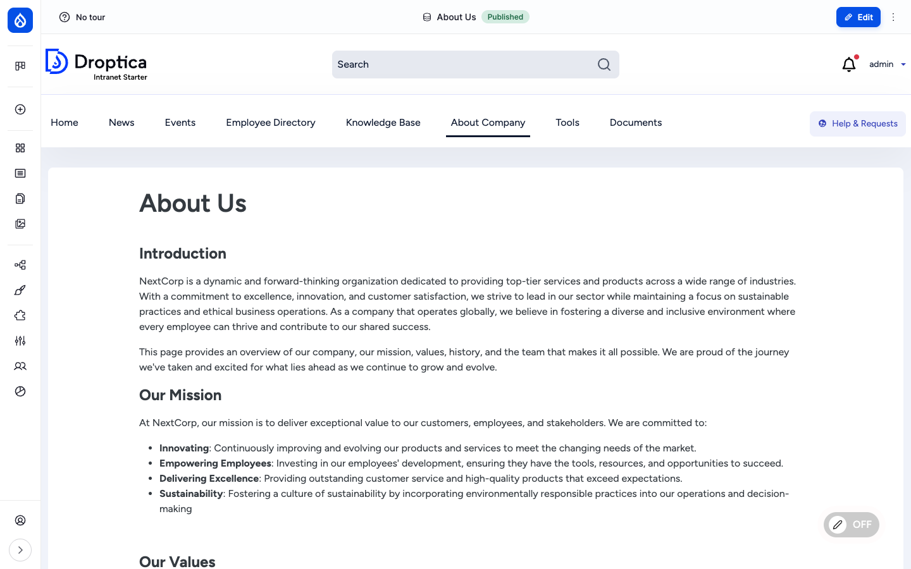
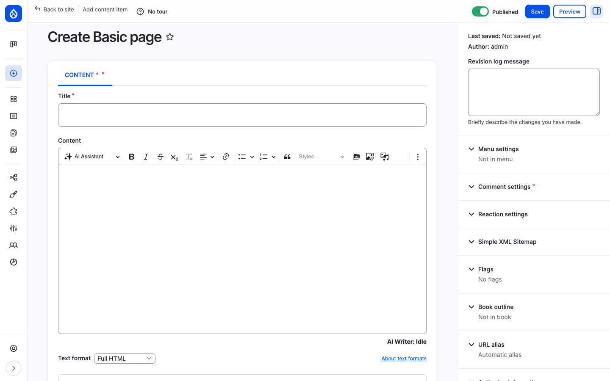

The **Basic page** content type (`page`) is Open Intranet's general-purpose flexible CMS layer. Where News is for time-sensitive announcements and Knowledge Base is for hierarchical handbook content, Pages is for everything else: the homepage, an *About Us* page, departmental hubs, project landing pages, dashboards, contact pages, "tools" pages, and any one-off informational page the site needs.

## What it is

A page is a Drupal node of bundle `page`. It stores a title, a rich-text body, an optional cover image, optional document attachments, and supports per-article reactions and comments. Pages are aliased under `/pages/{slug}` by default (the `/news-homepage` front page is itself a `page` node).

The body is a CKEditor 5 rich-text field with the AI Assistant button, full media embed support (images, videos, documents from the [Documents library](./documents)) and inline rendering of the same paragraphs library used elsewhere in the site.

## Components

### The page content type

Each page carries the following editorial fields:

| Field | Type | Purpose |
| --- | --- | --- |
| **Title** | Plain text | Page headline shown as `<h1>` and in the browser tab. |
| **Body** | Rich text (CKEditor 5) | The main page body, with the AI Assistant, media embeds, links and inline paragraphs. |
| **Background image** (`field_background_image`) | Media reference | Optional cover image. |
| **Document references** (`field_oi_document_ref`) | OI Document reference (multi-value) | Attach files from the [Documents library](./documents) to the page (the file lives in one place but appears here too). |
| **Reaction** (`field_basic_page_reaction`) | Voting reaction | Lets readers click a single "I like this" thumbs-up. Counter is shown next to the button. |
| **Comments** (`comment_node_page`) | Comment | Threaded comments below the body. |

### Layout Builder per-page layouts

The `page` content type has Layout Builder enabled. That means a content editor can decide *per page* how the layout looks — number of columns, which blocks go where, what kind of section background, what spacing — without writing CSS or asking a developer.

The Layout Builder UI is reached from any page edit page via the **Layout** tab. The editor:

1. Adds **sections** (one column, two columns, three columns, etc.).
2. Drops **blocks** into each section: the body field, custom blocks, view blocks, the Documents block, the Recently Read block, and any block from `/admin/structure/block`.
3. Picks a **section style** from `layout_builder_styles` (e.g. *Hero*, *Card*, *Quiet*) — pre-defined visual presets that the theme ships.
4. Sets **custom CSS classes** per section via `layout_custom_section_classes`.

The same `page` bundle can produce a tightly-controlled landing page (Hero + 3 columns + CTA), a documentation page (single column + Book navigation), a dashboard (KPIs from view blocks), or a free-form About-Us — all from the same content type.

### Frontend editing

When [frontend editing](https://www.drupal.org/project/frontend_editing) is on (toggle in the bottom-right of the page), every editable region of a rendered page shows a small pencil icon on hover. Clicking the pencil opens an inline editor for that field — title, body, media — without leaving the page. Save returns to the rendered view immediately.

This is the day-to-day editing experience for content editors: they navigate to the page, switch frontend editing **ON**, and edit text in place rather than going to `/node/{nid}/edit`.

### Reactions and comments

Like News articles, pages have a single "I like this" thumbs-up reaction (`field_basic_page_reaction`) and threaded comments (`comment_node_page`). The reaction button and comment thread appear at the bottom of the rendered page, with the same UI shown for News. See [Social interactions](./social) for details.

### URL pattern

Pages are aliased automatically by Pathauto using the pattern `/pages/[node:title-slug]`. The default front page is a Basic page with the alias `/news-homepage`. The KB landing page lives at `/pages/knwoledge-base` and is also a Basic page, which is why both News-style listings and KB landing pages share the same flexibility.

### Page Manager (admin pages)

In addition to `page` nodes, Open Intranet ships [Page Manager](https://www.drupal.org/project/page_manager). Page Manager creates **routed pages** that are not nodes but rather standalone URLs assembled from blocks and views. Most of the admin dashboards (e.g. the engagement reports landing page) are built with Page Manager.

Page Manager pages are managed at `/admin/structure/page_manager`. They are the right tool when a page should not be editable as content (no body, no comments, no reactions) but should still be a flexible composition of blocks under a stable URL.

## Integration with other features

- **Layout Builder** — Pages are the primary content type using Layout Builder per-content layouts. See [Layout Builder & Frontend Editing](./layout-builder).
- **Documents** — Use **Document references** to attach files from the [Documents library](./documents) directly to a page.
- **Reactions, Comments, Bookmarks** — All apply to pages. See [Social interactions](./social).
- **Engagement scoring** — Page views and interactions feed the user's [Engagement](./engagement) RFV score.
- **Search** — Pages are indexed by the `default_index` Search API index alongside articles, KB pages, documents and users.
- **Multilingual** — When additional languages are enabled, pages can be translated; each translation has its own revisions, comments and reactions.
- **Frontend editing** — In-place editing applies to pages out of the box.
- **AI Assistant** — The CKEditor toolbar in the page body has the AI Assistant button — see [AI Assistant in CKEditor](./ai).

## Permissions

| Capability | Default role(s) |
| --- | --- |
| View published pages | Anonymous + authenticated user |
| Create / edit / delete own pages | Content editor |
| Edit / delete any page | Content editor, Administrator |
| Use Layout Builder on a page | Content editor |
| Use frontend editing | Content editor (and the `Use frontend editing` permission) |
| Like a page | Authenticated user |
| Post comments | Authenticated user |
| Configure Page Manager pages | Administrator |
| View revisions / revert | Content editor, Administrator |

## Modules behind it

- Drupal core: `node`, `comment`, `views`, `path`, `editor`, `image`, `layout_builder`
- [`paragraphs`](https://www.drupal.org/project/paragraphs) — for in-body components (when configured per content type)
- [`layout_builder_styles`](https://www.drupal.org/project/layout_builder_styles) — pre-defined visual section styles
- [`layout_custom_section_classes`](https://www.drupal.org/project/layout_custom_section_classes) — custom CSS classes per section
- [`frontend_editing`](https://www.drupal.org/project/frontend_editing) — in-place editing pencil
- [`votingapi`](https://www.drupal.org/project/votingapi) + [`votingapi_reaction`](https://www.drupal.org/project/votingapi_reaction) — reactions
- [`flag`](https://www.drupal.org/project/flag) — bookmarks
- [`page_manager`](https://www.drupal.org/project/page_manager) — admin / routed pages
- [`pathauto`](https://www.drupal.org/project/pathauto) — `/pages/{slug}` URL alias
- [`search_api`](https://www.drupal.org/project/search_api) — search indexing

## Learn more

- [How to use it](../../user-guide/pages) — step-by-step procedures for creating, editing, switching layout and using frontend editing on pages
- [Creating content](../../user-guide/creating-content) — common authoring patterns shared by all content types
- [Layout Builder & Frontend Editing](./layout-builder) — the per-content layout system
- [AI Assistant in CKEditor](./ai) — the AI Writer button in the page body
- [Documents](./documents) — the file library that pages can pin from
- [Social interactions](./social) — reactions, comments and bookmarks in detail
