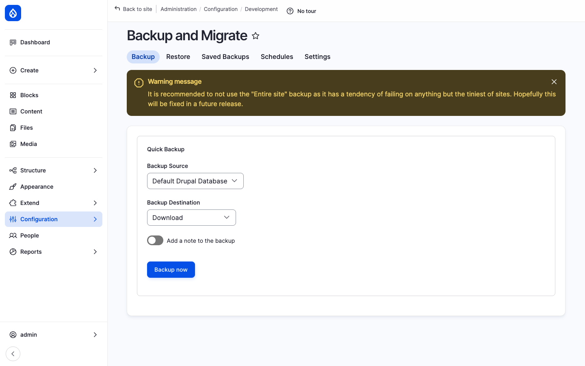
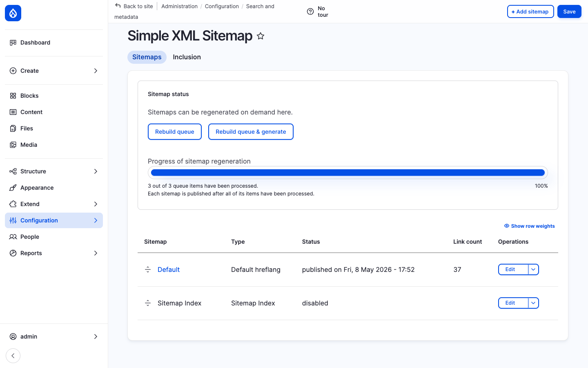
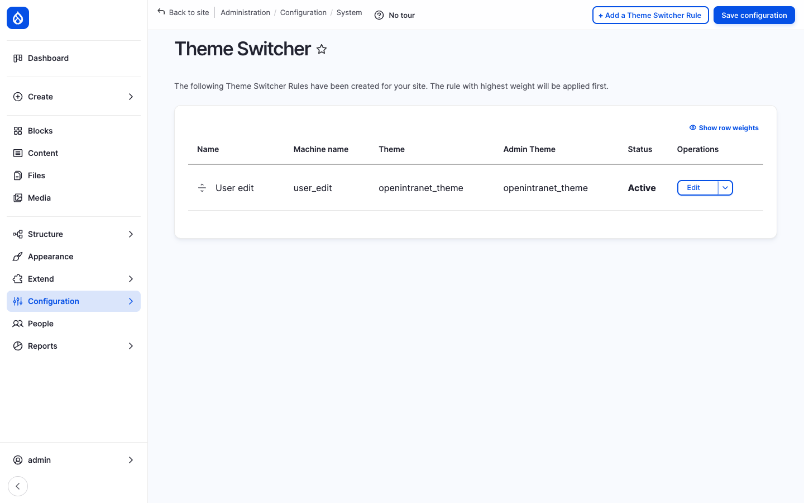

Open Intranet ships with a curated set of **small admin tools** that cover the long tail of *"oh, we also need this on a serious intranet"* features. Each one is a few clicks to use and a few minutes to configure, so they are documented together rather than as separate pages. They are:

- **Backup & Migrate** — On-demand and scheduled backups of the database (and, when needed, files / config).
- **Auto Logout** — Per-role idle-time logout for security-sensitive roles.
- **Coffee** — A *Cmd+K* command palette to jump anywhere on the site.
- **Simple XML Sitemap** — SEO-friendly sitemap generation for indexed pages.
- **Theme Switcher** — Apply different themes per role, language or path.
- **Masquerade** — Switch into another user's session (for support / debugging).
- **Diff** — Side-by-side comparison of any two revisions.

## Backup & Migrate

`/admin/config/development/backup_migrate` is the central admin page. The tool exposes five tabs — **Backup**, **Restore**, **Saved Backups**, **Schedules**, **Settings**:

- **Backup** — One-click create a backup. Pick a *source* (the Drupal DB, a folder on disk, the public files folder, the private files folder) and a *destination* (download to your browser, save to the server, push to S3 / Dropbox / Google Drive / FTP).
- **Restore** — Upload a backup file or pick from saved backups.
- **Saved Backups** — Manage backups stored on the server. Delete, restore, download.
- **Schedules** — Create cron-driven schedules ("daily at 02:00, keep last 14, push to S3").
- **Settings** — Compression (gzip / bzip2 / zip), exclude tables (cache, sessions), notifications by e-mail.

The tool's own UI warns *not* to use the *Entire site* backup mode for anything but the smallest sites — for production sites a database-only backup plus a separate file-system backup is the standard approach.

## Auto Logout

[Auto Logout](https://www.drupal.org/project/autologout) (`drupal/autologout`) ships in `composer.json` and is enabled in production deployments where regulated data is involved.

When enabled, it adds a per-role idle-time logout policy at `/admin/config/people/autologout`:

- **Per-role timeout** — Different roles can have different timeouts (e.g. 60 minutes for *Authenticated user*, 15 minutes for *HR officer*).
- **Inactivity warning** — A countdown dialog appears N seconds before logout with a *Stay logged in* button.
- **Whitelisted paths** — URLs that should not extend the timer (e.g. an iframe / embed page).
- **Cross-tab** — Activity in one browser tab keeps every tab logged in.

For an intranet that holds sensitive HR / finance data this is the single most important setting to tune up after the initial install.

## Coffee — command palette

[Coffee](https://www.drupal.org/project/coffee) is a small JavaScript command palette: press **Alt+D** (or **Alt+Ctrl+D** on Mac, configurable) and a fuzzy-search input pops up. Type the first few letters of any admin page, content title, taxonomy term or user — Coffee jumps directly there.

It indexes all the admin menu items and surfaces them with a single keystroke. For an editor working through many pages, this saves dozens of clicks a day.

The settings page at `/admin/config/user-interface/coffee` lets the admin add custom shortcuts (e.g. *site logo* → `/admin/config/system/site-information`) and pick which menus / content types feed the index.

## Simple XML Sitemap

[Simple XML Sitemap](https://www.drupal.org/project/simple_sitemap) generates an `/sitemap.xml` that lists every indexed page on the site. The admin page at `/admin/config/search/simplesitemap` shows the configured sitemaps:

For an intranet the sitemap is rarely consumed by a public crawler, but it is still useful for:

- Internal search engines (Solr / Elasticsearch) that crawl the URL list.
- Health checks ("how many pages do we publish?").
- Migrations and link-checking.

Per content-type / per-bundle the admin chooses *whether* to include a bundle, and at *what priority* and *change frequency*. The sitemap regenerates on cron (or on-demand from the admin page).

## Theme Switcher

The Theme Switcher module adds **rule-based theme assignment**. The admin page at `/admin/config/system/theme_switcher` lists the configured rules — each rule pairs a **selector** (URL path, role, language, content type) with a **theme** to render with.

Common use-cases:

- A **dedicated** theme for `/admin/*` (e.g. Gin Admin) and the default frontend theme everywhere else.
- A **white-label** theme for a specific tenant URL (e.g. `/partners/*` uses a partner-specific theme).
- A **language-specific** theme for an Arabic or Hebrew language version (RTL support).

Rules have priorities so that overlapping rules resolve deterministically.

## Masquerade

[Masquerade](https://www.drupal.org/project/masquerade) lets an administrator **switch into another user's session** for support and debugging. From the user list (`/admin/people`) or from a user's profile page, click *Masquerade as*. The admin's interface re-renders as that user — same blocks, same access, same dashboards.

A persistent **Unmasquerade** badge sits in the header so the admin knows they are masquerading and can switch back with one click.

This is the canonical "*can you reproduce the bug as me?*" tool: when a user reports a missing page or a permission issue, the admin masquerades, sees exactly what the user sees, fixes the misconfiguration and switches back.

Permissions are tightly controlled: a *Masquerade* permission is required, and admins are excluded from masquerading as another admin (so the audit trail is preserved).

## Diff

The [Diff](https://www.drupal.org/project/diff) module adds a **Compare** tab to every revisioned entity. Pick any two revisions, click *Compare* — the page renders a side-by-side or unified diff with field-by-field colouring (added text in green, removed text in red, edited text highlighted).

It works on every revisioned entity — News, Pages, KB pages, Events, Webform configurations, Documents — so any admin investigating *what changed* between yesterday and today has a one-click answer.

## How they fit together

These tools share a *small but always-on* design philosophy:

| Tool | Primary user | Primary use-case |
| --- | --- | --- |
| **Backup & Migrate** | Hosting admin | Disaster recovery, pre-update snapshot |
| **Auto Logout** | Security admin | Compliance — automatic session termination |
| **Coffee** | Every admin / editor | Faster navigation between admin pages |
| **Simple XML Sitemap** | Site builder | Internal index and external SEO (when public) |
| **Theme Switcher** | Site builder | Per-context theming (admin vs frontend, multi-tenant) |
| **Masquerade** | Support / training | Reproduce a user's experience |
| **Diff** | Editor / approver | Audit what changed between two revisions |

## Integration with other features

- **Backup & Migrate + Cron** — Schedules run on Drupal cron (or external systemd / Kubernetes cron via `drush bam-backup`).
- **Auto Logout + Access Control & Groups** — Per-role timeouts can be tied to specific high-privilege groups (e.g. *HR officer* gets 15 minutes, *Authenticated user* gets 8 hours).
- **Coffee + Custom URL aliases** — Pathauto-generated aliases are indexed by Coffee, so editors can fuzzy-search by article title.
- **Simple XML Sitemap + Multilingual** — Generates one sitemap per language, properly linked with `<xhtml:link rel="alternate">`.
- **Theme Switcher + Multilingual** — Pair with the *Language* condition for full RTL theming.
- **Masquerade + Engagement scoring** — Engagement events recorded while masquerading are correctly attributed (or excluded, depending on configuration).
- **Diff + Revisions** — Works on every Drupal revisioned entity; pairs naturally with the *Revisions* tab on News, KB pages, Pages.

## Permissions

| Tool | Permission | Default role(s) |
| --- | --- | --- |
| Backup & Migrate | Perform backups / restore | Administrator |
| Auto Logout | Configure auto-logout | Administrator |
| Coffee | Use Coffee | Authenticated user (configurable per role) |
| Sitemap | Administer sitemap | Administrator |
| Theme Switcher | Administer theme-switcher rules | Administrator |
| Masquerade | Masquerade as any user / role | Administrator |
| Diff | View diffs | Authenticated user (with revision-view) |

## Modules behind it

- [Backup and Migrate](https://www.drupal.org/project/backup_migrate)
- [Automated Logout](https://www.drupal.org/project/autologout)
- [Coffee](https://www.drupal.org/project/coffee)
- [Simple XML Sitemap](https://www.drupal.org/project/simple_sitemap)
- [Theme Switcher](https://www.drupal.org/project/theme_switcher_rules)
- [Masquerade](https://www.drupal.org/project/masquerade)
- [Diff](https://www.drupal.org/project/diff)
- Drupal core: `system`, `update`

## Learn more

- [News](./news), [Knowledge Base](./knowledge-base), [Pages](./pages), [Events](./events) — every revisioned content type pairs with **Diff**
- [Multilingual](./multilingual) — pairs with **Theme Switcher** (per-language theme) and **Sitemap** (per-language sitemaps)
- [Access Control & Groups](./access) — informs **Auto Logout** policy and **Masquerade** permissions
