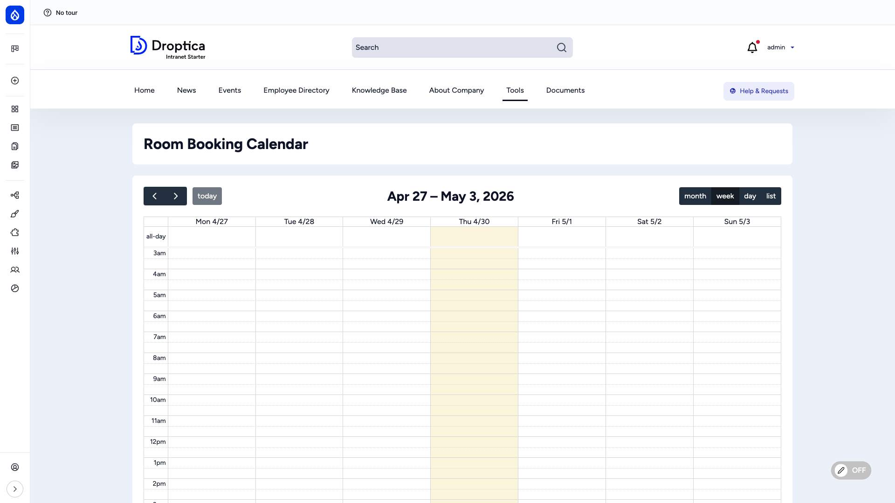
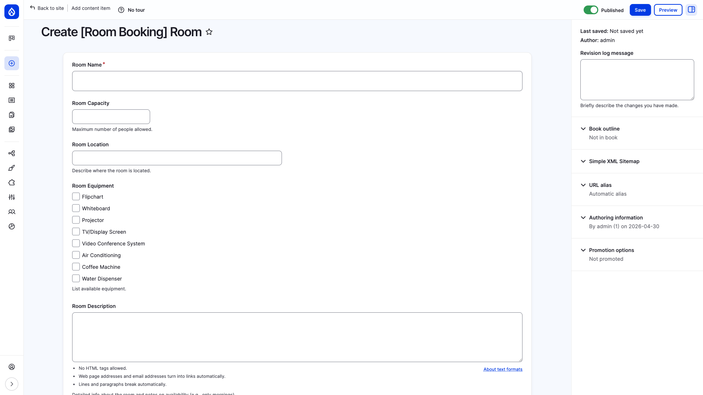
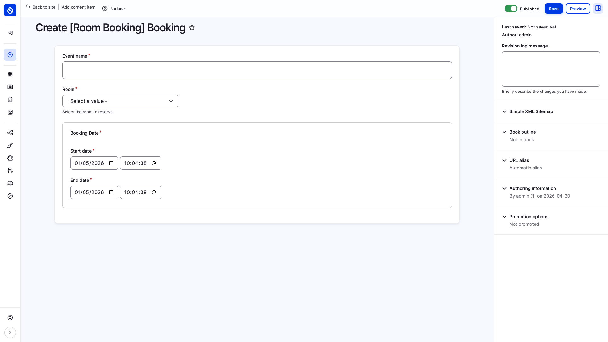
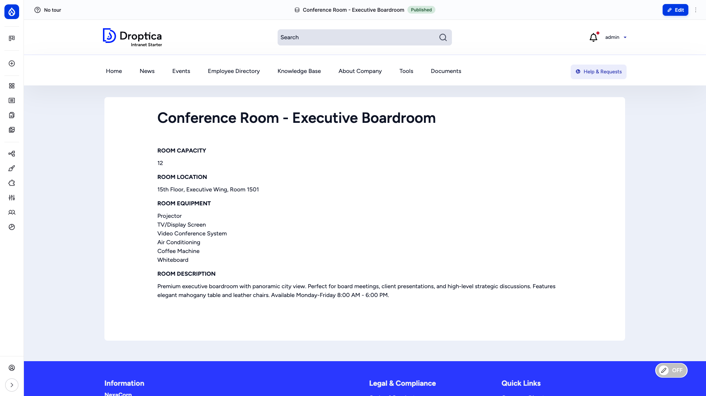

Manage every bookable space in your company — conference rooms, meeting rooms, creative spaces, phone booths and other facilities — with a built-in calendar and per-room metadata.

## Overview

The Room Booking feature ships as the **Room Booking System** recipe (`openintranet_rmb`). Once enabled, it adds two content types (Rooms and Bookings), a calendar view at `/rooms`, dedicated menu links and a `Room Manager` user role.

The feature uses Drupal core nodes and the `fullcalendar_view` contrib module under the hood — no custom entity engineering required, so everything you already know about Drupal content (revisions, permissions, multilingual) applies to rooms and bookings out of the box.

## Key capabilities

- **Two content types** — `rmb_room` for the bookable spaces and `rmb_booking` for individual bookings
- **Calendar view** — Drag-friendly month / week / day calendar at `/rooms` showing every booking
- **Rich room metadata** — Capacity, location, description and a multi-select equipment list (whiteboard, projector, video conference system, coffee machine, …)
- **Time-range bookings** — Each booking has a start and end timestamp via Drupal's native `datetime_range` field
- **Main-menu integration** — A "Room Booking" menu group with shortcuts to the calendar and the booking form
- **Demo content included** — Three sample rooms (Executive Boardroom, Creative Workshop, Phone Booth) install with the recipe so editors can see real examples
- **Dedicated role** — `Room Manager` for staff who curate the room catalogue without giving them full admin rights

## Enabling the recipe

Room Booking is **not** part of the core Open Intranet install — it is an optional recipe. Enable it once per site:

1. Visit **Administration → Browse → Recipes** (`/admin/modules/browse/recipes`)
2. Find **[Open Intranet] Room Booking System**
3. Click **Install**

The recipe imports two content types, fields, the calendar view, the `Room Manager` role, three menu links and three demo rooms.

After install you can re-apply the recipe at any time from the same page (the **Reapply** button) to restore default config.

## Calendar view — `/rooms`

The calendar at `/rooms` is the central hub. Every booking appears as a coloured event. Switch between **Month**, **Week** and **Day** views, click an event to open its detail page, or click an empty slot to start a new booking.

The page link is also exposed in the main menu under **Room Booking → Room Booking Calendar**.

## Adding a room — `/node/add/rmb_room`

Rooms are the bookable spaces. Use **Content → Add content → Room** or `/node/add/rmb_room`.

### Room fields

| Field | Type | Notes |
| --- | --- | --- |
| **Title** | Text | Room name shown everywhere (e.g. *"Conference Room — Executive Boardroom"*) |
| **Description** | Long text | Marketing copy, availability hours, restrictions |
| **Location** | Text | Free-form, e.g. *"15th Floor, Executive Wing, Room 1501"* |
| **Capacity** | Integer | Maximum number of people |
| **Equipment** | Multi-select | Pre-defined list (see below). Multiple values allowed. |

### Equipment options (out of the box)

- Flipchart
- Whiteboard
- Projector
- TV / Display Screen
- Video Conference System
- Air Conditioning
- Coffee Machine
- Water Dispenser

You can extend the list by editing the *Equipment* field on the `rmb_room` content type at `/admin/structure/types/manage/rmb_room/fields`.

## Adding a booking — `/node/add/rmb_booking`

Use **Content → Add content → Booking** or `/node/add/rmb_booking`. The same form opens when you click an empty slot in the calendar.

### Booking fields

| Field | Type | Notes |
| --- | --- | --- |
| **Title** | Text | Short description of the booking (e.g. *"Q4 strategy review"*) |
| **Date** | Datetime range | Start and end timestamp |
| **Room** | Entity reference | Pick from existing rooms |

After saving, the booking appears immediately in the calendar at `/rooms`.

## Room detail page

Each room has its own canonical page that lists capacity, location, equipment and the room description. Useful to share a direct link with a colleague: *"Book us into [Executive Boardroom]"*.

## Demo content

The recipe ships three illustrative rooms so editors can see how everything looks before adding their own:

| Room | Capacity | Location |
| --- | --- | --- |
| Conference Room — Executive Boardroom | 12 | 15th Floor, Executive Wing, Room 1501 |
| Creative Workshop Space | 8 | 5th Floor, Innovation Hub |
| Phone Booth | 1 | Multiple floors |

Delete or edit them once you have your real catalogue.

## Roles and permissions

The recipe creates a dedicated **`Room Manager`** role that can:

- Create, edit and delete rooms and bookings
- Manage the calendar view

Assign it to facility / office managers so they can curate the room catalogue without giving them full administrator rights. End users with the *Authenticated* role can typically create their own bookings (configurable per site) and see all rooms in the calendar.

Permissions are configurable at `/admin/people/permissions` — search for *"rmb_room"* and *"rmb_booking"* to see all the relevant rows.

## Menu links added

The recipe adds three entries to the main menu, grouped under a **Room Booking** parent:

- **Room Booking** (parent / dropdown)
  - **Room Booking Calendar** → `/rooms`
  - **Add Room Booking** → `/node/add/rmb_booking?destination=/rooms`

You can rename, reorder or hide these from **Structure → Menus → Main navigation**.

## Modules used

The recipe depends on the following Drupal modules — all of them ship with Open Intranet by default:

- `node`, `text`, `options` — Drupal core
- `datetime_range` — Drupal core
- `views` — Drupal core
- `fullcalendar_view` — Contrib calendar widget
