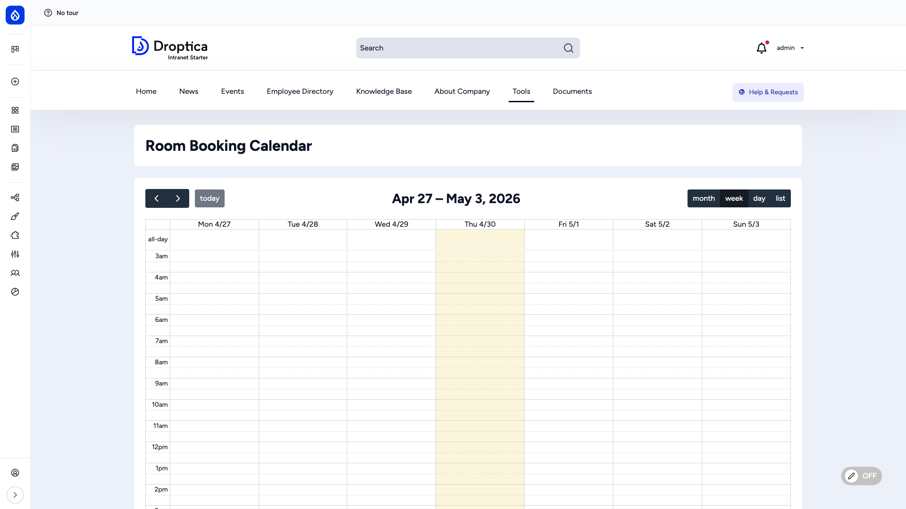
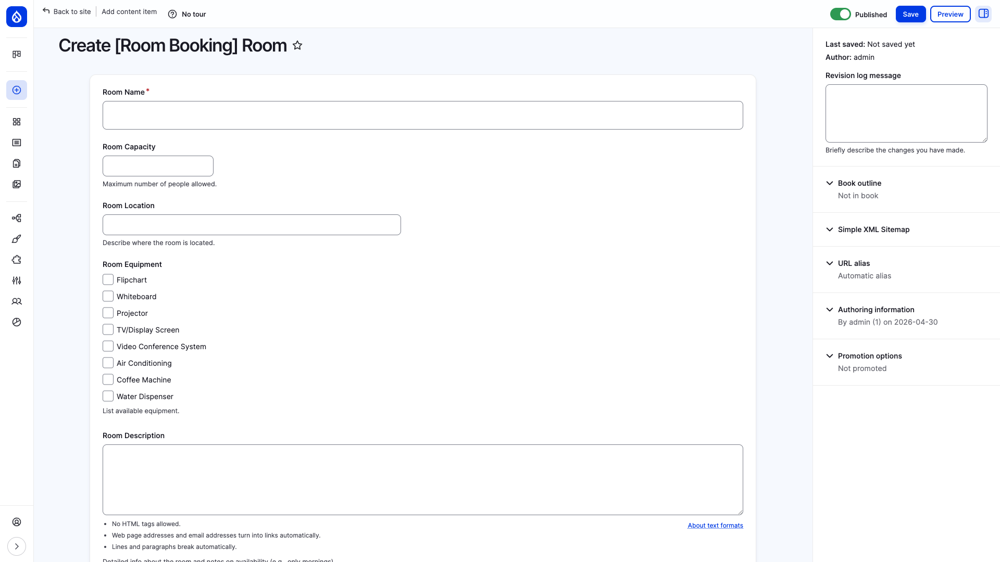
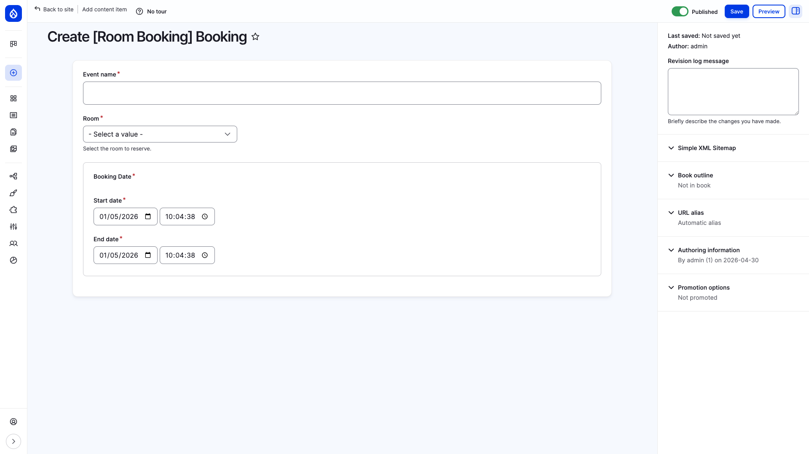
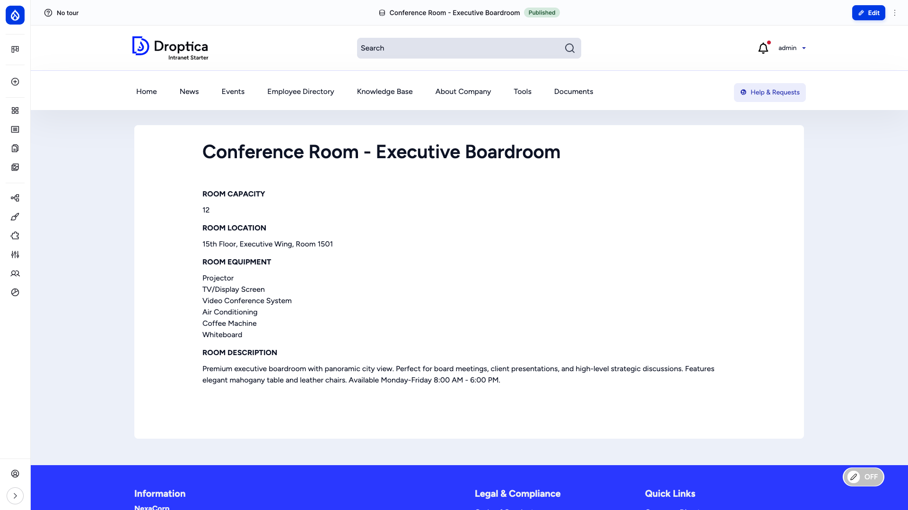

import Audience from '../../../components/Audience.astro';

<Audience level="optional" />

Manage every bookable space in your company — conference rooms, meeting rooms, creative spaces, phone booths and other facilities — with a built-in calendar and per-room metadata.

Looking for how to book a room? See [Room Booking](/docs/user-guide/room-booking/) in the User Guide.

## Overview

The Room Booking feature ships as the **Room Booking System** recipe (`openintranet_rmb`). Once enabled, it adds two content types (Rooms and Bookings), a calendar view at `/rooms`, dedicated menu links and a `RMB - Room Manager` user role.

The feature uses Drupal core nodes and the `fullcalendar_view` contrib module under the hood — no custom entity engineering required, so everything you already know about Drupal content (revisions, permissions, multilingual) applies to rooms and bookings out of the box.

## Key capabilities

- **Two content types** — `rmb_room` for the bookable spaces and `rmb_booking` for individual bookings
- **Calendar view** — Month / week / day / list calendar at `/rooms` showing every booking, opening in week view. Users can drag a booking they are allowed to edit to reschedule it, after a confirmation
- **Rich room metadata** — Capacity, location, description and a multi-select equipment list (whiteboard, projector, video conference system, coffee machine, …)
- **Time-range bookings** — Each booking has a start and end timestamp via Drupal's native `datetime_range` field
- **Main-menu integration** — A "Room Booking" menu group with shortcuts to the calendar and the booking form
- **Demo content included** — Three sample rooms (Executive Boardroom, Creative Workshop, Phone Booth) install with the recipe so editors can see real examples
- **Dedicated role** — `RMB - Room Manager` for staff who curate the room catalogue without giving them full admin rights

## Enabling the recipe

Room Booking is **not** part of the core Open Intranet install — it is an optional recipe. Enable it once per site:

1. Visit **Administration → Browse → Recipes** (`/admin/modules/browse/recipes`)
2. Find **[Open Intranet] Room Booking System**
3. Click **Install**

The recipe imports two content types, fields, the calendar view, the `RMB - Room Manager` role, three menu links and three demo rooms.

After install you can re-apply the recipe from the same page (the **Reapply** button) to restore default config. This only works while the recipe's configuration on your site is unchanged. If it fails with *"The configuration ... exists already and does not match the recipe's configuration"*, fix the settings by hand instead, for example the booking permissions described under [Roles and permissions](#roles-and-permissions).

## Calendar view — `/rooms`

The calendar at `/rooms` is the central hub. Every booking appears as a coloured event. The calendar opens in **week** view; switch between **month**, **week**, **day** and **list** with the buttons in the top right. Click an event to open its detail page in a new tab. Clicking an empty slot does not create a booking, use the **Add Room Booking** link instead.

The page link is also exposed in the main menu under **Tools → Room Booking → Room Booking Calendar**.

## Adding a room — `/node/add/rmb_room`

Rooms are the bookable spaces. Use **Create → [Room Booking] Room** or `/node/add/rmb_room`.

### Room fields

| Field | Type | Notes |
| --- | --- | --- |
| **Room Name** | Text | Room name shown everywhere (e.g. *"Conference Room — Executive Boardroom"*) |
| **Room Description** | Long text | Marketing copy, availability hours, restrictions |
| **Room Location** | Text | Free-form, e.g. *"15th Floor, Executive Wing, Room 1501"* |
| **Room Capacity** | Integer | Maximum number of people |
| **Room Equipment** | Multi-select | Pre-defined list (see below). Multiple values allowed. |

### Equipment options (out of the box)

- Flipchart
- Whiteboard
- Projector
- TV / Display Screen
- Video Conference System
- Air Conditioning
- Coffee Machine
- Water Dispenser

You can extend the list by editing the *Equipment* field on the `rmb_room` content type at `/admin/structure/types/manage/rmb_room/fields`.

## Adding a booking — `/node/add/rmb_booking`

Use **Create → [Room Booking] Booking**, the **Add Room Booking** menu link or `/node/add/rmb_booking`. Step-by-step instructions for users are in [Room Booking](/docs/user-guide/room-booking/).

### Booking fields

| Field | Type | Notes |
| --- | --- | --- |
| **Event name** | Text | Short description of the booking (e.g. *"Q4 strategy review"*) |
| **Booking Date** | Datetime range | **Start date** and **End date**, each with a date and a time |
| **Room** | Entity reference | Pick from existing rooms |

After saving, the booking appears immediately in the calendar at `/rooms`.

The form does not check for overlapping bookings: two bookings for the same room and time are both saved and both appear in the calendar.

## Room detail page

Each room has its own canonical page that lists capacity, location, equipment and the room description. Useful to share a direct link with a colleague: *"Book us into [Executive Boardroom]"*.

## Demo content

The recipe ships three illustrative rooms so editors can see how everything looks before adding their own:

| Room | Capacity | Location |
| --- | --- | --- |
| Conference Room — Executive Boardroom | 12 | 15th Floor, Executive Wing, Room 1501 |
| Creative Workshop Space | 8 | 5th Floor, Innovation Hub |
| Phone Booth | 1 | Multiple floors |

Delete or edit them once you have your real catalogue.

## Roles and permissions

Applying the recipe sets up these permissions:

| Who | Can do |
| --- | --- |
| **Authenticated user** | Create bookings, and edit and delete their **own** bookings |
| **RMB - Room Manager** (`rmb_room_manager`) | Create rooms, edit and delete any room, create bookings, edit and delete **any** booking |

Everyone who can view content sees the calendar and all rooms. Assign the **RMB - Room Manager** role to facility / office managers so they can curate the room catalogue and all bookings without giving them full administrator rights.

If Room Booking was installed before the booking permissions were part of the recipe, your site may lack them and ordinary users get *Access denied* on the **Add Room Booking** link. Check the *[Room Booking] Booking: Create new content*, *Edit own content* and *Delete own content* rows for the Authenticated user role at `/admin/people/permissions`.

Permissions are configurable at `/admin/people/permissions` — search for *"rmb_room"* and *"rmb_booking"* to see all the relevant rows.

## Menu links added

The recipe adds three entries to the main menu, under **Tools**, grouped under a **Room Booking** parent:

- **Room Booking** (parent / dropdown)
  - **Room Booking Calendar** → `/rooms`
  - **Add Room Booking** → `/node/add/rmb_booking?destination=/rooms`

You can rename, reorder or hide these from **Structure → Menus → Main navigation**.

## Modules used

The recipe depends on the following Drupal modules — all of them ship with Open Intranet by default:

- `node`, `text`, `options` — Drupal core
- `datetime_range` — Drupal core
- `views` — Drupal core
- `fullcalendar_view` — Contrib calendar widget
