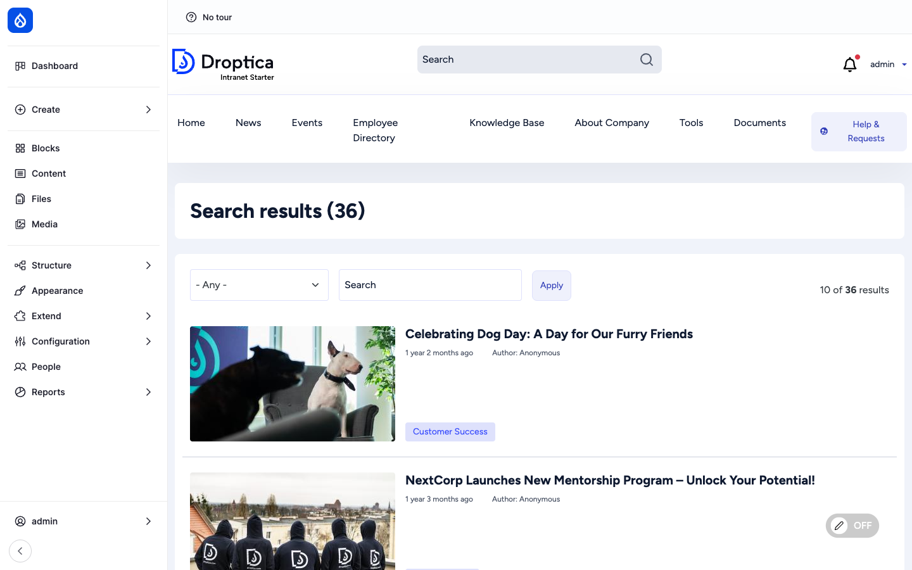
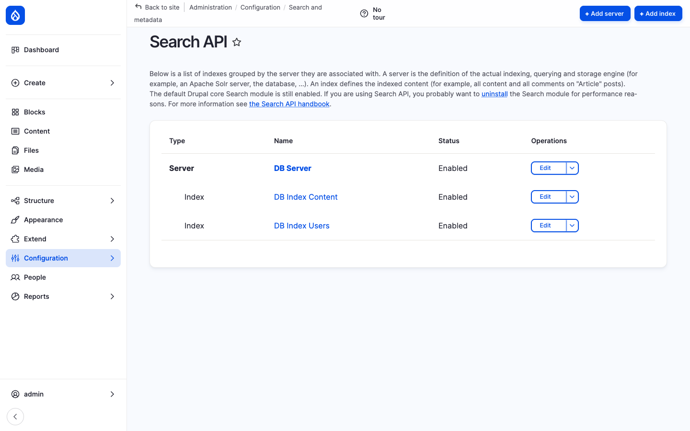
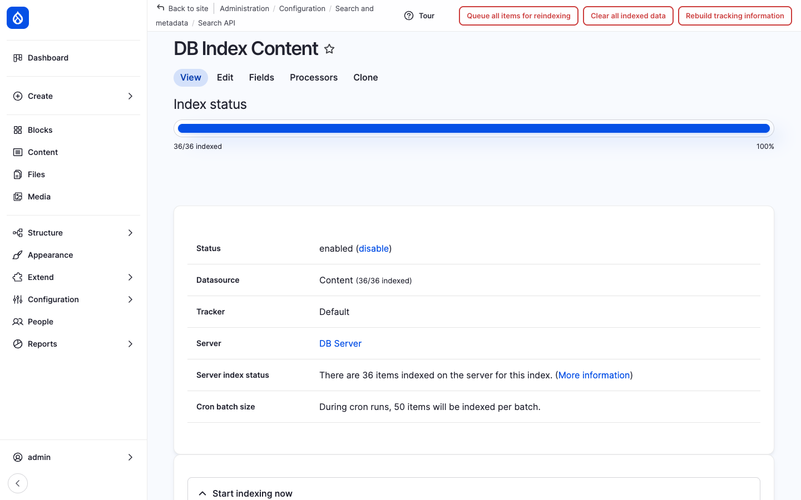

Open Intranet ships a single, unified **search experience** that spans all the indexable types — News, Pages, Documents, Knowledge Base, and the people in the directory. It is built on top of the [Search API](https://www.drupal.org/project/search_api) module, which decouples *what* gets indexed from the *engine* that does the indexing — so you can run on the database out of the box and switch to Apache Solr later without changing the search pages.

## What it is

There are two indexes by default:

- **DB Index Content** — Everything users normally search for: News articles, Pages and Documents.
- **DB Index Users** — The Employee Directory: a separate index dedicated to the user profile, with searchable name / department / office / phone / about fields.

Both run on the **DB Server** (database backend) — no extra service required. Switching to Apache Solr is a one-step swap (see *Optional Solr* below).

## Components

### The search page

`/search` is the main user-facing page. It is a Search API view with:

- **Keyword input** — full-text search across the indexed text fields.
- **Type facet** — restrict by *News article*, *Page*, *Document* and any other indexed bundle.
- **Result counter** — *N of M results*.
- **Result list** — title, thumbnail, age (e.g. *1 year 2 months ago*), author, tags.
- **Pagination** — 10 per page by default.

The view honours the [access control layer](./access). Items the user is not allowed to see are filtered out **before** the result list is built — so the count and the listing are both consistent with what the user can actually open.

### What gets indexed

The default content index covers **News articles, Pages, Documents, KB pages and Events** (every bundle that has a meaningful body of text). For each item Search API stores:

- Title
- Body / aggregated text content
- Tags / categories
- Created date, status, author
- Background image / thumbnail
- A *rendered item* field (the full rendered teaser, used for keyword matching)

The user index covers profile fields:

- First name, last name, full name
- Department, office, manager
- Phone, profile picture
- About text

This is what makes the **Employee Directory** searchable by *anything you remember about the person* — not just their username.

### Re-indexing

Search API listens to entity insert / update / delete and reindexes incrementally — there is no need to trigger a full re-index after every edit. A full reindex (`drush sapi-rt`) is only needed when the index schema changes (a new field is added, a processor is reconfigured, or you switch from the DB backend to Solr).

The status of each index — total items / indexed items / pending — is shown on `/admin/config/search/search-api`.

### Better Exposed Filters

The search page uses the [Better Exposed Filters](https://www.drupal.org/project/better_exposed_filters) module to render the facets. That means the **type facet** can be configured (per index) as a dropdown, a list of checkboxes, a chip cloud, or a hidden facet — without writing code. Site builders can change the facet style under the view's *Exposed form* settings.

### Access-aware results

The Search API content index includes a **node_grants** field that captures Drupal's access grants at index time. At query time the same grants are intersected with the current user's grants. The result is that every search query is automatically filtered to *what this specific user is allowed to see* — restricted Documents, KB pages and other content disappear from the listing for users who are not in the right group.

The full access story is on the [Access Control & Groups](./access) page.

### Optional Apache Solr

To switch to [Apache Solr](https://www.drupal.org/project/search_api_solr) — for very large catalogues, multi-language analysers, or fuzzy / synonym matching — the upgrade path is:

1. `composer require drupal/search_api_solr`
2. Create a Solr server (`/admin/config/search/search-api/add-server`) and point both indexes at it.
3. `drush sapi-rt` to reindex.
4. `drush sapi-i` to populate the new server.

The search pages themselves do not change — they are decoupled from the backend.

### Search blocks

A small **search block** lives in the site header (the magnifying-glass field next to the logo). Submitting that block jumps to `/search?keys=…` and runs the same view as the dedicated search page. The block can be repositioned through Block Layout (`/admin/structure/block`) without touching code.

## Integration with other features

- **News, Pages, Documents, KB, Events** — all indexed automatically; appear in the same unified search.
- **Employee Directory** — the second index makes the directory searchable by name, department, office, phone and *about* text.
- **Access Control & Groups** — every result is filtered through the access checker (`node_grants` in the index, intersected with the user's grants at query time).
- **Recently Read & Bookmarks** — search can be re-ranked using these signals (a search-result block on the user dashboard surfaces *recently-read content matching your query*).
- **AI assistant** — the AI-CKEditor integration can call search results as context for "*write a follow-up to the announcement about X*" prompts.

## Permissions

| Permission | Default role(s) |
| --- | --- |
| Use search | Authenticated user |
| Administer search (Search API admin pages) | Administrator |
| Administer search index (re-index, change fields) | Administrator |

## Modules behind it

- [Search API](https://www.drupal.org/project/search_api) — core indexing and querying framework
- [Search API Database](https://www.drupal.org/project/search_api) (bundled) — the default DB backend
- [Search API Solr](https://www.drupal.org/project/search_api_solr) — optional, for Apache Solr
- [Better Exposed Filters](https://www.drupal.org/project/better_exposed_filters) — facet rendering on the search view
- Drupal core: `views`, `node`, `user`

## Learn more

- [News and Articles](./news) — heaviest user of the content search
- [Documents](./documents) — also indexed by `db_index_content`; folder hierarchy is used as a facet on the Documents browser
- [Knowledge Base](./knowledge-base) — KB pages are indexed and surfaced through the same search
- [Employee Directory](./employee-directory) — uses the dedicated `db_index_users` index
- [Access Control & Groups](./access) — how access grants are applied to search results
