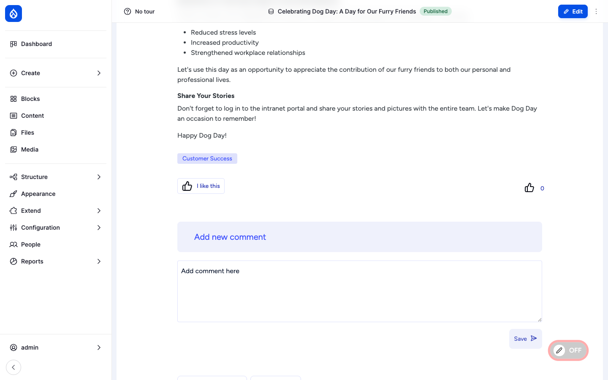
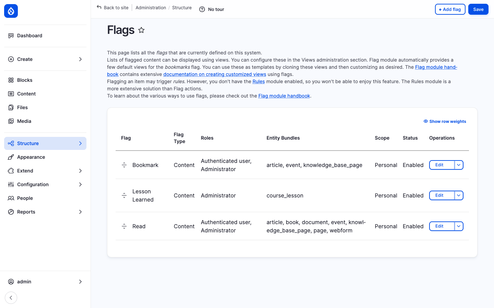
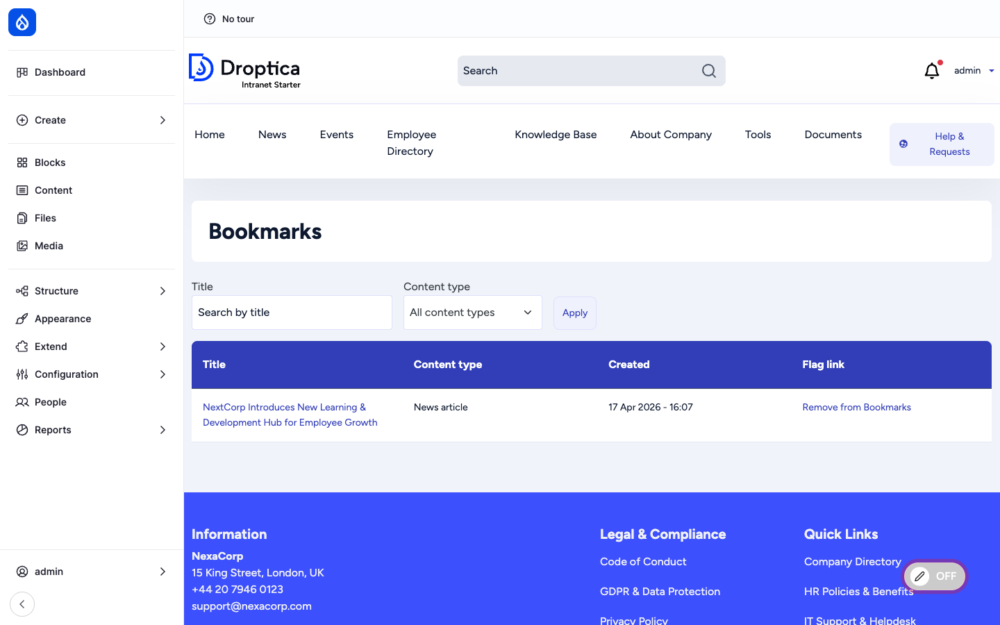

Open Intranet ships **four lightweight engagement primitives** that show up on every piece of content the site publishes: a one-click **reaction** (👍 *I like this*), threaded **comments**, a personal **bookmark**, and an automatic **recently read** list. Together they turn the intranet from a static document store into a place where employees actually interact with each other and with the content.

This page covers all four. They are documented together because they share the same mental model — *user X did Y on item Z* — and the same admin plumbing (the [Flag](https://www.drupal.org/project/flag) module).

## Reactions

### What it is

Reactions are one-click feedback signals on a piece of content. Open Intranet uses [Voting API](https://www.drupal.org/project/votingapi) plus [Voting API Reaction](https://www.drupal.org/project/votingapi_reaction) for this — the field is configurable, supports any number of emoji and shows live counts.

Out of the box every News article, KB page, page, document and event exposes a single **I like this** 👍 reaction. The button toggles: click once to vote, click again to retract. Counts update without a page reload.

### Where it lives

A reaction field is added to each enabled bundle. The default field is `field_news_article_reaction` on News, and similarly named fields on other types. Field UI exposes the underlying widget and lets a site builder swap the emoji set or add a second reaction field (e.g. *Helpful*, *Confused* on KB pages).

### Per-bundle counts and lists

Every reaction is stored as a row in `votingapi_vote`. That means views can list:

- *Most-liked News this week*
- *Articles you have liked*
- *Top reactors* (used by the [Engagement scoring](./employee-directory#engagement-scoring) feature)

The default install ships *Most-liked News this week* on the homepage and *Articles you have liked* on the user dashboard.

### Permissions

| Permission | Default role(s) |
| --- | --- |
| Vote on content (cast / retract a reaction) | Authenticated user |
| View reaction counts | Anonymous + Authenticated |
| Administer voting (change emoji set, manage votes) | Administrator |

## Comments

### What it is

Comments use Drupal core's [Comment](https://www.drupal.org/docs/8/core/modules/comment) module. Open Intranet enables them on News, Events, KB pages and Pages.

A comment is a content entity: it has its own subject + body, an author, a timestamp, a parent (for threading) and a status (published / unpublished / pending). Comments can be edited and deleted; deletion creates a tombstone so threads stay readable.

### Where it lives

Each enabled content type renders an **Add new comment** form below the main content, followed by the comment thread:

- **Threaded** — replies indent under their parent.
- **Pagination** — long threads paginate (default: 50 comments per page).
- **Email notifications** — an admin-configurable subscription system sends a digest to subscribers when a new comment is posted (off by default).
- **Editor** — comments use the same CKEditor 5 instance as the parent content, so authors can format text, embed images, paste tables, and use the [AI assistant](./ai-assistant).

### Moderation

The administrator can:

- Approve / unpublish a comment from the **Moderate comments** report at `/admin/content/comment`.
- Delete a comment outright (a comment can also be deleted by its author).
- Configure per-content-type defaults — closed / open / hidden — at the content type's *Comments* tab.
- Permanently disable comments on a specific item by switching its **Comment** widget to *Closed* on the edit form.

### Permissions

| Permission | Default role(s) |
| --- | --- |
| Post comments | Authenticated user |
| Skip comment approval (auto-publish) | Authenticated user (configurable) |
| Edit own comments | Authenticated user |
| Administer comments and comment settings | Administrator |
| View comments | Anonymous + Authenticated |

## Bookmarks

### What it is

Bookmarks are personal save-for-later flags. Open Intranet uses the [Flag](https://www.drupal.org/project/flag) module's *Bookmark* flag, with **Personal scope** — every user has their own list, no one else can see it.

The flag is enabled for **News articles, Events and Knowledge Base pages**:

### Where it lives

Each item exposes a **Bookmark this** link. Click once to bookmark, click again to remove. The bookmark count is per-user; there is no public "bookmarks" counter on a page.

A user's list lives at `/bookmarks`:

The page is a Drupal view with two filters (title search, content type) and a table layout. Each row offers a one-click **Remove from Bookmarks** link that operates without leaving the page.

A small **My bookmarks** link is also added to the main navigation (anywhere bookmarks are enabled).

### Permissions

| Permission | Default role(s) |
| --- | --- |
| Use the Bookmark flag | Authenticated user |
| Administer flags (create new flags, change scope, edit fields) | Administrator |

## Recently read

### What it is

Recently read is an *implicit* engagement signal. Where bookmarking is an explicit action, recently read records the fact that a user *opened* a page. It is provided by the [Recently Read](https://www.drupal.org/project/recently_read) module.

Every time an authenticated user views a piece of content, an entry is written to `recently_read_item`. Open Intranet enables this for **News articles, Events, KB pages, Pages and Documents**.

### Where it lives

Recently read is exposed as a **block** (via the `recently_read_content` view) — it lives in the user dashboard and can be placed by a site builder anywhere a sidebar is available. The block lists the N most recent items the current user opened, with title, type and timestamp.

The same data feeds:

- **Engagement scoring** — recently-read counts are part of a user's engagement score on their profile.
- **Personalised search and recommendations** — *More like the things you have read* style blocks.

### Lifecycle

Each recently-read entry has a TTL (default: 30 days, configurable per bundle). After the TTL expires, cron prunes the entry. The list also de-duplicates: opening the same page twice updates the timestamp instead of adding a new row.

### Permissions

| Permission | Default role(s) |
| --- | --- |
| View own recently-read items | Authenticated user |
| Administer Recently Read (TTL, enabled bundles) | Administrator |

## How they work together

Together these four primitives feed the **engagement layer**:

- **Reactions** — explicit, public, one-click positive feedback.
- **Comments** — explicit, public, multi-line conversation.
- **Bookmarks** — explicit, private, save-for-later.
- **Recently read** — implicit, private, track-what-you-saw.

This data is the input to:

- The **Engagement score** on each [employee profile](./employee-directory#engagement-scoring).
- The **Most engaged content this week** dashboard block.
- The "*People who read this also read*" recommendations.
- The **Must Read** report's *who-actually-read-it* check (recently-read is treated as a "read" signal alongside the explicit Read flag).

## Integration with other features

- **News, Events, KB pages, Pages, Documents** — All enabled for one or more of the four primitives.
- **Engagement scoring** — Reactions, comments and recently-read are inputs to the score.
- **Employee Directory** — Each profile shows an engagement strip (reactions cast, comments posted, bookmarks).
- **Search** — Personalised re-ranking can use bookmark + recently-read signals.
- **Must Read tracking** — Reads (explicit Flag + recently-read) are counted toward the Must Read report.
- **Access Control & Groups** — Bookmarks and recently-read lists are filtered through the access checker, so a user never sees an item they no longer have access to.

## Modules behind it

- [Voting API](https://www.drupal.org/project/votingapi) + [Voting API Reaction](https://www.drupal.org/project/votingapi_reaction) — reactions
- Drupal core: `comment` — comments
- [Flag](https://www.drupal.org/project/flag) — bookmarks (Bookmark flag) and Read tracking (Read flag)
- [Recently Read](https://www.drupal.org/project/recently_read) — implicit read history
- `openintranet_engagement` — composite engagement score that aggregates the above

## Learn more

- [News and Articles](./news) — heaviest user of reactions and comments
- [Knowledge Base](./knowledge-base) — KB pages enable the same primitives
- [Must Read tracking](./must-read) — uses the Read flag and recently-read as evidence
- [Employee Directory](./employee-directory) — engagement scoring derived from these primitives
