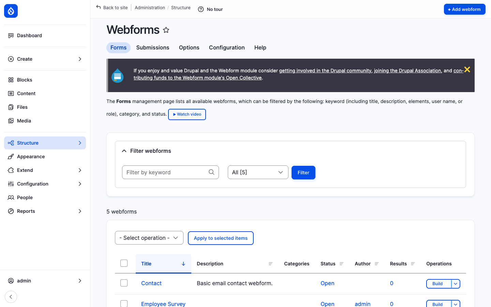
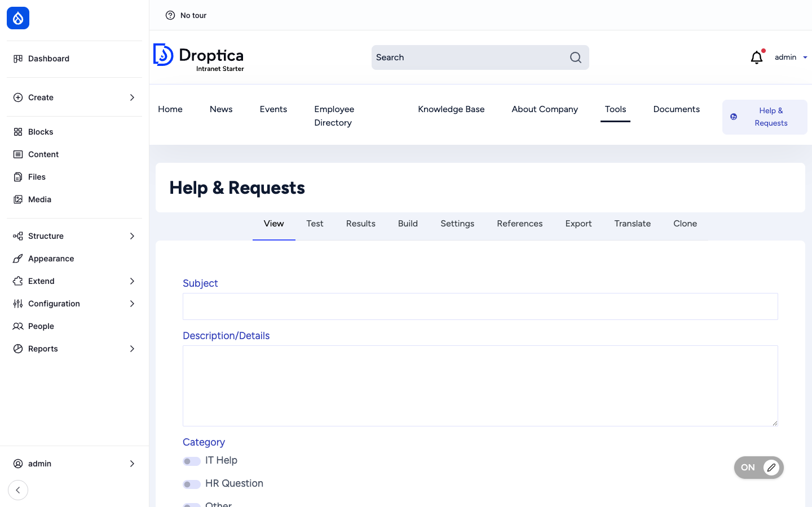
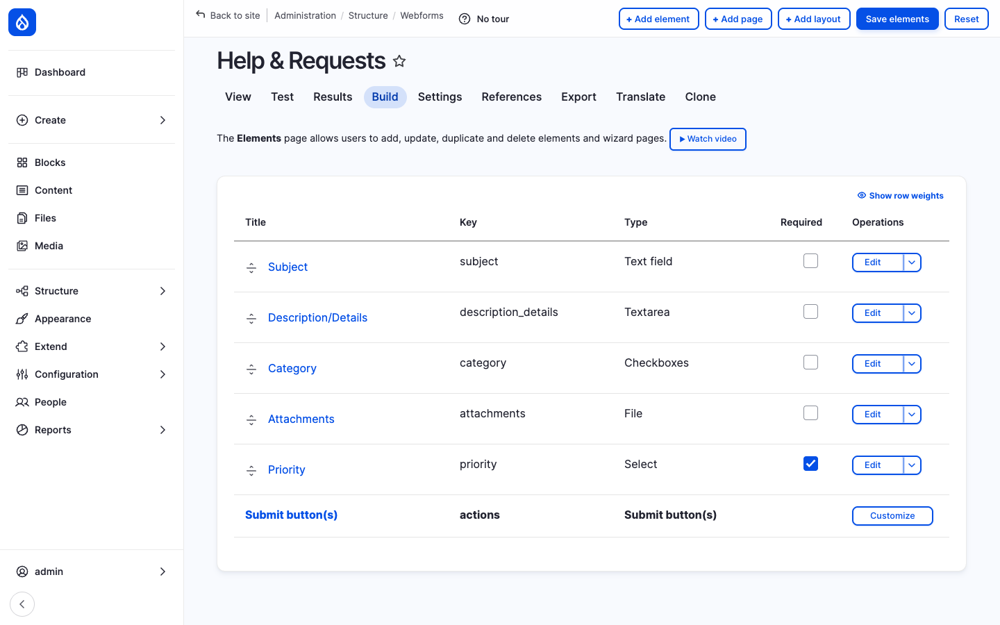

Open Intranet ships the [Webform](https://www.drupal.org/project/webform) module — Drupal's most popular form builder. It lets administrators build, version and manage **any kind of form** the company needs (contact, surveys, requests, ticketing, training enrolment, news submissions) without writing a line of code, then expose it as a standalone page or embed it in an article through the [Webform Node](https://www.drupal.org/project/webform) sub-module.

The default install ships **five ready-made webforms** — Contact, Employee Survey, Help & Requests, Submit News, Training Request — that demonstrate the breadth of what the builder can do.

## What it is

Webforms are first-class Drupal entities. Each form has its own configuration, its own list of submissions, its own permissions, its own URL, its own per-form settings (open / closed / scheduled), and its own set of e-mail and remote handlers. Administrators interact with everything through a single admin tab system: **View**, **Test**, **Results**, **Build**, **Settings**, **References**, **Export**, **Translate**, **Clone**.

The builder uses a YAML representation under the hood — that means a webform can be exported, version-controlled, and re-imported on another site exactly as designed.

## Components

### The forms list

`/admin/structure/webform` is the management page. It lists every webform on the site with its title, description, category, status (Open / Closed / Scheduled), author, submission count and a **Build** operation that opens the drag-and-drop editor.

The list is filterable by keyword, category and status. Bulk operations are available (delete, change status, change category) for housekeeping.

### Live form rendering

Every webform automatically gets its own URL at `/form/{machine-name}`. Users (depending on permissions) see the form rendered with the site's design tokens and any branding applied through the theme.

For administrators, the same page also exposes the full set of admin tabs (View / Test / Results / Build / Settings / …) so they can switch between *trying the form*, *seeing what's in it*, and *editing it* without leaving the page.

### The Build screen — drag-and-drop editor

The **Build** tab is the heart of the editor. It shows the form as a hierarchical list of elements (text, textarea, select, radios, checkboxes, file upload, signature, address, date, …) with drag-and-drop reordering, indent/outdent for nesting (fieldsets, containers, wizard pages), and inline edit / delete.

There are 50+ element types available out of the box, including:

- **Basic** — text, textarea, number, email, telephone, URL, password
- **Selection** — select, radios, checkboxes, tags, autocomplete (with Drupal entity reference)
- **Files** — file upload, image upload, signature, drawing
- **Composite** — address, contact, name, link
- **Advanced** — date, datetime, time, range slider, rating, captcha, computed fields
- **Layout** — fieldset, container, details (collapsible), webform wizard page (multi-page forms)
- **Markup** — HTML, processed text, table, twig template

Each element has its own configuration form: label, placeholder, default value, required state, validation rules, conditional logic, access control per role, multi-value, etc.

### Conditional logic

Every element can show / hide / require / disable itself based on the values of other elements. Conditions are configured in plain English ("If *Category* is *IT Help* then *Required* is true") through the *Conditions* tab on each element — no code, no JavaScript.

Multi-page wizards naturally combine with conditions: skip a page if a question on the previous page was *No*.

### Submissions — `/results`

Every submission is stored as a `webform_submission` entity with its own ID. The **Results** tab on each webform exposes:

- A **table view** of all submissions with sortable columns (per-element).
- An **individual view** of each submission (formatted like the rendered form).
- A **download** function — CSV, JSON, XML or Excel export with selectable columns and date filters.
- **Bulk operations** — delete, change state.
- **Search & filter** — by date range, status, individual field values.

Submissions can be **stored in the database** (the default) or sent only to handlers (e-mail, remote API) without being persisted — useful for regulated environments where the form should not retain data.

### Handlers — what happens on submit

The **Settings → Emails / Handlers** tab defines what happens when the form is submitted:

- **Email handler** — Send a templated e-mail to the submitter, an admin, a department address, or any token-resolved recipient. Multiple handlers can fire on the same submission (one to the submitter, one to the IT team, one to the manager).
- **Remote handler** — POST the submission as JSON to an external URL (Slack incoming webhook, Salesforce, Zendesk, ServiceNow, etc.).
- **Action handler** — Trigger a Drupal action (create a node, change a field, fire a Rules / ECA event).
- **Twilio handler** — Send an SMS (with the Twilio module enabled).
- **Custom handler** — A site builder can add a new plugin with the `#[WebformHandler]` attribute for any custom workflow.

Handlers are independently enabled / disabled and can be reordered.

### Webform Node — embed in articles

The **Webform Node** sub-module adds a *Webform* content type. A webform node has a body field plus a *Webform* reference field — pick one of the existing webforms and it renders inline, surrounded by your content. This is how to:

- Wrap a form in a written introduction (e.g. *Why we ask these questions*).
- Place the form on a custom URL inside the menu structure (e.g. `/about-us/contact`).
- Restrict the form to specific groups using the [Access](./access) layer.

### Multi-step / wizard forms

A webform with multiple **wizard page** elements becomes a multi-step form with a progress bar at the top. Each wizard page has its own validation, its own conditional logic, and its own *previous / next* navigation.

### Translation

Each webform can be translated per-element through the standard Drupal config translation system. With languages enabled, the **Translate** tab shows one form-element column per language and lets translators fill in the translated label / description / placeholder / option labels.

The webform then renders in the user's active language, with submission data still recorded in the original element keys (so reports work across languages).

### Configuration

`/admin/structure/webform/config` exposes platform-wide configuration:

- Default e-mail templates, default *from* address.
- Element library on / off (turn off advanced elements you do not want editors to use).
- Submission storage limits (per-form, per-day, per-user).
- Anti-spam (CAPTCHA, honeypot, time-based).
- Themes (apply a different theme to forms, e.g. for embedded use).
- Libraries (jQuery UI, Select2, etc.).

## Integration with other features

- **Webform Node** — Drop any form into an article with the *Webform* content type.
- **News, Pages, KB** — Embed a webform inside a content body using the CKEditor *Webform* button (with the right text format).
- **Messenger** — A custom webform handler can fire a Messenger broadcast on submit (e.g. *Submit news* triggers a notification to the editorial team).
- **AI assistant** — Build longer-text webform fields using CKEditor with the AI button enabled, so respondents can use *Improve writing* / *Translate*.
- **Multilingual** — Webforms translate per-element through standard config translation; submissions remain consistent across languages.
- **Access Control & Groups** — A webform-node can be restricted to specific groups via the per-node Access tab; webform-level access is also configurable per role.
- **ECA — no-code workflows** — A webform submission is an event ECA can react to (post to chat, create a node, fire a multi-step approval).

## Permissions

| Permission | Default role(s) |
| --- | --- |
| Access webform overview (see the admin list) | Administrator |
| Administer webforms (create / edit / delete forms) | Administrator |
| Administer webform submissions | Administrator |
| Administer webform configuration | Administrator |
| View own webform submissions | Authenticated user |
| Edit own webform submissions | Authenticated user (configurable per form) |
| Submit a specific webform | Configurable per form (anonymous, authenticated, role) |

Permissions can be set at three levels: site-wide, per-webform, and per-element (e.g. "only HR can see the *salary expectation* field").

## Modules behind it

- [Webform](https://www.drupal.org/project/webform) — core builder, elements, submissions, handlers
- [Webform Node](https://www.drupal.org/project/webform) — embed in a content type (sub-module)
- [Webform UI](https://www.drupal.org/project/webform) — drag-and-drop editor (sub-module)
- Drupal core: `field`, `entity`, `views`
- Optional: `webform_workflows_email` for approval workflows, `webform_attachment` for generated PDFs, `webform_image_select` for image-based selection

## Learn more

- [News and Articles](./news) — *Submit News* webform feeds the editorial pipeline
- [Messenger](./messenger) — handler integration for broadcast on submit
- [ECA — no-code workflows](./eca) — react to webform submissions with workflow automation
- [Multilingual](./multilingual) — per-element translation
- [Webform module on drupal.org](https://www.drupal.org/project/webform)
