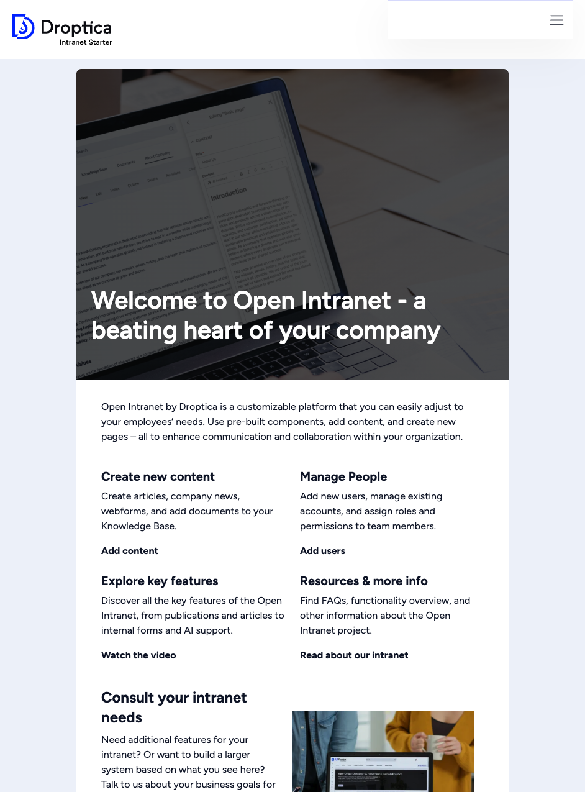

This guide walks you through installing Open Intranet from scratch. The recommended approach uses [DDEV](https://ddev.com/) — a Docker-based local development environment — which handles PHP, the database, and the web server for you.

## Prerequisites

Before you begin, make sure the following tools are installed on your machine:

| Requirement | Minimum version | Notes |
|---|---|---|
| **DDEV** | 1.24.0+ | [Install DDEV](https://ddev.com/get-started/) — requires Docker or Colima |
| **Docker** or **Colima** | Latest | DDEV uses containers under the hood |
| **Git** | 2.x | To clone the repository |
| **Composer** | 2.x | PHP dependency manager (DDEV provides it inside the container, so a local install is optional) |

### System requirements (if not using DDEV)

If you deploy Open Intranet to a traditional server without DDEV, you need:

| Requirement | Version |
|---|---|
| PHP | 8.3+ |
| Database | MariaDB 10.11+ / MySQL 8.0+ / PostgreSQL 16+ |
| Web server | Apache 2.4+ or Nginx 1.x |
| Composer | 2.x |
| Drush | 13.x (installed via Composer) |

Open Intranet is built on **Drupal 11** and follows its [system requirements](https://www.drupal.org/docs/getting-started/system-requirements).

## Step 1 — Clone the repository

Clone the Open Intranet project from drupal.org:

```bash
git clone https://git.drupalcode.org/project/openintranet.git
cd openintranet
```

Alternatively, download a release archive from the [Open Intranet project page](https://www.drupal.org/project/openintranet).

## Step 2 — Run the launch script

Open Intranet includes a `launch-intranet.sh` script that automates the entire DDEV setup:

```bash
bash launch-intranet.sh
```

The script performs the following steps automatically:

1. **Checks for DDEV** — exits with a message if DDEV is not installed.
2. **Configures DDEV** — creates a `.ddev` directory with the correct PHP version (8.3), docroot (`web`), and database settings.
3. **Starts containers** — runs `ddev start` to launch the web server, database, and PHP containers.
4. **Installs dependencies** — runs `ddev composer install` to download Drupal core, contributed modules, and libraries.
5. **Copies the starter theme** — places the Open Intranet theme into `web/themes/custom/`.
6. **Interactive prompts** — asks whether to remove installation files (choose **no** if you plan to contribute back).

When the script finishes you will see:

```
Congratulations, you've installed Open Intranet!
Next steps:
• Run "ddev launch" to install Open Intranet in a browser
• Run "drush site-install openintranet install_configure_form.enable_demo_content=1"
  to install Open Intranet in a terminal
```

:::tip
Pass `-y` to skip all interactive prompts: `bash launch-intranet.sh -y`
:::

## Step 3 — Install the site

You have two options: install via the **web browser** or via the **command line**.

### Option A — Browser installation

Open the site in your browser:

```bash
ddev launch
```

The Drupal installer will open automatically. Follow the on-screen steps:

1. **Choose language** — select your preferred language (English is the default).
2. **Choose profile** — **Open Intranet** should already be selected.
3. **Verify requirements** — the installer checks that all PHP extensions and file permissions are correct.
4. **Set up database** — DDEV handles this; the defaults are pre-filled.
5. **Install profile** — the installer applies the Open Intranet recipes and enables all required modules. This takes a few minutes.
6. **Configure site** — enter your site name, admin email, username, and password.
7. **Choose content** — optionally install **demo content** (sample news, events, pages, users, and organizational structure). This is highly recommended for your first installation.

After installation completes, you are redirected to the **Welcome** page.

### Option B — Command-line installation (recommended)

For a faster, non-interactive installation use Drush:

**With demo content (recommended for first-time users):**

```bash
ddev drush site-install openintranet install_configure_form.enable_demo_content=1 -y
```

**Without demo content (clean, empty site):**

```bash
ddev drush site-install openintranet -y
```

The `-y` flag confirms all prompts automatically. Installation typically takes 2–5 minutes depending on your machine.

:::note[About demo content]
Demo content populates the intranet with realistic sample data — news articles, events, knowledge base pages, an employee directory with user profiles, organizational groups, and a document library. Event dates are automatically randomized so they appear as upcoming. Demo content is ideal for evaluation and training.
:::

## Step 4 — Log in

After installation, get a one-time administrator login link:

```bash
ddev drush user:login
```

This prints a URL you can open in your browser. You will be logged in as the administrator (user 1).

The site is now accessible at the URL shown by DDEV, typically:

```
https://openintranet.ddev.site
```

(The exact URL depends on the directory name you cloned into.)



## What was installed

The Open Intranet install profile sets up a complete intranet out of the box:

| Component | Details |
|---|---|
| **Drupal core** | Version 11.x with all required core modules |
| **Front-end theme** | Open Intranet Theme (Bootstrap Barrio subtheme) |
| **Admin theme** | Gin with the Gin Toolbar |
| **Content types** | News articles, Events, Knowledge Base Pages, Basic Pages, Webforms |
| **Document management** | Folder-based document library with upload and search |
| **Employee directory** | User profiles with department, position, and contact info |
| **Organization chart** | Interactive visual org chart based on group hierarchy |
| **Knowledge base** | Book-structured internal documentation |
| **Search** | Full-text search powered by Search API |
| **Social features** | Comments, reactions (likes), bookmarks, and "must read" flags |
| **AI integration** | CKEditor AI assistant for content creation |
| **SSO-ready** | Prepared for Single Sign-On integration (see [Configuration](/docs/getting-started/configuration/)) |

## Troubleshooting

### DDEV fails to start

Make sure Docker (or Colima) is running:

```bash
docker info
```

If using Colima:

```bash
colima start
```

### Port conflicts

If another service is using ports 80/443, DDEV will show an error. Either stop the conflicting service or configure DDEV to use different ports:

```bash
ddev config --router-http-port=8080 --router-https-port=8443
ddev restart
```

### Composer memory errors

If Composer runs out of memory inside the container:

```bash
ddev config --php-memory-limit=-1
ddev restart
ddev composer install
```

### Database connection errors

DDEV manages the database automatically. If you see connection errors, try restarting:

```bash
ddev restart
```

### Clearing caches

If something looks broken after installation, clear all caches:

```bash
ddev drush cache:rebuild
```

## Next steps

- [Configuration](/docs/getting-started/configuration/) — configure site name, email, optional modules, and SSO
- [User Guide](/docs/user-guide/) — learn how to use the intranet as an everyday employee
