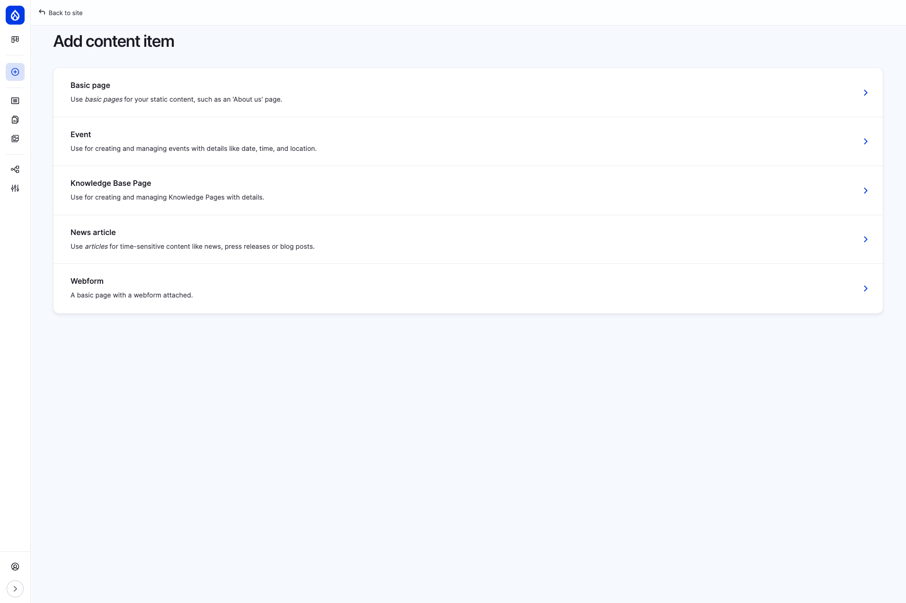
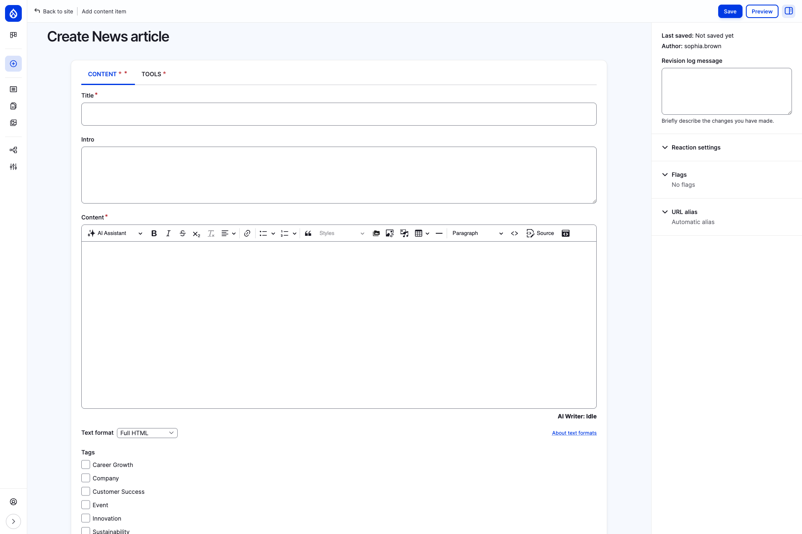
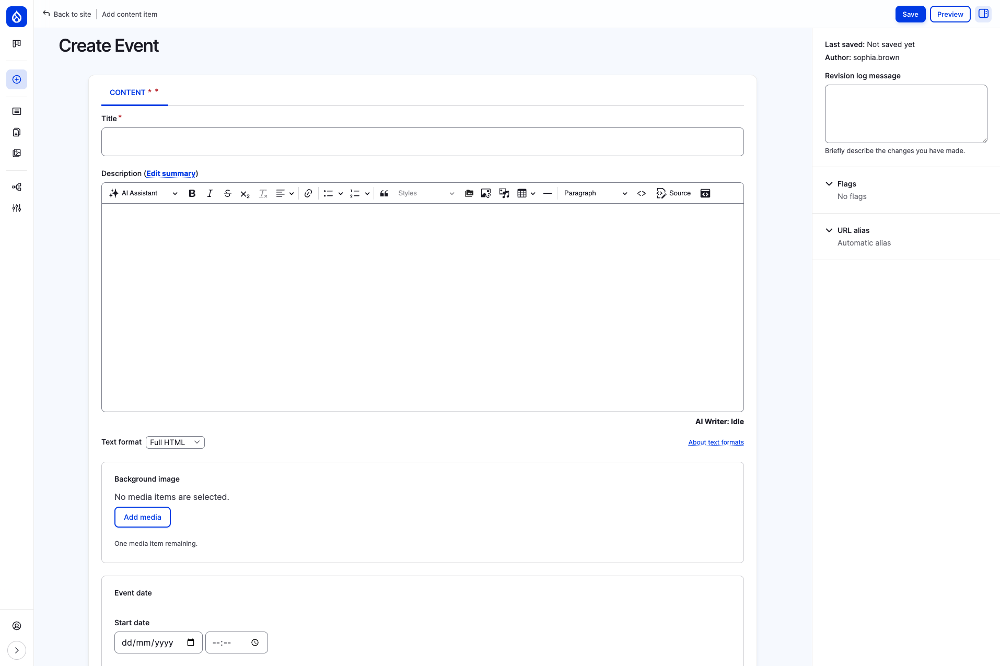
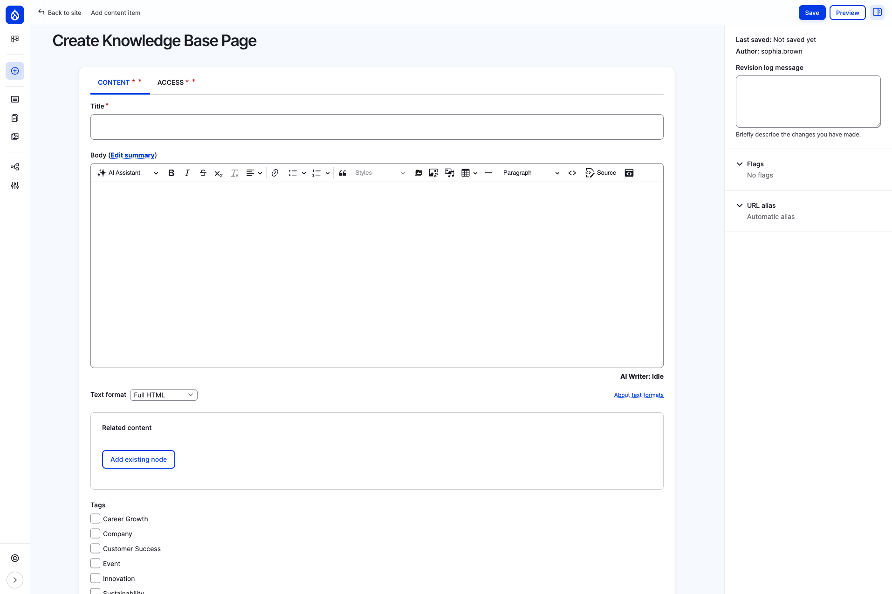

Users with the **Content Editor** role can create and publish content directly from the administration interface. This page walks through the available content types and how to create each one.

## Accessing the content creation page

To create new content, use the **Create** menu in the top administration toolbar. Clicking it reveals links to every content type you have permission to add.

The available content types for a content editor are:

| Content type | Purpose |
|---|---|
| **Basic page** | Static informational pages (e.g. About Us, department pages, policies) |
| **Event** | Company events with date, time, location, and an optional map |
| **Knowledge Base Page** | Internal documentation organized in a hierarchical book structure |
| **News article** | Time-sensitive updates such as company news, press releases, or blog posts |
| **Webform** | Pages with an embedded form (surveys, feedback, applications) |

## Creating a news article

Navigate to **Create > News article** to open the article form.

### Fields

| Field | Required | Description |
|---|---|---|
| **Title** | Yes | The headline displayed on the news listing and article page |
| **Intro** | No | A short lead paragraph shown in the listing teaser |
| **Content** | Yes | The main body, edited with a full rich-text editor (CKEditor). Supports bold, italic, lists, links, headings, images, tables, embedded media, and code blocks |
| **Tags** | No | Categorize the article (e.g. Company, Innovation, Team Spirit). Multiple tags can be selected |
| **Background image** | No | A hero/teaser image displayed at the top of the article and in listing cards. Upload or select from the media library |
| **Related documents** | No | Link to documents stored in the Document Management section |

### Sidebar options

The right sidebar offers additional settings:

- **Revision log message** — describe what changed (useful when editing existing articles)
- **Reaction settings** — control whether reactions (likes) are enabled
- **Flags** — pre-set Bookmark or Read flags for the article
- **URL alias** — by default an alias is generated automatically from the title (e.g. `/news/my-article-title`)

Click **Save** to publish the article immediately, or **Preview** to see how it will look before saving.

## Creating an event

Navigate to **Create > Event** to open the event form.

### Fields

| Field | Required | Description |
|---|---|---|
| **Title** | Yes | The name of the event |
| **Description** | No | Full event details, edited with the rich-text editor. Click **Edit summary** to provide a short teaser shown in the events listing |
| **Background image** | No | A header image for the event detail page |
| **Start date** | No | Date and time the event begins |
| **End date** | No | Date and time the event ends |
| **Country** | No | Select the country to enable the address fields |
| **Location Map** | No | An interactive map (Leaflet / OpenStreetMap) where you can pin the event venue. Zoom and pan to set the marker |
| **Hide location** | No | Check to hide the physical location from viewers |
| **Event online** | No | Mark the event as online-only and provide an **Event Online Text** (e.g. a video call link) |

### Tips for events

- If the event is in-person, select a **Country** first — this reveals additional address fields (city, street, postal code).
- Use the **map** to give attendees a precise location. They will see it on the event detail page.
- For hybrid events, fill in both the physical location and the **Event Online Text**.

## Creating a knowledge base page

Navigate to **Create > Knowledge Base Page** to open the form.

### Fields

| Field | Required | Description |
|---|---|---|
| **Title** | Yes | The page title, displayed in both the article and the book sidebar navigation |
| **Body** | No | The main content, edited with the rich-text editor. Click **Edit summary** for a short description |
| **Related content** | No | Link to other existing nodes. Click **Add existing node** and start typing a title to search |
| **Tags** | No | Categorize the page (same tag vocabulary as news articles) |
| **Related documents** | No | Attach documents from the Document Management section |

### Content and Access tabs

The Knowledge Base Page form has two tabs:

- **CONTENT** — all the fields described above
- **ACCESS** — control which groups (organizational units) can view this page. By default, knowledge base pages may be visible to all authenticated users, but editors can restrict access to specific groups

### Adding pages to the book hierarchy

After saving a Knowledge Base Page, you can organize it within the book structure:

1. Edit the page and look for the **Book outline** section.
2. Choose a **parent** page to nest it under, or select **\<top-level>** to make it a root-level section.
3. The page will then appear in the sidebar navigation of the Knowledge Base.

## Creating a basic page

Navigate to **Create > Basic page**. The form is similar to the Knowledge Base Page with a title and rich-text body. Basic pages are used for static, standalone content like department overviews, company policies, or informational landing pages.

Basic pages do not appear in the book hierarchy — they exist as independent pages accessible via their URL or linked from menus and other content.

## Working with the rich-text editor

All content types use a CKEditor-powered rich-text editor with a full toolbar. Common formatting options include:

- **Text formatting** — Bold, Italic, Strikethrough, Subscript
- **Structure** — Headings (Paragraph, Heading 1–6), Block quotes, Horizontal lines
- **Lists** — Bulleted and Numbered lists
- **Links** — Insert links to internal pages or external URLs
- **Media** — Insert images (upload, URL, or media library), embed iframes
- **Tables** — Create and edit tables
- **Code** — Insert inline code or switch to **Source** view for raw HTML
- **AI Assistant** — Use the built-in AI writing assistant for drafting and editing help

### Text format

Below the editor you will find a **Text format** dropdown. In most cases, keep the default **Full HTML** for the widest formatting options. Other options like **Basic HTML** or **Restricted HTML** limit which HTML tags are allowed.

## After saving

Once you save content:

- It is immediately published and visible to users with appropriate access.
- A URL alias is auto-generated from the title (e.g. a news article titled "Q1 Results" becomes `/news/q1-results`).
- The content appears in relevant listing pages (news feed, events calendar, knowledge base sidebar).
- Search indexes are updated so the content becomes discoverable via the site-wide search.
