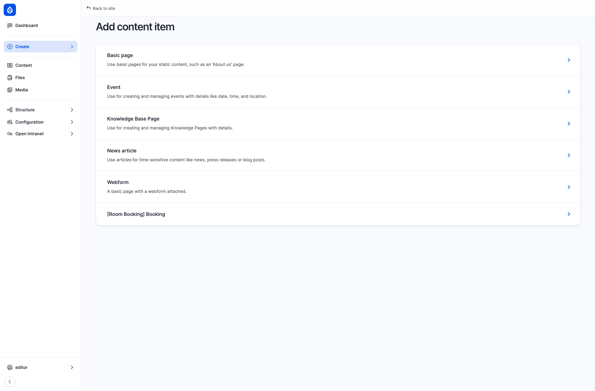
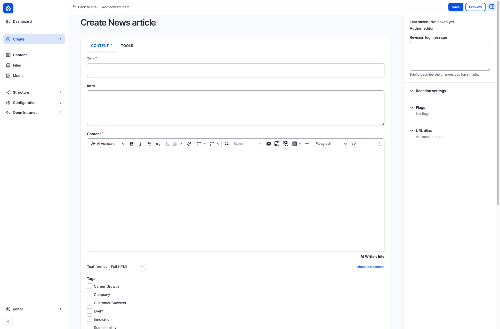
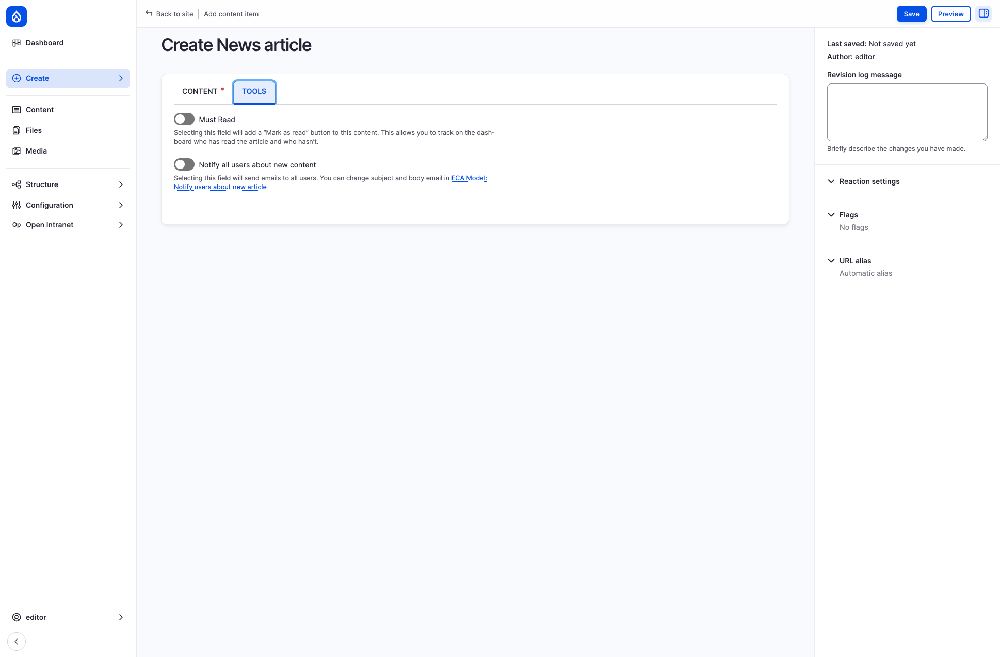
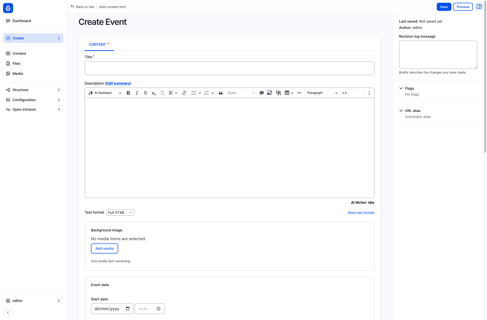
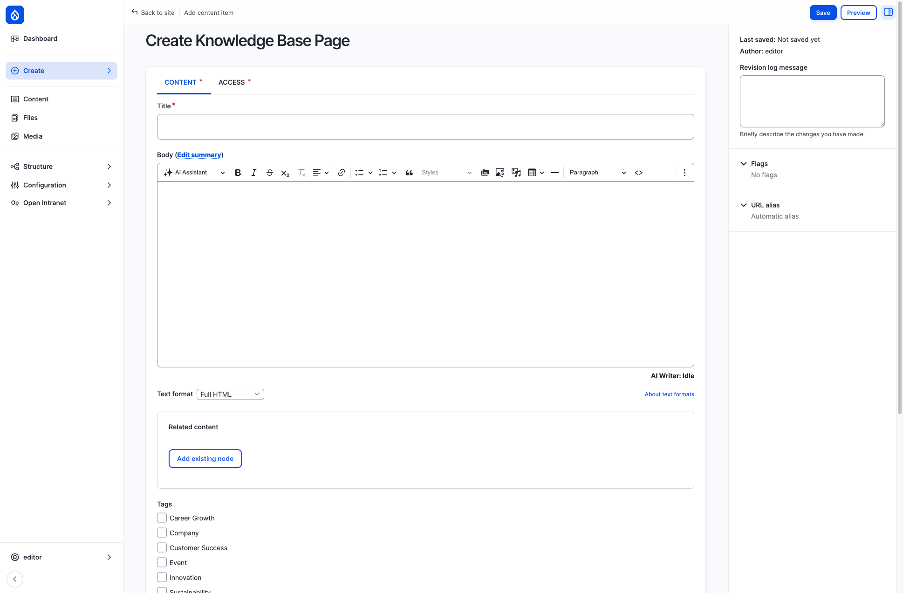
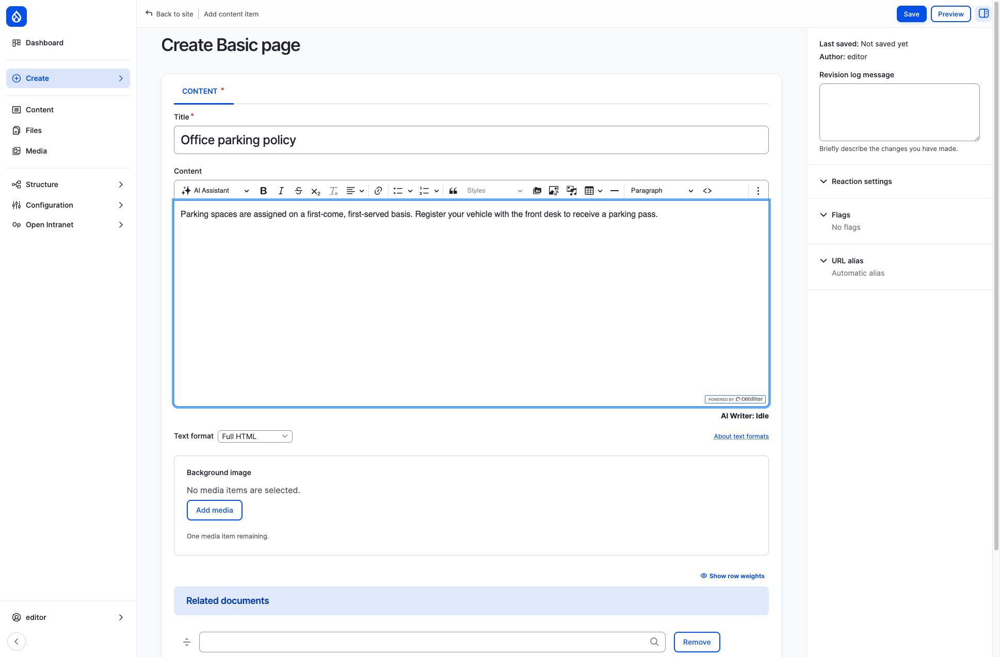

import { Steps } from '@astrojs/starlight/components';
import Audience from '../../../components/Audience.astro';

<Audience level="editors" />

Users with the **Content editor** role (or one of the scoped editor roles, such as *Content Editor - News Article*; see [Default roles](/docs/administration/users/#default-roles)) can create and publish content directly from the administration interface. This page walks through the available content types and how to create each one.

## Accessing the content creation page

To create new content, click **Create** in the administration sidebar on the left. It lists every content type you have permission to add.

The available content types for a content editor are:

| Content type | Purpose |
|---|---|
| **Basic page** | Static informational pages (e.g. About Us, department pages, policies) |
| **Event** | Company events with date, time, location, and an optional map |
| **Knowledge Base Page** | Internal documentation organized in a hierarchical book structure |
| **News article** | Time-sensitive updates such as company news, press releases, or blog posts |
| **Webform** | Pages with an embedded form (surveys, feedback, applications) |

## Creating a news article

Navigate to **Create > News article** to open the article form.

### Fields

| Field | Required | Description |
|---|---|---|
| **Title** | Yes | The headline displayed on the news listing and article page |
| **Intro** | No | A short lead paragraph shown in the listing teaser |
| **Content** | Yes | The main body, edited with a full rich-text editor (CKEditor). Supports bold, italic, lists, links, headings, images, tables, embedded media, and code blocks |
| **Tags** | No | Categorize the article (e.g. Company, Innovation, Team Spirit). Multiple tags can be selected |
| **Background image** | No | A hero/teaser image displayed at the top of the article and in listing cards. Upload or select from the media library |
| **Related documents** | No | Link to documents stored in the Document Management section |

### CONTENT and TOOLS tabs

The News article form has two tabs. **CONTENT** holds the fields above. **TOOLS** holds two switches, both off by default, and stays hidden until you click the tab:

| Switch | What it does |
|---|---|
| **Must Read** | Adds a **Mark as read** button to the article and lets you track on the dashboard who has read it and who has not. See [Must Read](/docs/features/must-read/) |
| **Notify all users about new content** | Sends an email to all users about the article. An administrator can change the subject and body in the ECA model *Notify users about new article* |

### Sidebar options

The right sidebar offers additional settings:

- **Revision log message** — describe what changed (useful when editing existing articles)
- **Reaction settings** — control whether reactions (likes) are enabled
- **Flags** — pre-set Bookmark or Read flags for the article
- **URL alias** — by default an alias is generated automatically from the title (e.g. `/news/my-article-title`)

Click **Save** to publish the article immediately, or **Preview** to see how it will look before saving.

## Creating an event

Navigate to **Create > Event** to open the event form.

### Fields

| Field | Required | Description |
|---|---|---|
| **Title** | Yes | The name of the event |
| **Description** | No | Full event details, edited with the rich-text editor. Click **Edit summary** to provide a short teaser shown in the events listing |
| **Background image** | No | A header image for the event detail page |
| **Start date** | No | Date and time the event begins |
| **End date** | No | Date and time the event ends |
| **Country** | No | Select the country to enable the address fields |
| **Location Map** | No | An interactive map (Leaflet / OpenStreetMap) where you can pin the event venue. Zoom and pan to set the marker |
| **Hide location** | No | Check to hide the physical location from viewers |
| **Event online** | No | Mark the event as online-only and provide an **Event Online Text** (e.g. a video call link) |

### Tips for events

- If the event is in-person, select a **Country** first — this reveals additional address fields (city, street, postal code).
- Use the **map** to give attendees a precise location. They will see it on the event detail page.
- For hybrid events, fill in both the physical location and the **Event Online Text**.

## Creating a knowledge base page

Navigate to **Create > Knowledge Base Page** to open the form.

### Fields

| Field | Required | Description |
|---|---|---|
| **Title** | Yes | The page title, displayed in both the article and the book sidebar navigation |
| **Body** | No | The main content, edited with the rich-text editor. Click **Edit summary** for a short description |
| **Related content** | No | Link to other existing nodes. Click **Add existing node** and start typing a title to search |
| **Tags** | No | Categorize the page (same tag vocabulary as news articles) |
| **Related documents** | No | Attach documents from the Document Management section |

### Content and Access tabs

The Knowledge Base Page form has two tabs:

- **CONTENT** — all the fields described above
- **ACCESS** — the required **Data classification** label (*Public*, *Internal*, *Confidential* or *Restricted*; *Public* by default), shown as a badge next to the page title

To restrict who can open a page to specific groups or people, save the page and open its **Access** tab (next to **Edit** and **Revisions**). This needs the *Set entity access restrictions* permission, which the **Content editor** role has. See [Access Control](/docs/features/access/).

### Adding pages to the book hierarchy

<Audience level="administrators" />

The **Book outline** and **Menu settings** panels in the right sidebar are shown to administrators only, so editors do not see them. After you save a Knowledge Base Page, ask an administrator to place it in the book structure, or do it yourself if you are one:

<Steps>

1. Edit the page and expand the **Book outline** panel.
2. Choose the **Book** (the department section) the page belongs to.
3. Choose the **Parent item**: the book's own top page to place the page directly under the book, or another page to nest it below.
4. Optionally set the **Weight** to change the order among sibling pages, then save.

</Steps>

The page then appears in the sidebar navigation of the Knowledge Base.

## Creating a basic page

Basic pages are static, standalone pages such as an About page, a department overview or a company policy. To add one:

<Steps>

1. Click **Create** in the administration sidebar and choose **Basic page**.
2. Enter a **Title** (required).
3. Write the page in the **Content** editor (see [Working with the rich-text editor](#working-with-the-rich-text-editor)). Keep the default **Full HTML** text format unless you have a reason to change it.
4. Optionally add a **Background image** (**Add media**) and **Related documents** (start typing a document title).
5. Optionally describe the change in **Revision log message** in the right sidebar.
6. Click **Save**. The page is published immediately.

</Steps>

A saved page gets an address based on its title: a page titled "Office parking policy" is available at `/pages/office-parking-policy`. A new page does not appear in any menu on its own. Share the link, or ask an administrator to add it to the navigation: they tick **Provide a menu link** in the **Menu settings** panel of the edit form (see [Menu management](/docs/administration/menu-management/)).

Basic pages do not appear in the book hierarchy — they exist as independent pages accessible via their URL or linked from menus and other content.

### Editing an existing page

Open the page and click the **Edit** tab, or find it under **Content** in the administration sidebar. Change it and click **Save**. Every save creates a revision: use the **Revisions** tab to see earlier versions, and the **Revision log message** to note what you changed.

## Creating a webform page

Choose **Create > Webform** to add a page with an embedded form (surveys, feedback, applications). It has a **Title**, a **Body** and a **Webform** field that selects the form to show. Building the form itself is covered in [Webforms](/docs/features/webforms/).

## Working with the rich-text editor

All content types use a CKEditor-powered rich-text editor with a full toolbar. Common formatting options include:

- **Text formatting** — Bold, Italic, Strikethrough, Subscript
- **Structure** — Headings (Paragraph, Heading 1–6), Block quotes, Horizontal lines
- **Lists** — Bulleted and Numbered lists
- **Links** — Insert links to internal pages or external URLs
- **Media** — Insert images (upload, URL, or media library), embed iframes
- **Tables** — Create and edit tables
- **Code** — Insert inline code or switch to **Source** view for raw HTML
- **AI Assistant** — Use the built-in AI writing assistant for drafting and editing help

### Text format

Below the editor you will find a **Text format** dropdown. In most cases, keep the default **Full HTML** for the widest formatting options. Other options like **Basic HTML** or **Restricted HTML** limit which HTML tags are allowed.

## After saving

Once you save content:

- It is immediately published and visible to users with appropriate access.
- A URL alias is auto-generated from the title: news articles get `/news/...` (e.g. "Q1 Results" becomes `/news/q1-results`), basic pages `/pages/...` and knowledge base pages `/knowledge/...`.
- The content appears in relevant listing pages (news feed, events calendar, knowledge base sidebar).
- Search indexes are updated so the content becomes discoverable via the site-wide search.
