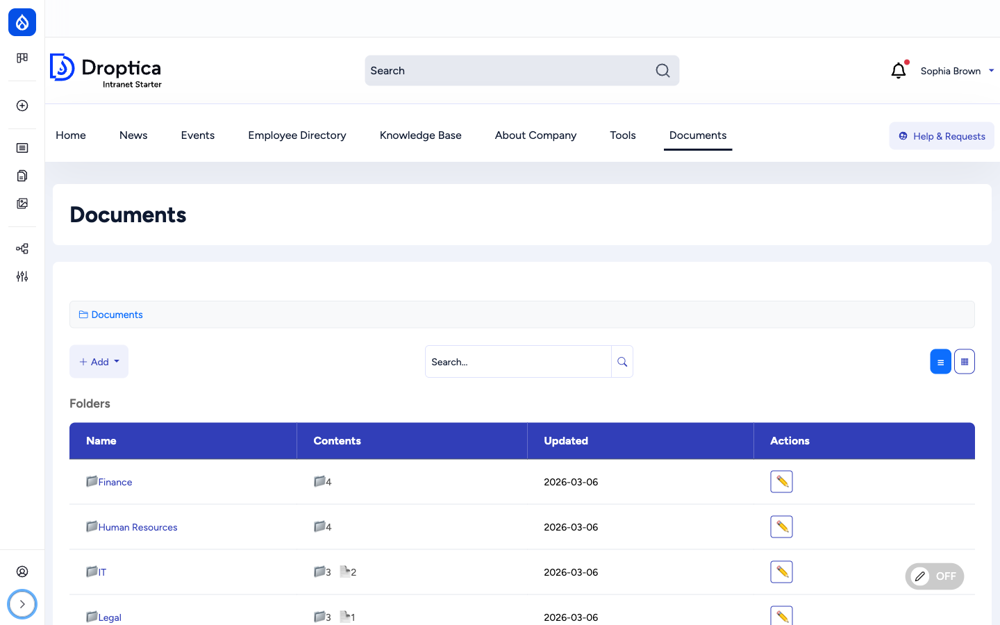
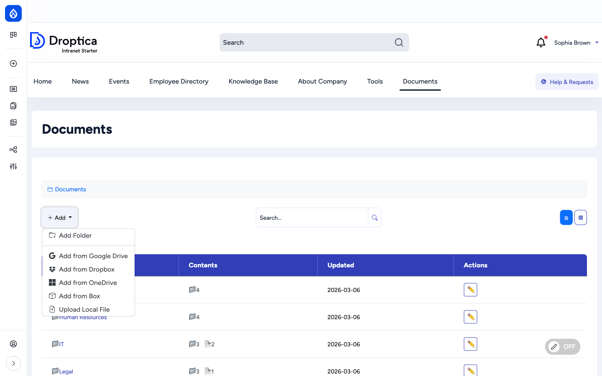
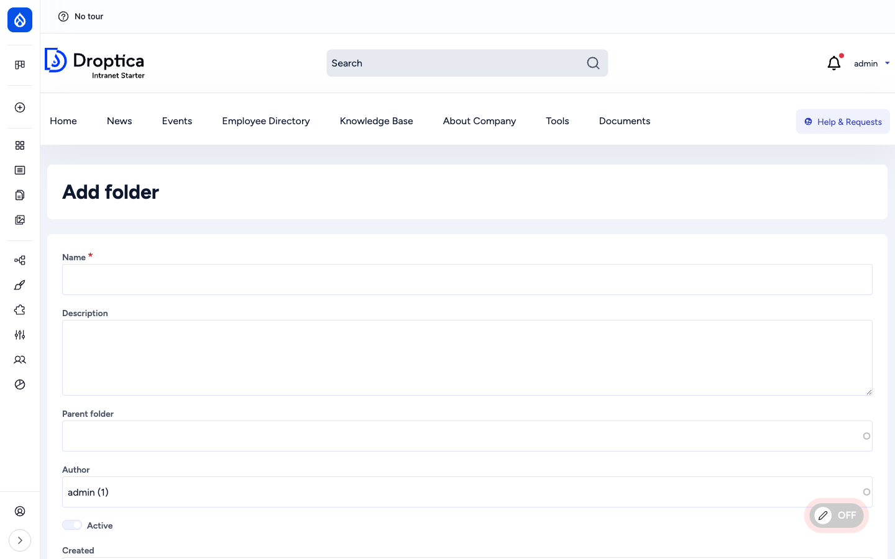
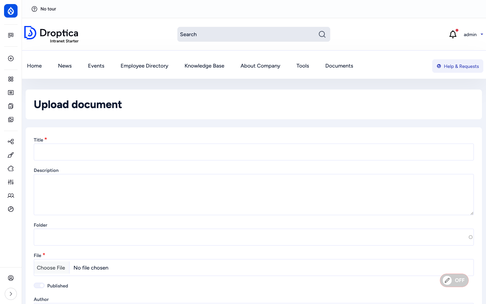
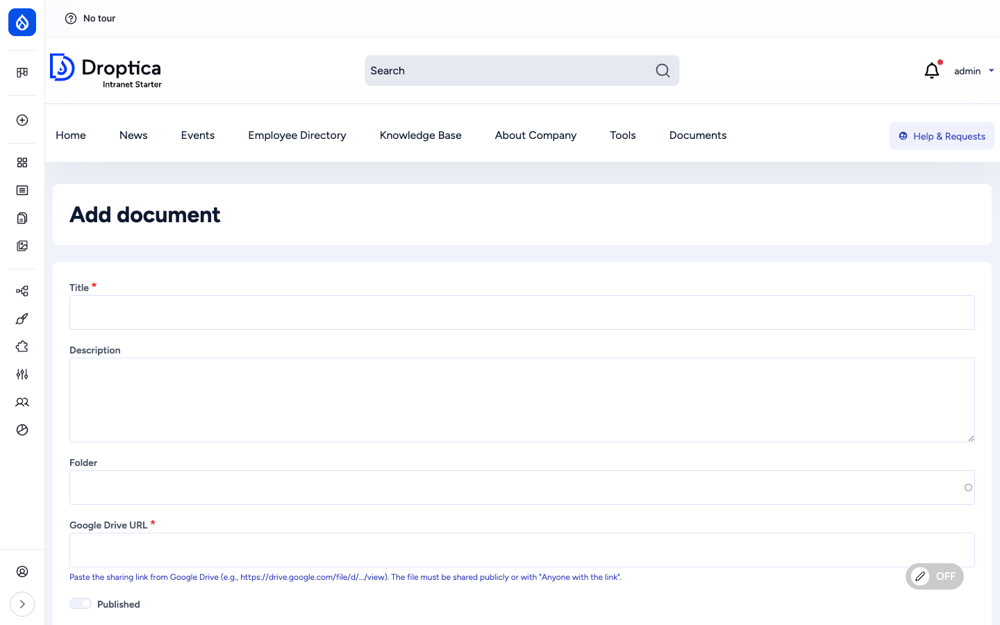
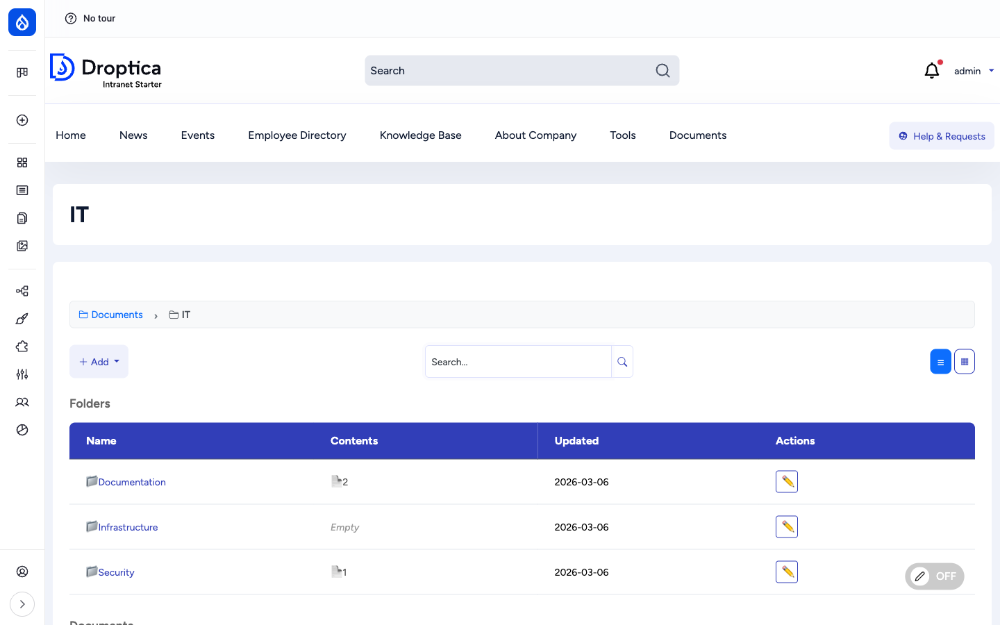
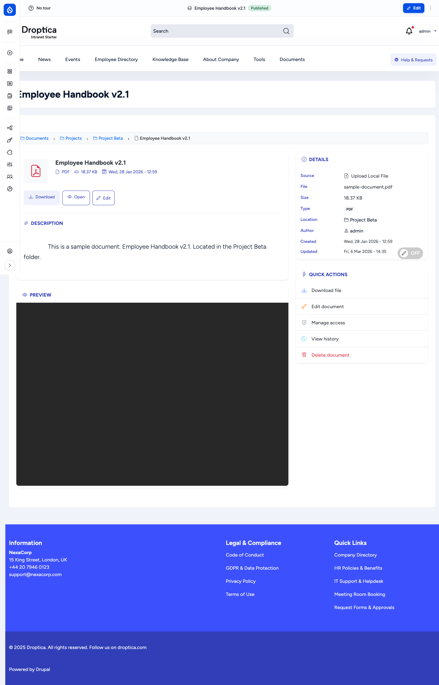
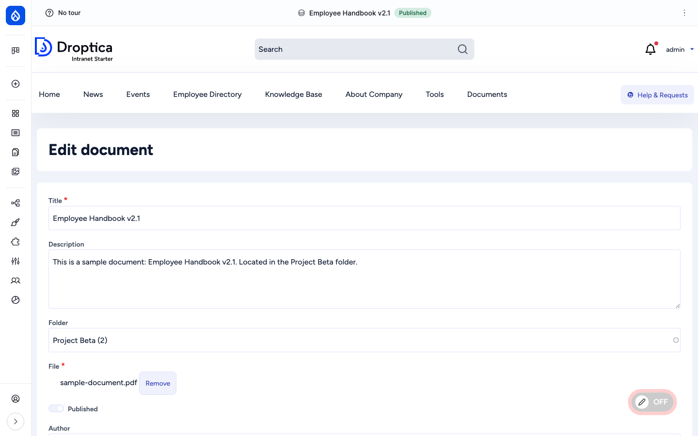
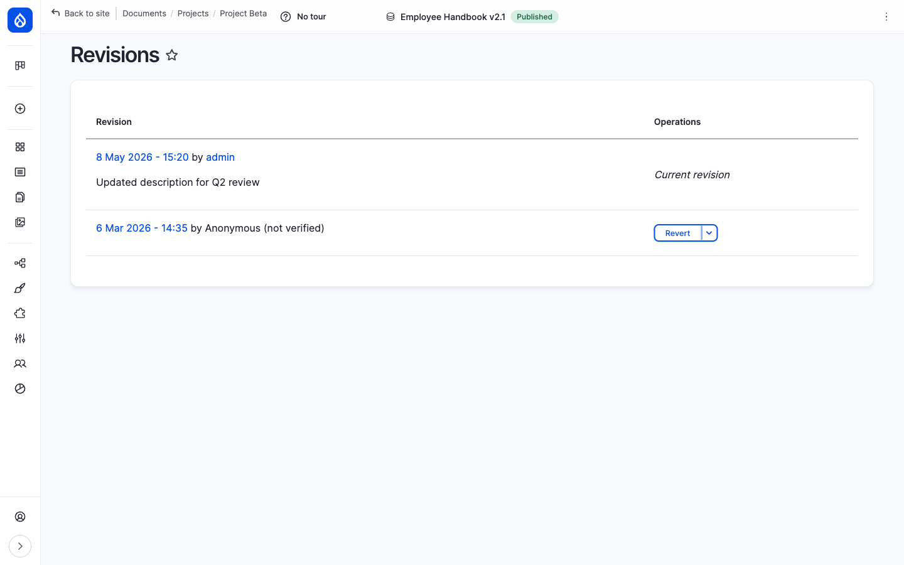
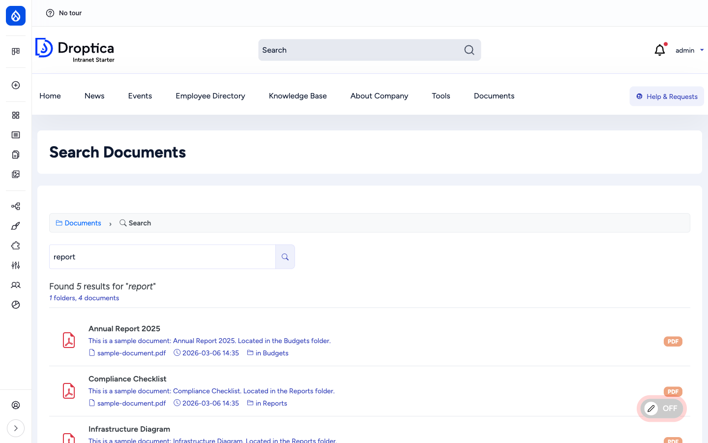

The **Documents** section is a hierarchical file library shared by the whole company. You can browse folders, upload files from your computer or link to files stored in Google Drive, OneDrive, Dropbox or Box, preview most file types directly in the browser, and search across every folder. Each document tracks its own revision history and — if your administrator has set it up — can be restricted to specific groups (for example, "Finance" or "Berlin Sales") or to individual users.

This page walks through the user-facing flows. For the admin-side configuration (enabling cloud sources, setting up access groups, the per-document Access tab), see [Administration → Documents](/docs/administration/documents/).

## The folder browser

Click **Documents** in the main navigation to open the browser at `/documents`. You always see the same three building blocks:

1. A **breadcrumb trail** at the top, so you know where you are in the hierarchy and can jump back up at any level.
2. An **+ Add** menu and a **search bar** above the listing.
3. A table of **subfolders** and **documents** in the current folder.

The two icons in the top-right toggle between **list view** (the default, table layout) and **grid view** (cards with file-type icons).

The columns mirror what is on disk:

| Column | Meaning |
| --- | --- |
| **Name** | Folder or document title. Click to open. |
| **Contents** | For folders: subfolder count and document count, shown side by side. |
| **Updated** | The most recent change date. |
| **Actions** | Inline edit pencil — quick edit without opening the item. |

## Adding folders and documents

Click **+ Add** above the listing to see the full menu. The available options depend on which sources your administrator has enabled in **Settings** (see [Administration → Documents](/docs/administration/documents/#enabling-document-sources)). Out of the box it shows **Add Folder** and **Upload Local File**; once cloud sources are turned on you also get **Add from Google Drive**, **Add from Dropbox**, **Add from OneDrive**, and **Add from Box**.

### Add a folder

Choose **Add Folder** to open the folder form. You only have to give the folder a **Name** — the **Description** and **Parent folder** are optional. The **Active** toggle controls visibility: leaving it on shows the folder in the browser; turning it off hides the folder without deleting it (useful for archiving).

If you opened the form from inside a folder (using its own **+ Add** menu), the **Parent folder** is pre-filled for you. Otherwise the new folder is created at the top level.

### Upload a local file

Choose **Upload Local File** to upload a file from your computer. Fill in the **Title** (this is what colleagues will see — it doesn't have to match the filename), an optional **Description**, pick a **Folder** from the autocomplete, and choose your **File**.

The maximum upload size is set by your administrator (50 MB by default).

### Add a file from Google Drive, OneDrive, Dropbox or Box

Choosing one of the cloud-source options opens a similar form, but instead of a file picker you get a URL field labelled with the source name (for example, **Google Drive URL**). Paste the sharing link from the cloud provider, give the document a **Title** and optional **Description**, and pick a **Folder**.

Two things to keep in mind for cloud sources:

- **The file must be shared publicly** (or via "Anyone with the link") on the source platform — Open Intranet only embeds the link; it does not pull the file content.
- The **URL is validated** against each provider's known URL patterns, so a random URL or a private link will be rejected.

## Browsing inside a folder

Clicking a folder name takes you inside it. The browser stays the same, just scoped to that folder: the breadcrumb grows by one segment, the **Folders** section now lists any subfolders, and a separate **Documents** section appears below for the files in this folder.

You can nest folders as deeply as you like. Use the breadcrumb to jump straight back up — there's no need to "go back" page by page.

## The document detail page

Clicking any document title opens its detail page. This is the central screen for everything you can do with a single file.

The page has four parts:

- **Header bar** — title, file-type icon, file size and the date, plus three action buttons: **Download** (saves the file locally), **Open** (opens the file in a new tab) and **Edit** (only shown if you have edit rights).
- **Description** — the optional description set when the document was added.
- **Preview** — for **images** (`.jpg`, `.png`, `.gif`, `.webp`) the picture is rendered inline. For **PDFs** it is shown in an embedded viewer. For **Google Drive / OneDrive / Dropbox / Box** files the cloud provider's own embed is loaded. For other file types (Word, Excel, ZIP, etc.) only the download/open buttons are shown.
- **Details** sidebar — a structured summary: source type, original filename, file size, MIME type, the folder it lives in (clickable), the author and the created/updated dates.
- **Quick actions** sidebar — a compact menu of the most common operations: **Download file**, **Edit document**, **Manage access**, **View history** and **Delete document**. Items only show if you have permission to perform them.

If the document is referenced by any other intranet content (a news article that links to it, a knowledge base page that embeds it, etc.) you'll also see a **Referenced by** section listing those pages — a quick way to discover where a file is being used before you delete or replace it.

## Editing and deleting

Click **Edit** on the detail page (or the inline pencil in the folder listing) to change the **Title**, **Description**, **Folder** or replace the **File**. The **Published** toggle keeps the document on the site without removing it; unpublishing hides it from non-editors but preserves the entity and its revisions.

**Delete** is available on the document detail page (Quick actions → Delete document) and on the folder listing's actions menu. Deleting a folder asks for confirmation and removes the folder, its subfolders and any documents inside.

## Revision history

Every save of a document creates a new **revision**. Open the **Revisions** tab on the detail page to see the timeline.

Each row shows the revision date, the user who made it and an optional **revision log message** explaining the change. The newest revision is marked **Current revision**. For any older revision you can:

- **View** it — clicking the date opens that revision in read-only mode.
- **Revert** to it — promoting that revision to the current one (a new revision is created so nothing is lost).
- **Delete** the revision (admins only).

Revisions are useful when you need to roll back an unwanted change, recover an older version of a document that was overwritten, or audit who changed what and when.

## Searching documents

Click the search icon (or visit `/documents/search`) to search across the entire document library — every folder, no matter how deep. The search matches against three fields:

- **Document titles**
- **Document descriptions**
- **Original filenames**

Each hit shows the title, the description, the original filename, the last update date and the folder path so you can jump directly to where the file lives. Folders that match by name are also returned and listed at the top of the results.

Search covers the title, description and original filename of every document. To also index the *content* of files (the words inside a PDF, Word document, etc.), ask your administrator to install a content-extraction module like [Search API Attachments](https://www.drupal.org/project/search_api_attachments).

## Sharing and permissions

Most folders and documents in your intranet are visible to all logged-in users. But your administrator can restrict any folder or document to specific **groups** (for example, *Finance*, *Berlin Office*, *Warsaw Sales*) or to specific **individual users**. When that's done, only the chosen people see the item — for everyone else, it's as if the file doesn't exist.

### Why you might not see a folder or document

If a colleague refers to a document and you can't find it, the most likely reasons are:

1. **Group restriction** — the document is restricted to a group you're not a member of. Contact the document owner or your administrator to be added to the group, or to confirm whether the file is meant for your team at all.
2. **Folder inheritance** — by default, documents inherit the access rules of their parent folder. So even if a single document has no restrictions, it may still be hidden because its folder is restricted.
3. **Unpublished** — the author has unpublished the document while editing. Only editors and admins see unpublished items.

Owners (the user who uploaded the document) always retain access to their own files, so a question to the document author is usually the fastest route.

### Reading the Access tab

If you have permission, every document and every folder has an **Access** tab that shows exactly who can see it. The tab lives at `/documents/document/{id}/access` and `/documents/folder/{id}/access` and is described in detail in [Administration → Documents → Access control](/docs/administration/documents/#access-control-on-folders-and-documents).

The short version: the form has two sections — **Groups with access** (a checkbox list of all defined groups) and **Individual users with access** (a free-form user picker). When a folder or document has *no* boxes ticked and no users picked, it falls back to the standard intranet permissions and is visible to everyone with the *View document* permission.

## Quick reference

| Action | How |
| --- | --- |
| **Open a folder** | Click the folder name in the listing. |
| **Jump up the hierarchy** | Click any segment in the breadcrumb. |
| **Switch list ↔ grid view** | Use the two icons in the top right of the toolbar. |
| **Add a folder** | **+ Add → Add Folder**. |
| **Upload a file from your computer** | **+ Add → Upload Local File**. |
| **Link a Google Drive / OneDrive / Dropbox / Box file** | **+ Add → Add from …** — paste the sharing URL. |
| **Edit a folder or document** | Pencil icon in the actions column, or **Edit** on the detail page. |
| **Replace the file** | Edit the document, click **Remove** next to the current file, then upload the new one. |
| **See older versions** | Open the document → **Revisions** tab. |
| **Roll back to an older version** | **Revisions** tab → **Revert** on the row you want. |
| **Search** | Search bar in the toolbar, or `/documents/search`. |
| **See who can access a document** | Open the document → **Access** tab (admin permission required). |

## Required permissions

| To do this, you need this permission | Comes with |
| --- | --- |
| Browse folders and view documents | *View folder* and *View document* (granted to **Authenticated user** by default) |
| Upload files and create folders | *Create document*, *Create folder* (granted to **Content editor**) |
| Edit any document or folder | *Edit document*, *Edit folder* (granted to **Content editor**) |
| Delete documents or folders | *Delete document*, *Delete folder* (granted to **Content editor**) |
| Revert / delete document revisions | *Revert document revision*, *Delete document revision* |
| Restrict who can see a folder/document | *Set entity access restrictions* (granted to **Administrator**) |
| Bypass all restrictions | *Bypass access restrictions* (granted to **Administrator**) |
| Configure document sources and module settings | *Administer documents* (granted to **Administrator**) |

A complete reference, including the access-control permissions and group management, is in [Administration → Documents](/docs/administration/documents/#permissions-reference).
