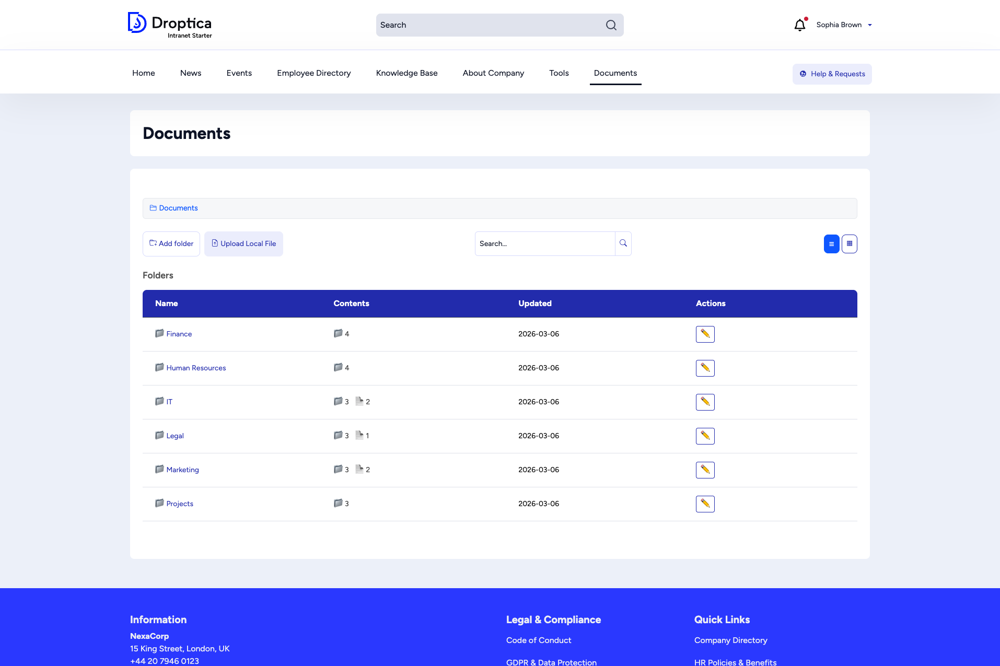

The **Documents** section provides a file management system for organizing and sharing company files.

## Folder browser

Click **Documents** in the main menu to see the top-level folder structure. The view shows:

- A **breadcrumb trail** so you always know where you are in the hierarchy
- **Add folder** and **Upload Local File** buttons for creating new content
- A **search bar** to quickly find documents by name
- **List/grid toggle** buttons to switch between view modes
- A table of folders showing **Name**, **Contents** count, **Updated** date, and **Actions**

## Working with documents

| Action | How |
|--------|-----|
| **Open a folder** | Click the folder name to browse its contents. |
| **Upload a file** | Click **Upload Local File**, select a file from your computer, and choose the target folder. |
| **Create a folder** | Click **Add folder**, provide a name, and save. |
| **Search** | Type in the search bar and click the search icon. Results filter across all folders. |
| **Switch view** | Use the list (☰) or grid (▦) toggle buttons in the top right. |
| **Edit a folder** | Click the pencil icon (✏️) in the Actions column to rename or move a folder. |

## Folder structure

Documents are typically organized by department:

- **Finance** — Budgets, invoices, financial reports
- **Human Resources** — Policies, onboarding guides, forms
- **IT** — Technical documentation, setup guides
- **Legal** — Contracts, compliance documents
- **Marketing** — Brand assets, campaign materials
- **Projects** — Project-specific documents and deliverables

Your administrator may have set up additional folders specific to your organization.
