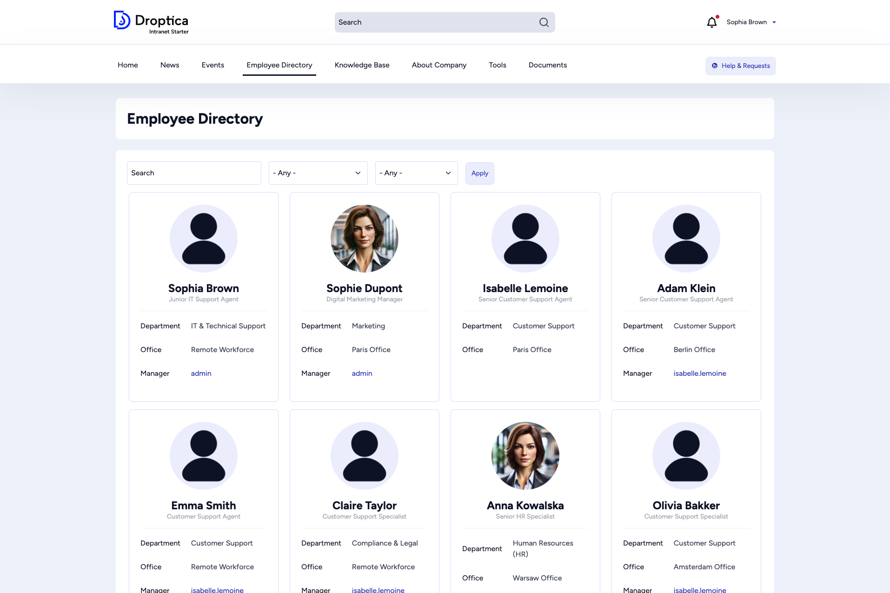
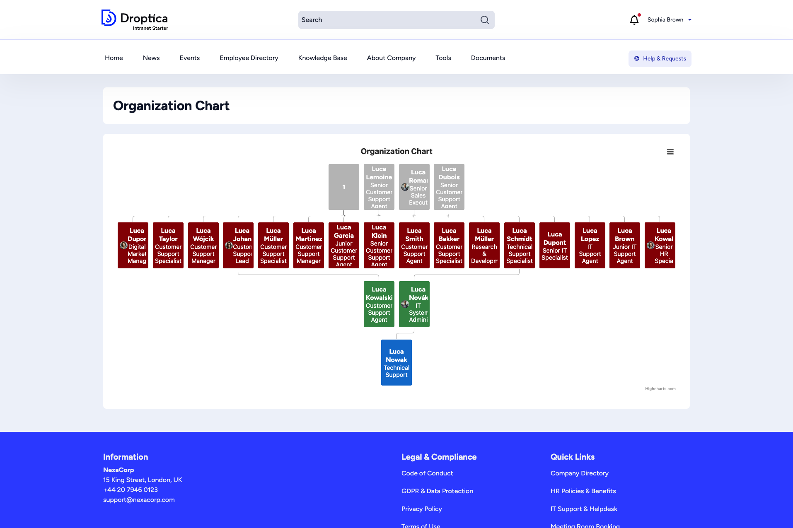

The **Employee Directory** helps you find colleagues across the organization. It includes a searchable directory and an interactive organization chart.

## Directory listing

Click **Employee Directory** in the main menu to see a grid of employee cards. Each card displays:

- **Profile picture** (or a default avatar)
- **Full name** and **job title**
- **Department** and **Office** location
- **Manager** (linked to their profile)

### Searching and filtering

Use the controls at the top of the page to narrow results:

| Control | Description |
|---------|-------------|
| **Search** | Type a name or keyword to find specific employees. |
| **Department** | Select a department from the dropdown to filter by team. |
| **Office** | Select an office location to see who works there. |
| **Apply** | Click to apply the selected filters. |

The listing is paginated. Use the page numbers at the bottom to browse more employees.

## Organization chart

The organization chart visualizes the reporting structure as an interactive tree. Access it from the **Highlighted links** widget on the homepage or via the direct URL.

The chart is powered by Highcharts and supports:

- **Interactive nodes** — Click any person to see their details
- **Hierarchical layout** — Managers at the top, reports below
- **Color-coded levels** — Different colors distinguish management levels
- **Menu button** — Access additional chart options via the hamburger menu (☰)

Click any person's node to navigate to their profile page.
