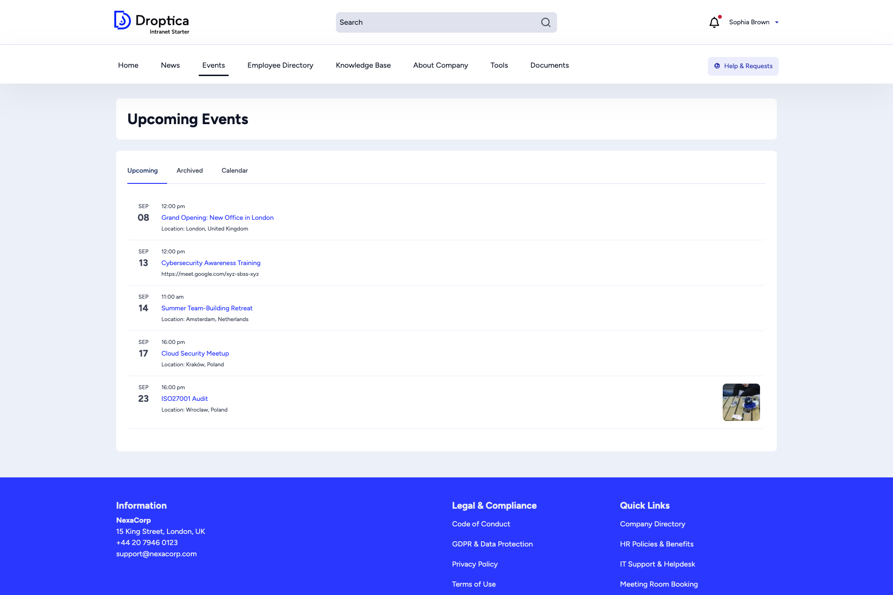
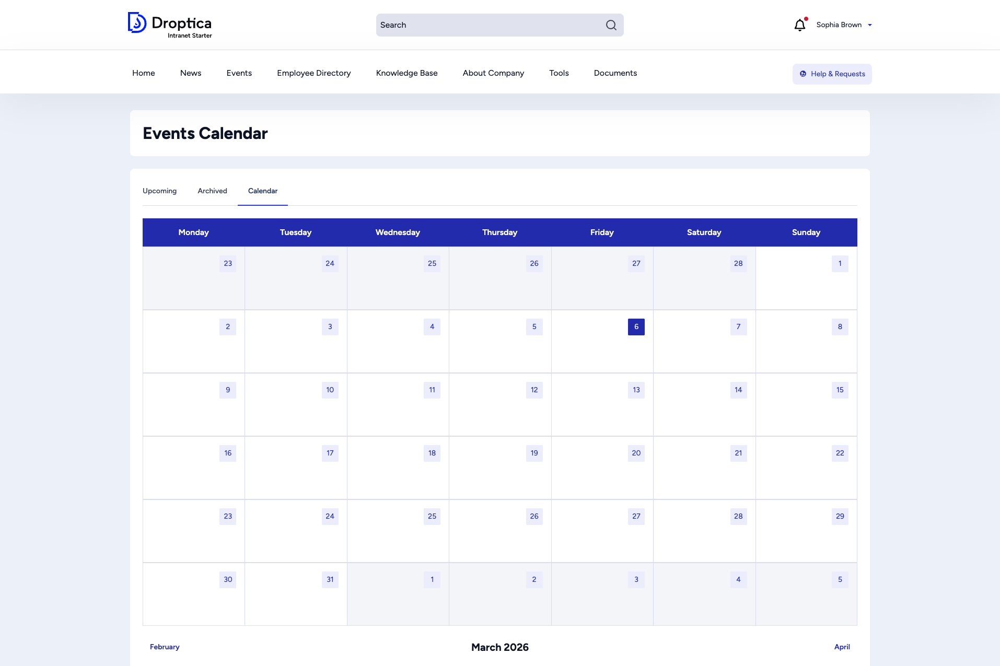
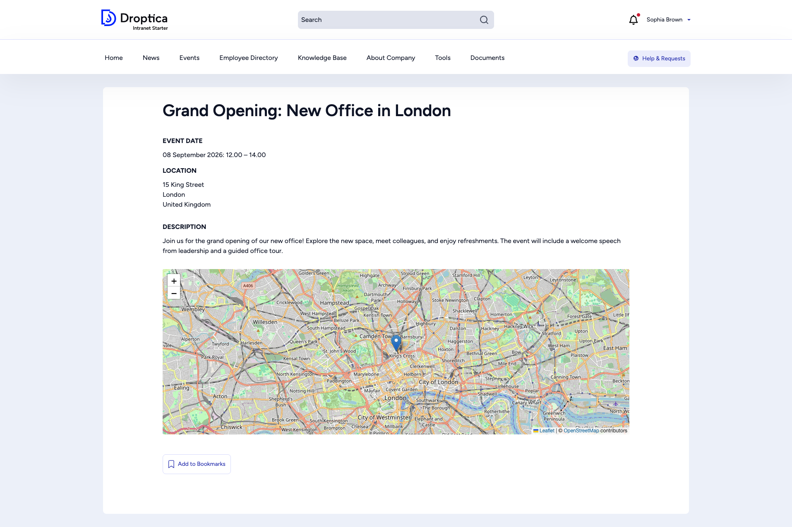

The **Events** section helps you stay informed about company meetings, team outings, training sessions, and other scheduled activities.

## Upcoming events

Click **Events** in the main menu to see a list of upcoming events sorted by date. Each entry displays:

- The **month and day** in a large format for quick scanning
- Event **time** and **title**
- The **location** (physical address or online meeting link)

### Tabs

The events page provides three tabs:

| Tab | Description |
|-----|-------------|
| **Upcoming** | Events happening in the future (default view). |
| **Archived** | Past events you may want to review. |
| **Calendar** | A monthly calendar grid showing events on their scheduled dates. |

## Calendar view

Switch to the **Calendar** tab to see events laid out on a monthly grid. Navigate between months using the **Previous** and **Next** links at the bottom.

## Event details

Click any event title to see the full details:

- **Event date** — The exact date and time range.
- **Location** — The full address or meeting link.
- **Description** — A detailed explanation of the event, its purpose, and what to expect.
- **Map** — If a physical address is provided, an interactive map (powered by OpenStreetMap) shows the location.
- **Add to Bookmarks** — Save the event for quick access later.

