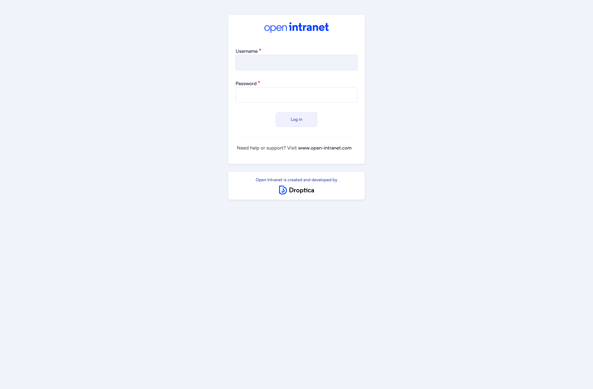
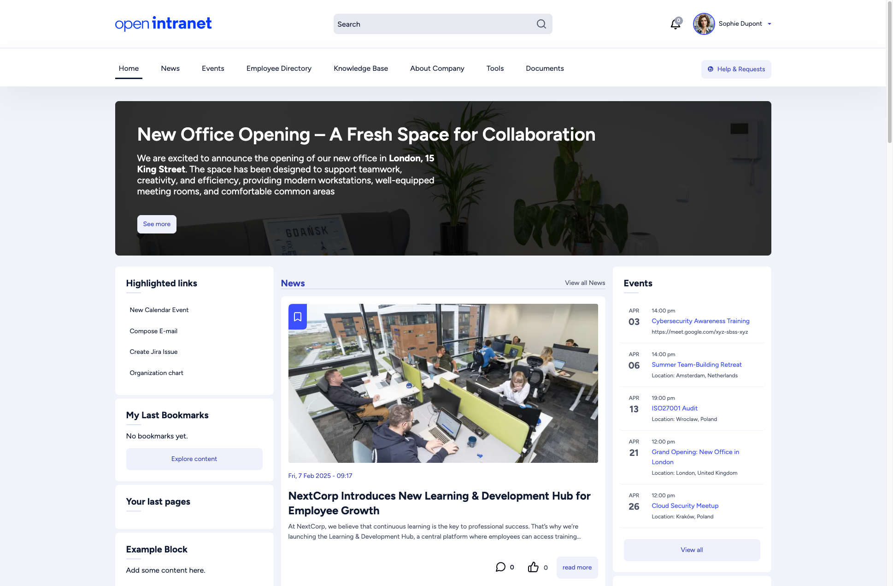
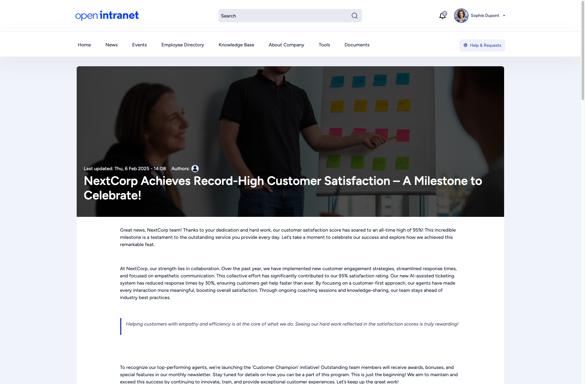
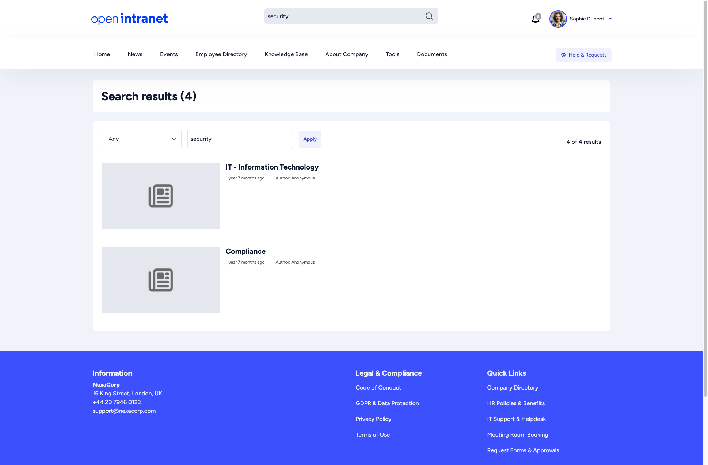
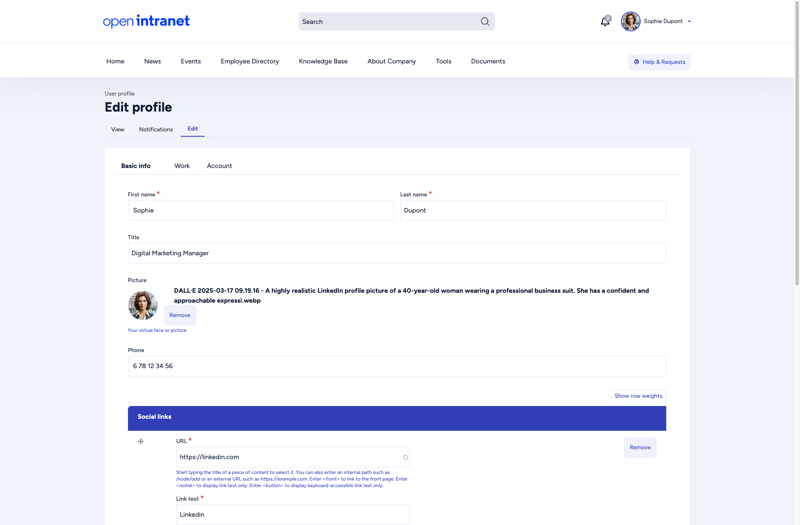
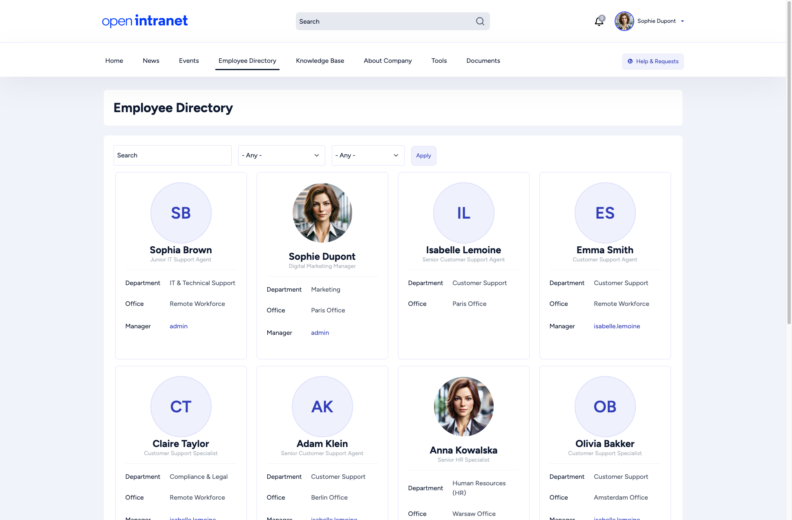
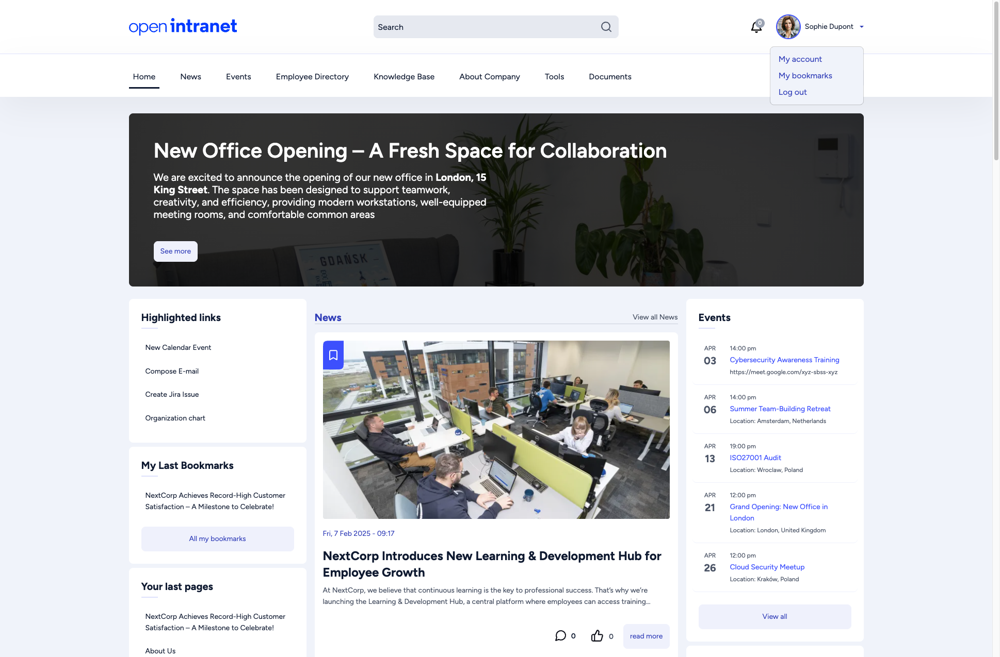
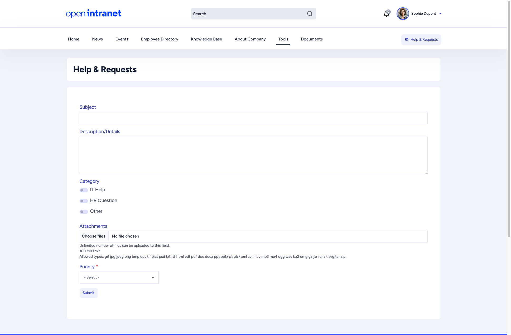

import { Steps } from '@astrojs/starlight/components';

This page takes about ten minutes. Follow the steps in order, or jump to the one you need.

<Steps>

1. **Sign in**

   Open your intranet address, enter your **Username** and **Password** and click **Log in**. Your administrator creates your account, so there is no sign-up page. Resetting a forgotten password by email is switched off in a default installation, so if you forget yours, ask your administrator.

   

2. **Look around the homepage**

   The main menu runs across the top: **Home**, **News**, **Events**, **Employee Directory**, **Knowledge Base**, **About Company**, **Tools** and **Documents**. Next to it you find the search box, the notification bell and your name. The homepage shows a banner, **Highlighted links**, **My Last Bookmarks**, the latest news and upcoming events. More in [Homepage & Navigation](/docs/user-guide/homepage/).

   

3. **Read the news and react**

   Open **News**, click an article and read it. Under the article, click **I like this** to show appreciation, and scroll down to join the discussion in the comments. See [Social Features](/docs/user-guide/social-features/) for details.

   

4. **Find something with search**

   Type a word into the search box at the top of any page and press Enter. The results page lists matching news, pages, knowledge base articles and more. More in [Search](/docs/user-guide/search/).

   

5. **Complete your profile**

   Click your name in the top-right corner and choose **My account**, then open the **Edit** tab. The **Basic info** tab holds your name, title, picture, phone number and social links; the **Work** and **Account** tabs hold the rest, including your email address and password. A complete profile helps colleagues find and recognise you. More in [Your Profile](/docs/user-guide/user-profile/).

   

6. **Find a colleague**

   Open **Employee Directory**, search by name or use the filters. Each card shows a colleague's name, title, department, office and manager. On the homepage, **Organization chart** under **Highlighted links** shows who reports to whom. More in [Employee Directory](/docs/user-guide/employee-directory/).

   

7. **Bookmark what you want to keep**

   On an article, click **Add to Bookmarks**, which you find below the comments. To see everything you saved, click your name and choose **My bookmarks**.

   

8. **Know where to get help**

   The **Help & Requests** button in the header opens a form where you describe your problem, choose a category (IT Help, HR Question or Other) and a priority, and attach files. For anything about your account or access, ask your administrator.

   

</Steps>

## What next?

- [Documents](/docs/user-guide/documents/): browse folders and download files
- [Knowledge Base](/docs/user-guide/knowledge-base/): internal articles organized by topic
- [Roles: what you can do](/docs/user-guide/roles/): find out why some buttons are missing for you
