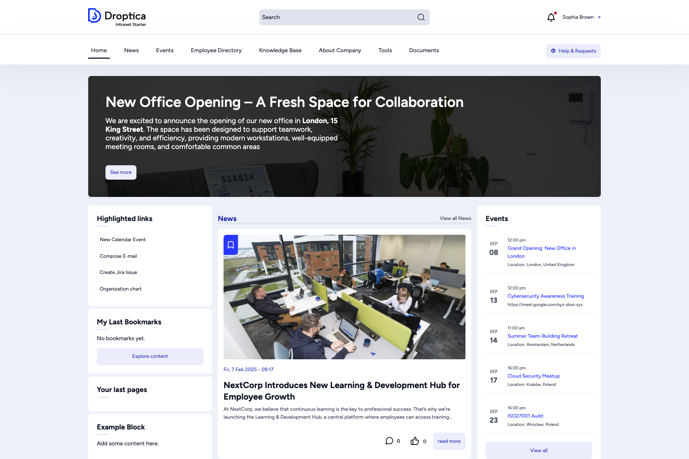

The homepage is the first screen you see after logging in. It gives you a quick overview of what is happening in the organization.

## Homepage layout

The homepage is divided into several areas:

- **Banner** — A large hero area at the top highlighting an important announcement or campaign. Click **See more** to read the full article.
- **News feed** — The center column shows the latest news articles with thumbnails, publication dates, and short summaries. Click any title to read the full article, or use **View all News** to see older articles.
- **Events sidebar** — The right column lists upcoming events with dates, times, and locations. Click an event title to see details, or **View all** to open the full events listing.
- **Highlighted links** — A widget with quick-action shortcuts such as *New Calendar Event*, *Compose E-mail*, or *Organization chart*. These links are configured by your administrator.
- **My Last Bookmarks** — Shows content you have bookmarked. If empty, click **Explore content** to start browsing.
- **Your last pages** — A list of pages you recently visited, making it easy to pick up where you left off.

## Header bar

The header bar is always visible at the top of every page and contains:

| Element | Description |
|---------|-------------|
| **Logo** | Click the company logo on the left to return to the homepage from any page. |
| **Search** | A search field in the center. Type a keyword and press Enter to search across all intranet content. |
| **Notifications bell** | Shows a badge when you have unread notifications. Click to view them. |
| **User menu** | Your name and avatar in the top-right corner. Click to access your profile, bookmarks, and log out. |

## Main menu

Below the header bar, the main navigation menu provides access to all major sections:

- **Home** — Returns to the homepage.
- **News** — All company news articles.
- **Events** — Upcoming and past events, including a calendar view.
- **Employee Directory** — Search for colleagues by name, department, or office.
- **Knowledge Base** — Internal documentation organized by topic.
- **About Company** — Pages about the organization, departments, and legal information.
- **Tools** — Links to forms, help requests, surveys, and other utilities.
- **Documents** — The document management system with folders and files.
- **Help & Requests** — Quick access to support forms and requests.

Some menu items have sub-menus that appear on hover or click, revealing additional pages.

## Footer

At the bottom of every page, the footer provides:

- **Company contact information** — Address, phone, and email.
- **Legal & Compliance links** — Code of Conduct, GDPR, Privacy Policy, Terms of Use.
- **Quick Links** — Shortcuts to frequently used pages like Company Directory, HR Policies, and IT Support.
