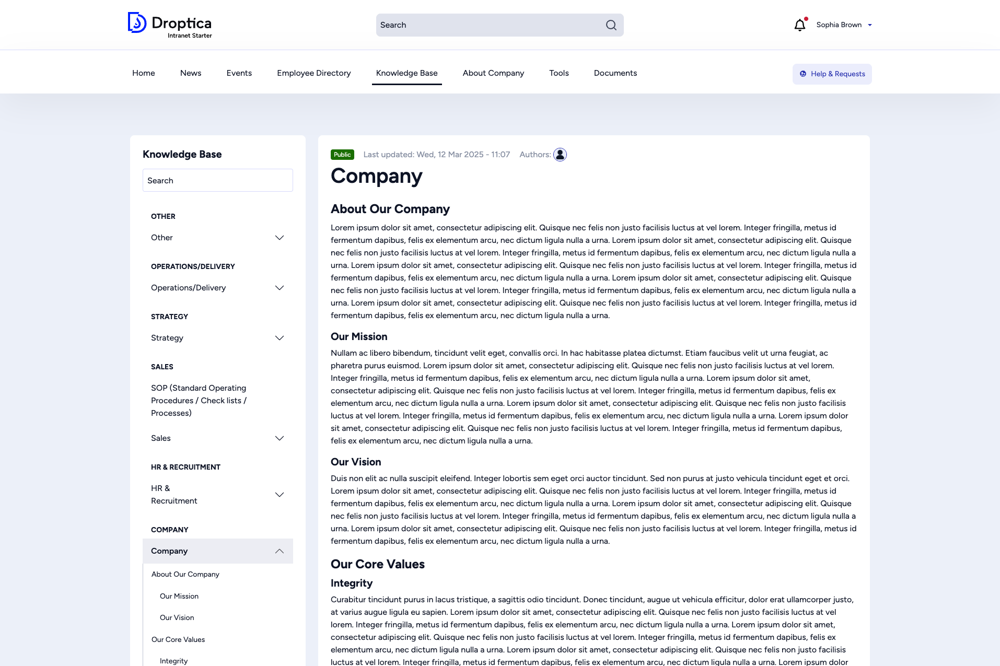

The **Knowledge Base** is the central hub for internal documentation. It organizes articles into a hierarchical book structure, making it easy to find policies, procedures, department-specific information, and more.

## Accessing the Knowledge Base

Click **Knowledge Base** in the main menu. The sub-menu shows top-level categories (departments) that you can jump to directly:

- Company
- Finance
- HR & Recruitment
- Marketing
- Operations/Delivery
- Sales
- Strategy
- Other

## Browsing articles

Each Knowledge Base article is part of a **book** — a hierarchical tree of related pages. When you open an article, a sidebar on the left shows:

- A **search field** to filter the table of contents
- The **full book outline** grouped by department, with expandable/collapsible sections
- The **current page** highlighted for orientation

The article itself displays:

- A **visibility badge** (e.g. *Public*) indicating who can see the page
- The **last updated** date and **author**
- The full article content with headings, text, and any embedded media
- **Tags** for categorization

## Navigating the book structure

Use the sidebar to move between pages within the same book. Click any title to jump directly. Use the expand/collapse arrows to reveal or hide sub-pages.

The book structure lets your organization maintain living documentation that evolves over time, with clear ownership and a logical hierarchy.
