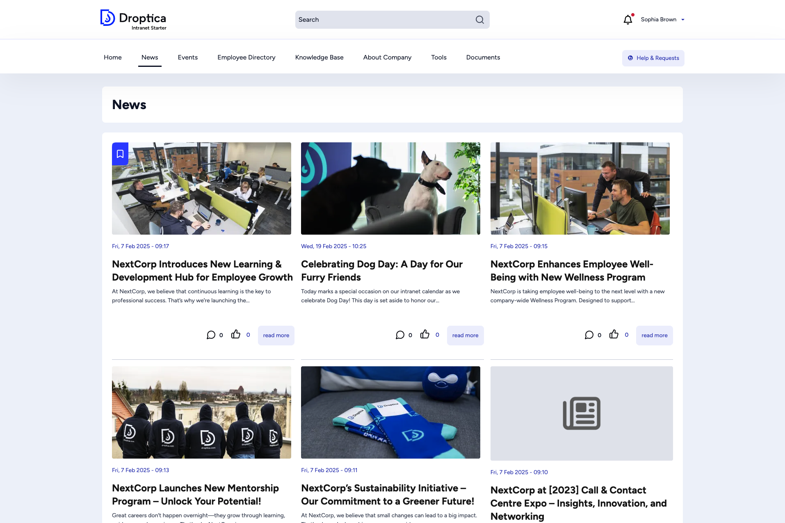
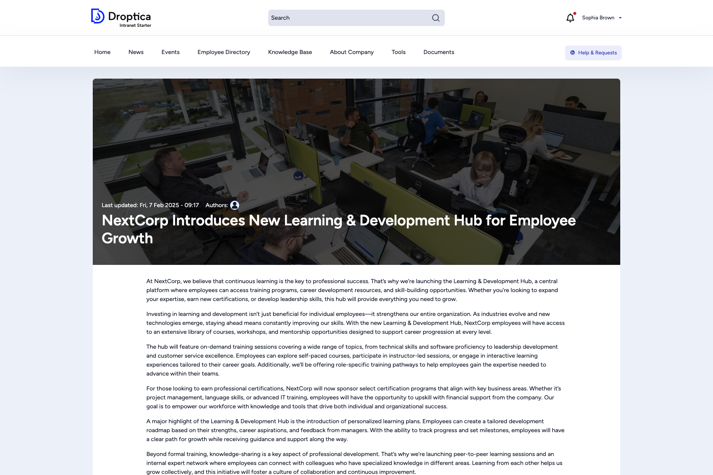

The **News** section keeps you up to date with company announcements, project updates, and organizational changes.

## News listing

Click **News** in the main menu to see all published articles in reverse chronological order. Each card shows:

- A thumbnail image (if available)
- Publication date and time
- Article title and a short summary
- Comment and reaction counts
- A **read more** link

The listing is paginated. Use the page numbers at the bottom to browse older articles.

## Reading an article

Click any title or **read more** to open the full article. A news article page includes:

- A **hero image** spanning the full width
- The publication date and author avatar
- The full article text
- **Tags** categorizing the article (e.g. *Career Growth*, *Customer Success*)
- A **like** button to express appreciation
- A **comment form** at the bottom where you can join the conversation
- An **Add to Bookmarks** link to save the article for later

## Interacting with articles

| Action | How |
|--------|-----|
| **Like** | Click the thumbs-up icon below the article. The counter increments. |
| **Comment** | Scroll to the comment form, type your message, and click **Save**. |
| **Bookmark** | Click **Add to Bookmarks** to save the article to your personal bookmarks list. |
