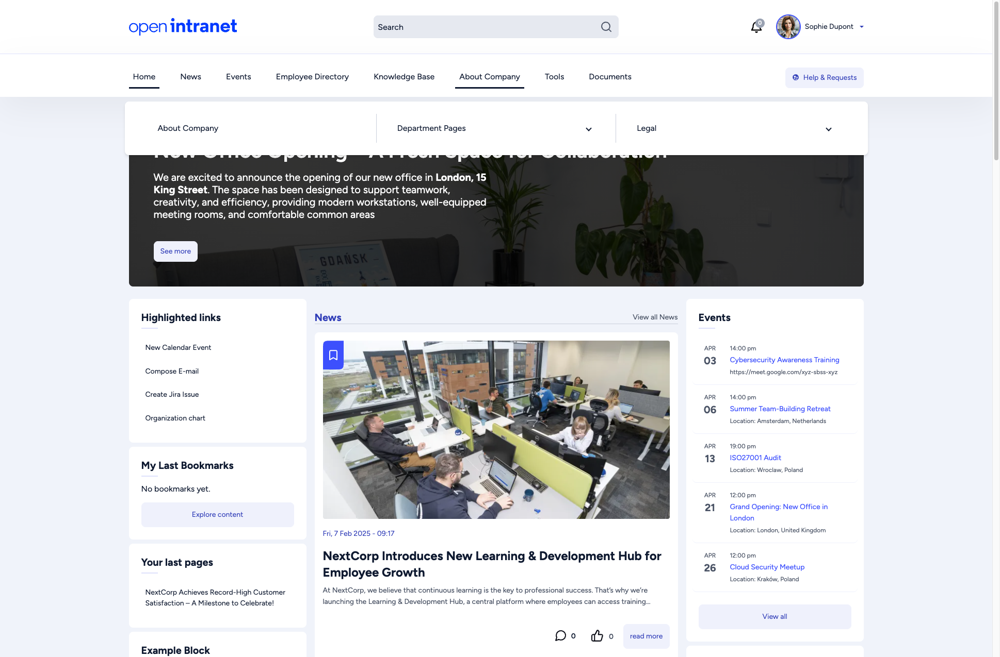
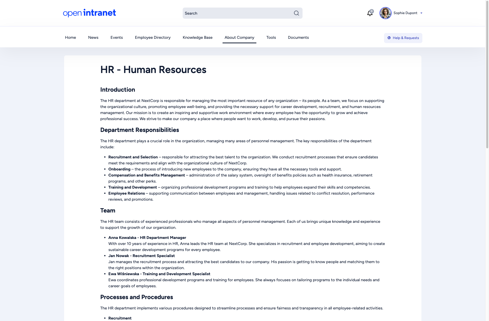
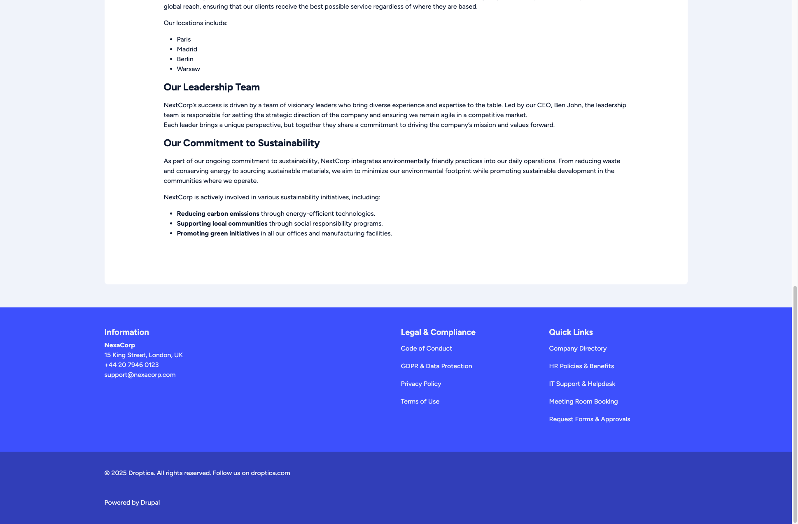

import { Tabs, TabItem } from '@astrojs/starlight/components';
import Audience from '../../../components/Audience.astro';

**Pages** are static content pages that provide information about the organization, departments, policies, and other resources that do not change frequently.

## Finding pages

Most pages are in the main menu. Point at **About Company** to open its submenu, and click any entry to open the page.

<Tabs>
  <TabItem label="Department pages">

    Each department can have its own page with relevant information, contacts and resources. You find them under **About Company > Department Pages**:

    - Customer support
    - Finance
    - Marketing
    - IT
    - HR

    

  </TabItem>
  <TabItem label="Legal and compliance">

    Under **About Company > Legal** you find **Policies & Regulations**, **Compliance** and **Contracts**. The footer of every page also links to important documents under **Legal & Compliance**:

    - **Code of Conduct**
    - **GDPR & Data Protection**
    - **Privacy Policy**
    - **Terms of Use**

    

  </TabItem>
  <TabItem label="Company information">

    General information about the company is on the **About Company** page, the first entry of the **About Company** submenu. The footer **Quick Links** column points to frequently used places such as the company directory and IT support.

    Forms such as **Training Request**, **Help Requests**, **Employee Survey** and **Submit News** are under **Tools > Forms**.

  </TabItem>
</Tabs>

## Page features

Static pages can include:

- Formatted text with headings, lists, and emphasis
- Embedded images and media
- Links to other intranet pages or external resources
- File attachments for downloadable documents

## Adding or editing a page

<Audience level="editors" />

Users with an editor role can add and edit basic pages. See [Creating a basic page](/docs/user-guide/creating-content/#creating-a-basic-page) for the step-by-step instructions, including how a new page gets into the navigation.

## Related

- [Knowledge Base](/docs/user-guide/knowledge-base/): longer internal documentation
- [Search](/docs/user-guide/search/): find a page by a word from it
- [Creating Content](/docs/user-guide/creating-content/): for editors
