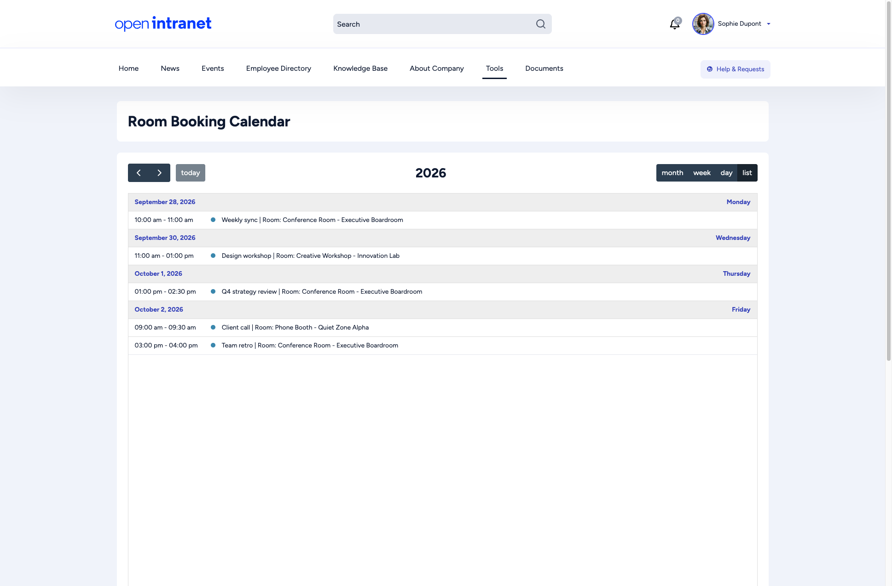
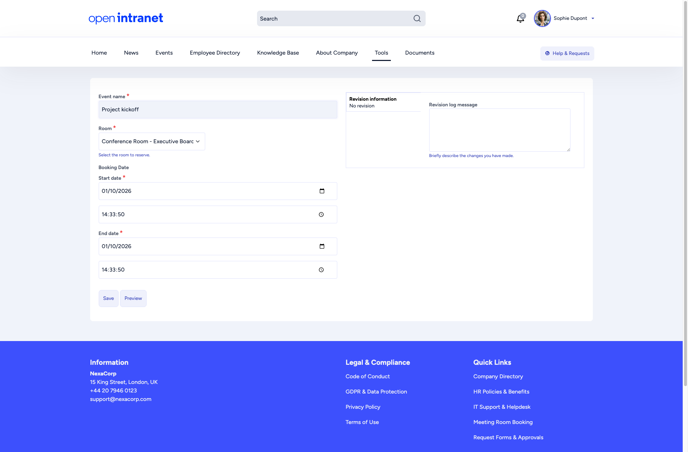

import { Steps } from '@astrojs/starlight/components';
import Audience from '../../../components/Audience.astro';

<Audience level="optional" />

**Room Booking** lets you reserve shared spaces such as conference rooms, meeting rooms and phone booths, and see which rooms are taken. It is an optional feature. If you do not see **Tools > Room Booking** in the main menu, ask your administrator whether it is enabled (see [Room Booking setup](/docs/features/room-booking/)).

## The room calendar

Open **Tools > Room Booking > Room Booking Calendar**, or go to `/rooms`. The calendar opens in **week** view. Use the buttons in the top right to switch between **month**, **week**, **day** and **list**, the arrows to move back and forth, and **today** to jump to the current date. The picture shows the **list** view.

Each booking shows its time, its name and the room. Click a booking to open its details in a new tab.

## Booking a room

<Steps>

1. Open **Tools > Room Booking > Add Room Booking**.
2. Enter an **Event name**, for example "Q4 strategy review".
3. Choose the **Room**.
4. Set the **Start date** and the **End date**, each with a date and a time.
5. Click **Save**. You return to the calendar, where the new booking appears.

</Steps>

:::note
Open Intranet does not check for double bookings. Look at the calendar first to make sure the room is free at that time.
:::

Clicking an empty slot in the calendar does not start a booking. Use **Add Room Booking**.

## Changing or cancelling a booking

Open the booking and use the **Edit** tab to change it, or the **Delete** tab to cancel it. You can edit and delete your own bookings. Room managers can edit and delete any booking.

To move a booking, you can also drag it to another day or time in the calendar. Open Intranet asks you to confirm the new time before it saves the change.
