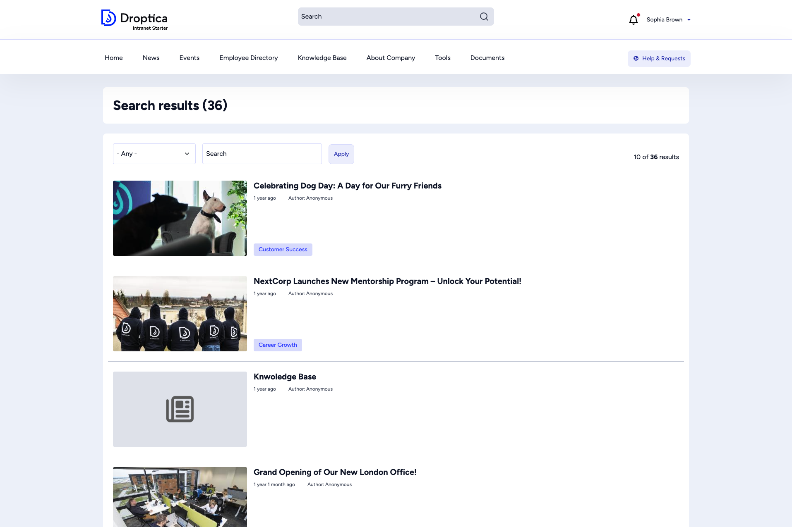

The **search** feature lets you find any content across the intranet — articles, events, Knowledge Base pages, documents, and more.

## How to search

There are two ways to start a search:

1. **Header search bar** — Type a keyword in the search field at the top of any page and press Enter.
2. **Search page** — Navigate directly to the search page for advanced filtering.

## Search results

After searching, you see a results page showing:

- The **total number of results** (e.g. "36 results")
- A **content type filter** dropdown — narrow results to a specific type (News article, Event, Knowledge Base Page, Basic page, etc.)
- A **search field** to refine your query
- Result cards with **thumbnail**, **title**, **publication date**, **author**, and **tags**

Results are paginated. Use the page numbers at the bottom to browse more results.

## Filtering results

Use the **content type** dropdown to focus on a specific kind of content:

| Filter | Shows |
|--------|-------|
| **- Any -** | All content types (default) |
| **News article** | Company news and announcements |
| **Event** | Upcoming and past events |
| **Knowledge Base Page** | Internal documentation |
| **Basic page** | Static pages (About, Departments, etc.) |
| **Book page** | Pages within a book hierarchy |
| **Webform** | Forms and surveys |

Select a content type and click **Apply** to filter the results.

## Tips for effective searching

- Use **specific keywords** rather than generic terms for better results.
- If you get too many results, use the **content type filter** to narrow down.
- Search looks at titles, body text, and tags, so you can find content even if you only remember a keyword from the text.
