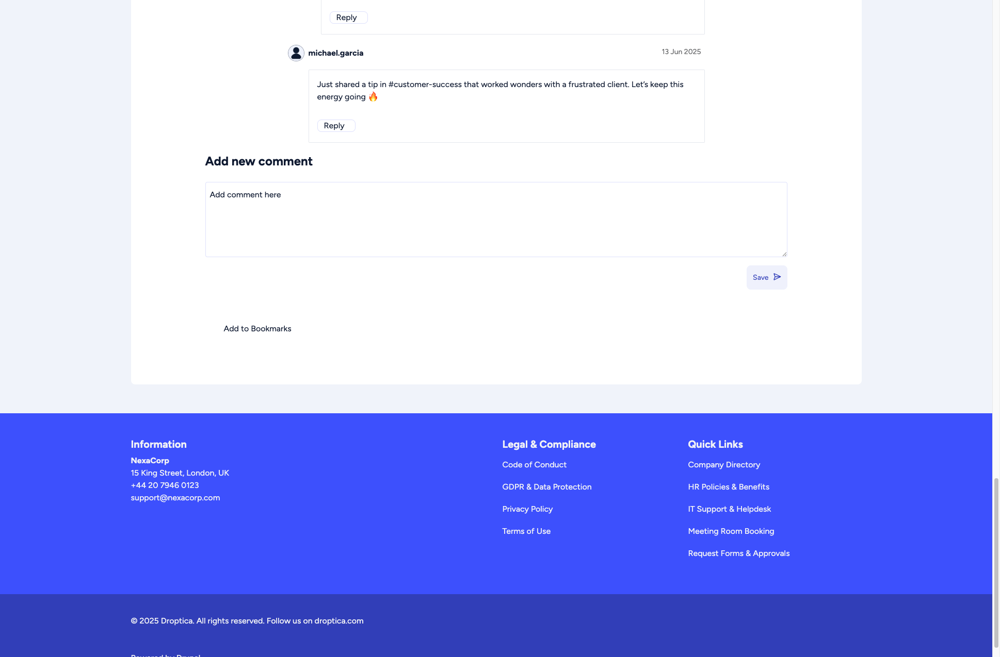
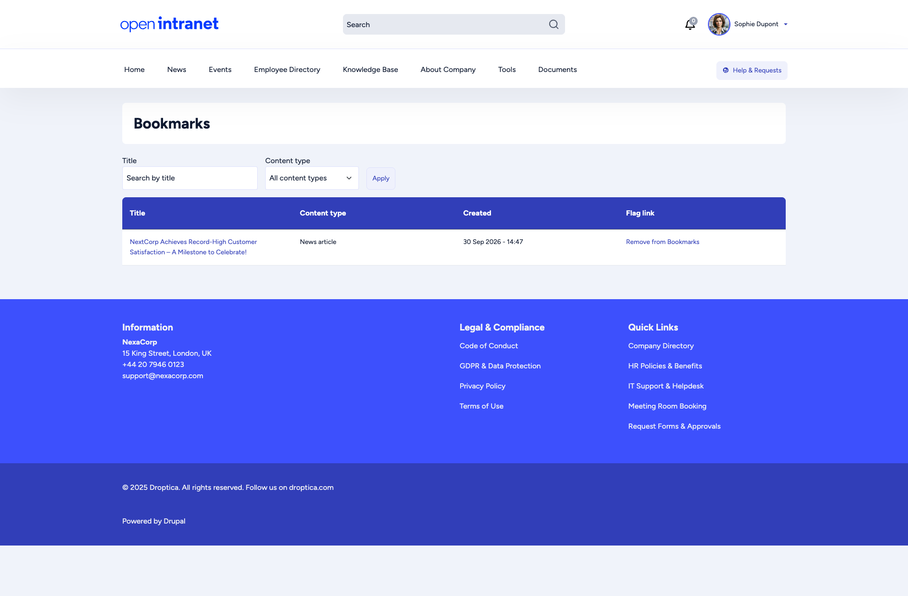
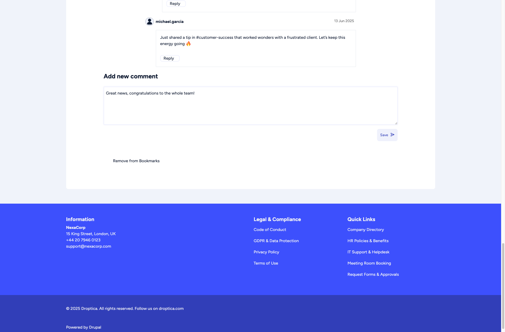
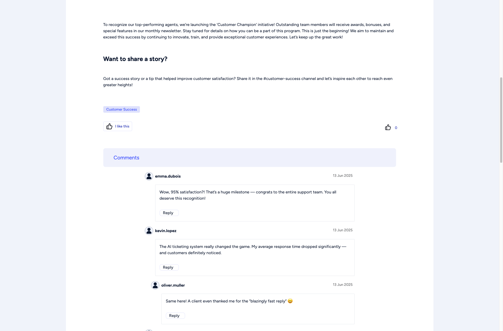

import { Steps, CardGrid, LinkCard } from '@astrojs/starlight/components';

Open Intranet includes social features that let you interact with content, save items for later, and engage with colleagues.

<CardGrid>
  <LinkCard title="Bookmarks" description="Save an article, event or knowledge base page for later." href="/docs/user-guide/social-features/#bookmarks" />
  <LinkCard title="Comments" description="Share feedback, ask questions and reply to colleagues." href="/docs/user-guide/social-features/#comments" />
  <LinkCard title="Reactions" description="Say thanks with one click." href="/docs/user-guide/social-features/#reactions" />
</CardGrid>

## Bookmarks

Bookmarks let you save news articles, events and Knowledge Base pages for quick access later.

### Adding a bookmark

<Steps>

1. Open the article, event or Knowledge Base page.
2. Click **Add to Bookmarks**. You find it at the end of the page, below the comments. News cards on the homepage also show a bookmark icon in the corner.

</Steps>

The link then changes to **Remove from Bookmarks**; click it to take the page off your list.

### Viewing your bookmarks

<Steps>

1. Click your name in the top-right corner.
2. Choose **My bookmarks**.

</Steps>

The **Bookmarks** page lists everything you saved, with its content type and the date you saved it. Click a title to go back to the content.

On the homepage, the **My Last Bookmarks** widget shows your most recent bookmarks, with an **All my bookmarks** link.

## Comments

Many content types, including news articles, support comments. Commenting lets you share feedback, ask questions, or start discussions.

### Posting a comment

<Steps>

1. Scroll to the **Add new comment** section at the bottom of an article.
2. Type your comment in the text box.
3. Click **Save**.

</Steps>

Your comment appears immediately below the article, visible to all users. To answer a colleague, click **Reply** under their comment: replies are shown indented below it.

## Reactions

The like feature lets you express appreciation for content without writing a comment. Under a news article, click **I like this**. The counter with the thumbs-up on the right shows how many people reacted. Reactions are available on news articles and basic pages, and they are a lightweight way to acknowledge content and help surface popular articles.

