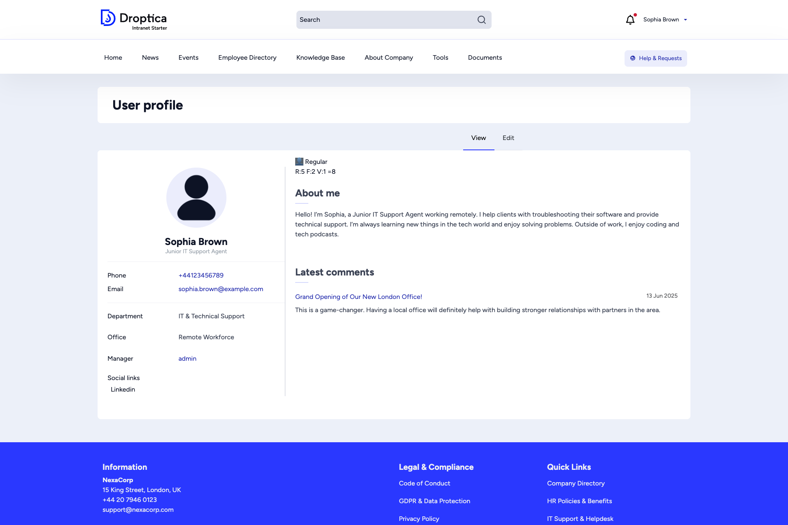

Your **user profile** is your digital identity within the intranet. It shows your contact information, department, and recent activity.

## Viewing your profile

Click your name in the top-right corner of any page, then select **My account** to see your profile. The profile page shows:

- **Profile picture** and **name**
- **Job title**
- **Contact details** — phone number, email address
- **Department** and **Office**
- **Manager** — a direct link to your manager's profile
- **Social links** — any external profile links you have added (e.g. LinkedIn)
- **About me** — a personal bio or description
- **Latest comments** — your recent comments across the intranet

## Editing your profile

Click the **Edit** tab at the top of your profile page. The edit form is organized into three tabs:

### Basic info

- **First name** and **Last name** (required)
- **Title** — your job title
- **Picture** — upload or change your profile photo
- **Phone** number
- **Social links** — add URLs to your professional profiles (LinkedIn, etc.)

### Work

- **About me** — a text area for your personal bio
- **Department** — your team or department
- **Office** — your physical office location
- **Manager** — your direct manager

### Account

- **Email address** — your login email
- **Password** — change your password

After making changes, click **Save** to update your profile.
